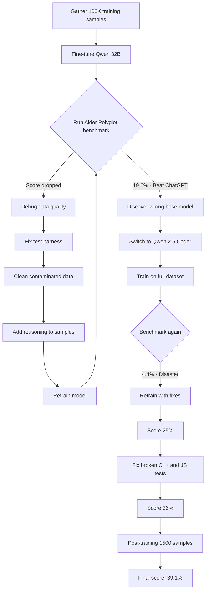

## Why This Matters

A YouTuber with no ML background fine-tuned an open-source model and beat ChatGPT on a respected coding benchmark. That's not just a fun project — it's evidence that the barrier to training competitive AI models has collapsed. The tools, research papers, and compute are accessible enough that a motivated individual can do it from a home office (with a few near-fires along the way).

What makes this compelling isn't the benchmark score. It's the process: months of data wrangling, repeated failures, and the kind of stubborn iteration that actually teaches you something. PewDiePie documents the full arc — from naive optimism to genuine understanding.

## Key Takeaways

- **Supervised fine-tuning is surprisingly accessible.** The core loop is simple: gather instruction-response pairs, feed them to a base model, nudge its parameters. PewDiePie collected ~100K coding samples and trained on Qwen 32B using publicly available techniques from DeepSeek's research.

- **Data quality is everything.** The first training run made the model _worse_. Synthetic data from LLMs looks perfect but hides subtle errors — "razor blades in burgers." A broken test harness let garbage data through. Garbage in, garbage out is not a cliché here; it's a debugging session.

- **Chinese AI research is remarkably open.** DeepSeek released their full model weights and detailed training documentation. PewDiePie's entire approach was built on this openness — a stark contrast to Western labs that guard their processes. The irony of China being the open-source champion wasn't lost on him.

- **Adding reasoning to training data works.** Including step-by-step thinking in training samples (inspired by chain-of-thought research) was the key to breaking past the performance ceiling. The model improved by learning to decompose problems before solving them.

- **Benchmarks are fragile.** A third of the Aider Polyglot benchmark wasn't even running correctly (C++ and JavaScript tests were broken). Fixing the benchmark itself jumped the score from 25% to 36%. The score you see depends heavily on the testing setup — not just the model.

- **The diff vs. whole format problem is real.** Many models struggle with editing existing code (diff format) versus writing complete files (whole format). This format mismatch tanks benchmark scores and reflects a genuine usability gap in coding assistants.

## The Training Journey

::

## Notable Quotes

> "I have become so accustomed to failure, you have no idea."

> "Garbage data in, garbage data out."

> "I would never have learned wanting to learn how to code if it wasn't for AI coming into the picture."

## The Uncomfortable Truth

After all that work, Qwen 3 shipped and scores 40% out of the box. Months of effort to match what a new release delivers for free. PewDiePie acknowledges this with refreshing honesty — the point was never to ship a production model. It was to understand how the thing works by building it wrong, over and over, until you build it right.

There's a Linus Torvalds quote he references that captures the whole philosophy: enjoy doing things you're not good at, because that's how you learn. Expect to fail. Embrace failing.

## Connections

- [[rlhf-reinforcement-learning-from-human-feedback]] — PewDiePie's supervised fine-tuning is phase 2 of the three-phase training process Chip Huyen describes. He skips RLHF entirely, working only with instruction-response pairs — which shows how far SFT alone can take you on a specific benchmark.

- [[andrej-karpathy-were-summoning-ghosts-not-building-animals]] — Karpathy talks about training LLMs at the conceptual level; PewDiePie shows what the actual hands-on experience looks like for a non-researcher. The "ghosts imitating documents" framing hits differently when you watch someone manually curate the documents being imitated.

- [[2025-the-year-in-llms]] — Simon Willison covers Chinese AI's surprising openness and the explosion of open-source models as a 2025 trend. PewDiePie's project is a concrete example of someone riding that wave — DeepSeek's transparency made this entire project possible.
