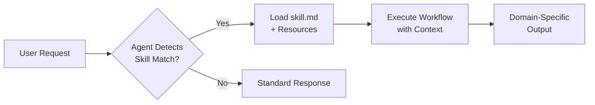

## Key Takeaways

- Skills are folders containing `skill.md` files plus optional resources (scripts, images, templates)
- They load on demand when the agent detects a request matching the skill's description
- Skills are an open standard, transferable between VS Code, GitHub Copilot Cloud, and CLI agents
- Unlike static custom instructions, skills bring action-oriented automation into the mix

## What Makes Skills Different from Instructions

Custom instructions define coding standards and preferences. Skills go further: they include scripts, examples, and workflows that make agents action-oriented. A skill for image manipulation doesn't just describe preferences—it knows which ImageMagick commands to run and how to locate binaries on any machine.

## Skill Structure

```text
skills/
└── prd-writing/
    ├── skill.md          # Required: defines name, triggers, workflow
    └── helpers.js        # Optional: scripts, templates, resources
```

The `skill.md` frontmatter defines:

- **Name**: Human-readable identifier
- **When to use**: Semantic description triggering automatic loading
- **Workflow stages**: Step-by-step process the agent follows

## How Skills Load



::

## Practical Examples

| Skill              | Purpose                                  | Resources Loaded            |
| ------------------ | ---------------------------------------- | --------------------------- |
| PRD Writing        | Structured product requirement documents | Workflow stages, templates  |
| Image Manipulation | Batch processing, conversions            | ImageMagick commands, paths |
| Web Testing        | Playwright interactions, test generation | Test helper scripts         |

## Notable Quotes

> "Agent skills aren't just fancy instructions. They're portable, task-specific workflows that load only when you need them."

> "Skills make agents know how to do the work and how you want it to be done."

## Connections

- [[claude-code-skills]] - The same concept implemented in Claude Code: markdown files that extend agent capabilities with specialized knowledge and automatic triggering
- [[context-engineering-guide-vscode]] - Explains the broader VS Code context engineering approach that skills build upon, including custom instructions and planning agents
