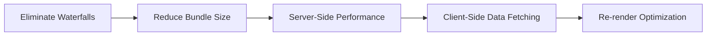

## Summary

Vercel released `react-best-practices`, a structured repository of 40+ performance rules across 8 categories. The framework emphasizes **ordering**—start at the highest-impact level rather than micro-optimizing. Fix async waterfalls before worrying about re-renders. Reduce bundle size before tweaking component memoization.

The rules compile into an `AGENTS.md` file designed for AI coding agents, enabling consistent refactoring across large codebases.

## Optimization Priority



::

## Key Concepts

- **Impact ratings**: Each rule includes CRITICAL to LOW ratings
- **Ordering matters**: Foundational fixes yield compounding benefits
- **Agent-first design**: Rules integrate as Agent Skills for Opencode, Codex, Claude Code, and Cursor

## Code Snippets

### Parallelizing Awaits

Sequential awaits waste time when operations are independent.

```typescript
// Before: Sequential (slow)
const user = await getUser(id);
const posts = await getPosts(id);

// After: Parallel (fast)
const [user, posts] = await Promise.all([getUser(id), getPosts(id)]);
```

### Lazy State Initialization

Expensive computations in `useState` run on every render unless wrapped in a callback.

```typescript
// Before: Parses JSON on every render
const [config] = useState(JSON.parse(localStorage.getItem("config")));

// After: Parses only once
const [config] = useState(() => JSON.parse(localStorage.getItem("config")));
```

## Installation

```bash
npx add-skill vercel-labs/agent-skills
```

## Connections

- [[introducing-agent-skills-in-vs-code]] - The Agent Skills framework that these React best practices integrate with, enabling automatic loading of performance rules
- [[claude-code-skills]] - Claude Code's skill system, one of the supported targets for installing these rules as agent skills
