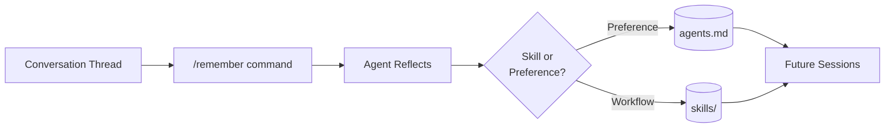

## Key Takeaways

- Agents starting fresh each session lose valuable context accumulated during conversations
- The `/remember` slash command injects a reflection prompt into the conversation, triggering the agent to analyze the thread and extract learnings
- Persistent storage uses the file system: `agents.md` for preferences and user context, plus skill files for reusable workflows
- Agents can update memory organically during conversation when users say "always do this" or "this is a good workflow"
- Users retain full control—if `/remember` doesn't behave as expected, direct instructions override automated extraction

## The /remember Flow

::

## How It Works

The flow has three steps:

1. **User invokes `/remember`** — A prompt gets injected into the thread instructing the agent to review the conversation and capture valuable knowledge
2. **Agent reflects** — It analyzes the full conversation context, identifies best practices, and decides where to store each learning
3. **Agent writes to persistent storage** — Preferences go to `agents.md`, reusable workflows become skill files

## Storage Structure

The file system serves as agent memory:

- **agents.md** — User preferences, ways of working, team context
- **skills/** — Reusable workflows (e.g., "utility testing skill" with test-first development steps)

## Notable Quotes

> "Your thread is so good and you wish that you could bottle that up, bottle the information that you've shared in that thread and have the agent remember that."

> "At the end of the day you have full control—if you decide 'I want this to be a skill' or 'I want this added to agents.md', you can just instruct the agent to do that."

## Connections

- [[claude-code-continuous-learning-skill]] - Implements the same pattern for Claude Code: extracting reusable knowledge from debugging sessions and saving it as skills for future sessions
- [[agents-md-open-standard-for-ai-coding-agents]] - The `agents.md` file format this feature writes to, providing AI agents with project-specific guidance
