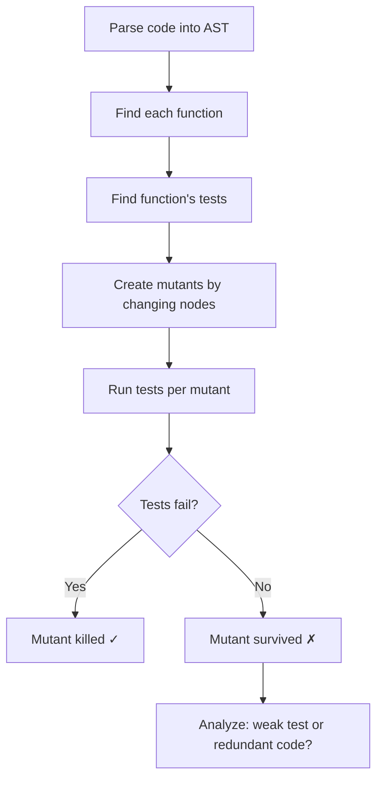

## Overview

Dave Aronson introduces mutation testing as a technique for evaluating test suite quality. Unlike traditional testing which checks code correctness, mutation testing assumes the code works and asks: "Are my tests strict enough to notice bugs?"

## Key Arguments

### Code Coverage Is a Negative Indicator

Coverage reports which lines your tests execute, but says nothing about whether correctness matters to those tests. A test can "cover" code while making no meaningful assertions about it—like running a function but throwing away the result.

> "The only thing that code coverage tells us is that some tests executed those lines of code shown in green. It tells us nothing about whether the correctness of that code made any difference to whether the test passed or failed."

Coverage is most useful in its absence: uncovered code definitely isn't tested. Covered code might be tested well, poorly, or not at all.

### Mutation Testing Checks Two Qualities

1. **Code is meaningful** - Every tiny change produces a noticeable effect on behavior
2. **Tests are strict** - The test suite notices changes and fails

The tool creates "mutants" (copies of code with one small change), runs tests against each, and reports which survive. Surviving mutants mean either the code is redundant or the tests are weak.

### How Mutations Work

::

Mutation operators include:

- Arithmetic swaps (`+` → `-`, `*` → `/`)
- Comparison changes (`<` → `<=`, `==` → `!=`)
- Logical inversions (`&&` → `||`, insert negation)
- Removing lines, loop controls, or entire function bodies

### Why Only One Mutation Per Mutant

The **competent programmer hypothesis** assumes developers make small mistakes, not catastrophic ones. Multiple mutations might cancel out (swapping arguments twice returns to original), and single mutations help humans understand what the mutant is revealing.

## Practical Takeaways

- **Start small**: Test specific files, classes, or just what changed since last commit
- **Interpret carefully**: Surviving mutants require investigation—some are false alarms (debugging logs, equivalent mutations)
- **Use incrementally**: Run on changes, not entire codebase
- **Improve tests or remove code**: Surviving mutants mean either add stricter tests or delete redundant code

## Notable Quotes

> "Mutation testing checks that every possible tiny little change to the code has a noticeable effect on the behavior of that code and that our test suite is strict enough to notice that change and fail."

> "Test coverage is what I call a negative indicator. It's actually more useful in its absence than its presence."

## Connections

- [[mutation-testing-skill]] - Provides a systematic manual approach to mutation testing during code review, applying the concepts Dave teaches here
- [[stryker-mutator]] - A mutation testing framework that automates the process described in this talk for JavaScript, TypeScript, C#, and Scala
