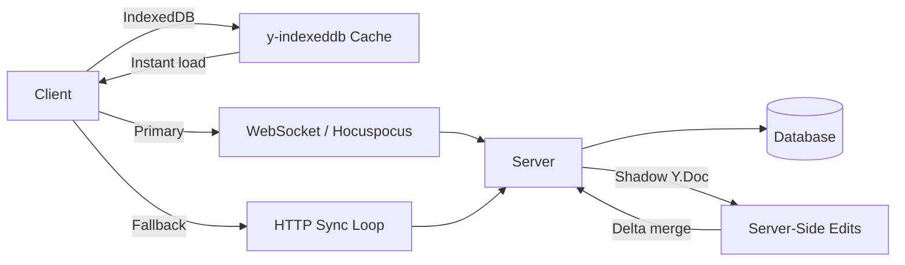

## Summary

Palanikannan recaps his first international conference talk at FOSDEM 2026 about building Plane's collaborative Wiki on Yjs. The article distills hard production lessons: a dependency upgrade once killed seven pods, yet zero user data was lost because CRDTs handled convergence through careful design. The piece covers the architecture choices, debugging war stories, and operational patterns that took Plane from demo to production-grade local-first software.

## Key Concepts

- **Save the binary** — The Y.Doc binary is the source of truth, not JSON or HTML. Plane initially stored JSON and converted on demand, which caused duplicate content when Hocuspocus skipped persisting on read-only opens. The fix: persist the binary immediately after conversion.
- **Never overwrite, always merge** — CRDTs converge through operation merging. Wholesale document replacement turns a collaborative editor into Dropbox. This principle applies at both the Yjs layer and the storage layer.
- **HTTP fallback for dead WebSockets** — When sockets die, an HTTP loop fetches the latest state, merges locally, and saves back. Because CRDT merges are idempotent, racing clients still converge on the next cycle.
- **Shadow Y.Doc for server-side edits** — To edit documents server-side without stomping live user edits, Plane clones into a shadow doc, runs changes there, computes the delta, and merges back. Yjs handles the rest.
- **Force-close with app-specific codes** — Oversized documents (50MB image pastes) can deadlock the gateway. Plane detects these and force-closes WebSockets with custom close codes (4001 for doc too big, 4002 for memory pressure), broadcast through Redis so every server drops the doc.

## Architecture



::

## Code Snippets

### Persisting the binary after conversion

Snapshot the full Y.Doc to avoid the read-without-save trap.

```typescript
const base = new Doc();
applyUpdate(base, encodeStateAsUpdate(ydoc));
```

### Shadow Y.Doc for non-destructive server edits

Clone, edit, compute delta, merge back — users keep typing.

```typescript
const base = new Doc();
applyUpdate(base, encodeStateAsUpdate(ydoc));
const update = encodeStateAsUpdate(base, encodeStateVector(ydoc));
applyUpdate(ydoc, update); // CRDT merge into live doc
```

### Force-close codes for oversized documents

Custom WebSocket close codes broadcast through Redis.

```typescript
export enum CloseCode {
  FORCE_CLOSE = 4000,
  DOCUMENT_TOO_LARGE = 4001,
  MEMORY_PRESSURE = 4002,
  SECURITY_VIOLATION = 4003,
}
```

## The Debugging Story

Plane upgraded to Hocuspocus v3, rolled out on a Friday, and a large customer onboarded the same day with massive tables. Memory climbed, pods restarted, WebSockets dropped. The bug: `process.nextTick` runs before Promise continuations, so the unload check ran before a debounce flag cleared. Documents stayed in memory forever. The fix was an `afterExecution` callback that runs after the flag clears — deterministic cleanup instead of event loop roulette.

## What to Monitor

- Docs per pod (scaling signal)
- Memory per doc (binary size as proxy)
- Update rate (who's hammering the server)
- Persist latency and failures (early warnings)
- Force-close codes 4001/4002 (overload indicators)
- Time-to-first-content (is caching working?)

## Connections

- [[a-gentle-introduction-to-crdts]] — Provides the theoretical CRDT foundation that Palani's production war stories put to the test
- [[local-first-software]] — The foundational essay defining the paradigm Plane's Wiki implements: user-owned data that survives server outages
- [[local-first-software-pragmatism-vs-idealism]] — Palani's talk is pure pragmatist territory: shipping CRDTs to real users and dealing with the sharp edges idealists rarely discuss
