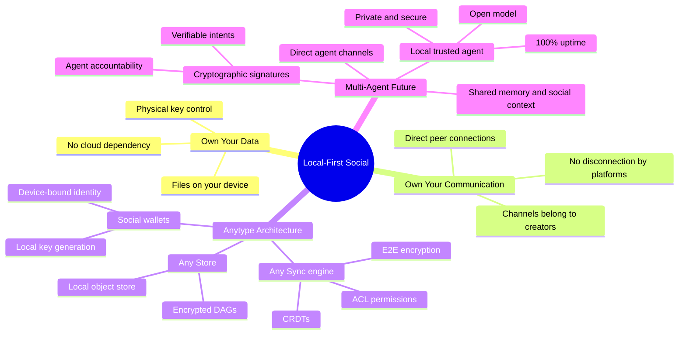

## Overview

Zhanna Sharipova, co-founder of Anytype, makes a move most local-first talks don't: she shifts the frame from data ownership to _relationship_ ownership. The familiar pitch — your files, your device, no cloud dependency — is the starting point, not the destination. The real argument: when software becomes social, the communication channel connecting people is as valuable as the data itself. Lose access to a cloud platform and you don't just lose your files — you lose your connections to hundreds or thousands of people.

She backs this with a personal anchor. She grew up in the part of the world map that was behind the Berlin Wall. The venue of Local-First Conf sits where that wall once stood. In 2025, digital walls are fortifying again — and a single click can sever your connections to friends, family, and communities.

## Key Arguments

### Data Ownership Is Necessary but Insufficient

The standard local-first pitch stops at "own your data." Sharipova argues this misses the social dimension. In a community of hundreds, your connections to those people become as valuable as the data — sometimes more. A local-first wiki for one person is solved. A local-first communication platform for communities is the hard problem.

### Anytype's Architecture: Channels You Own

Anytype's approach combines three layers: Any Sync (a CRDT-based sync engine with E2E encryption and ACL-based permissions), Any Store (a local object store), and social wallets (device-local key generation for identity). Every channel of communication is created locally, with keys generated on-device without internet. No one can revoke your access because no one granted it in the first place.

The demo showed chats that blur the line between messaging and structured data — a single space holds conversations, documents, feature requests, bug reports, and custom object types. Groups are highly customizable, combining chat, documents, and databases into one format.

::

### The Multi-Agent Future Needs Local-First Infrastructure

The most forward-looking section of the talk. Sharipova sketches a near future (1-2 years) where we're surrounded by hundreds of agents — every business, every channel, every environment running its own. This multi-agent world needs four foundations:

1. **Shared memory and social context** — agents need to know who knows whom, what relationships exist, and what information can be shared with whom
2. **Cryptographic signatures** — agentic capabilities can't scale if a hallucinating agent can book a $10,000 non-refundable trip on your behalf. Signatures make intents verifiable and agents accountable
3. **A local agent you trust** — your digital twin, running on an open model, on infrastructure you control, with 100% uptime across all your devices
4. **Direct communication channels** — agent-to-agent communication that's private and direct, protecting both data and the channel itself

The punchline: these four requirements map perfectly onto the infrastructure already being built for local-first social software. What's good for human digital independence turns out to be exactly what trustworthy AI agents need.

### MCP Server for Anytype

A bonus demo showed Anytype's local MCP server — published on npm, configurable from desktop settings. An AI assistant used it to automatically create structured data (speakers, talks, schedules) in an Anytype space from a conference agenda, showing the practical bridge between local-first data and AI tooling.

## Notable Quotes

> "Local first social is about owning not only just your data but also your communication channel."
> — Zhanna Sharipova

> "In no way can agentic capabilities scale if a hallucinating agent can book a $10,000 non-refundable trip for you by mistake."
> — Zhanna Sharipova

## Practical Takeaways

- Local-first social is the harder, more valuable problem than local-first personal — it requires solving identity, permissions, and channel ownership without a central authority
- Anytype's chat release (expected mid-2025) will test whether combining messaging + structured data + local-first can actually replace cloud social tools
- The MCP server pattern — local-first apps exposing their data to AI agents — could become a standard integration model

## Connections

- [[local-first-software]] — The foundational Ink & Switch essay that Sharipova explicitly references with her "owning your data in spite of the cloud" framing, but she extends the thesis from data to communication channels
- [[safe-in-the-keyhive]] — Brooklyn Zelenka's talk at the same conference tackles the exact cryptographic access control layer (E2EE + capabilities) that Anytype's architecture depends on
- [[a-social-filesystem]] — Dan Abramov argues social data should behave like portable files; Sharipova goes further — it's not just the data that should be portable, but the entire communication channel
- [[local-first-the-secret-master-plan]] — Peter van Hardenberg's vision of malleable software connects to Anytype's customizable groups where users create their own object types and templates
- [[the-ux-of-local-first]] — Eileen Wagner's talk from the same conference surfaces the UX challenges that Anytype's chat-meets-database approach will need to solve for mainstream adoption
