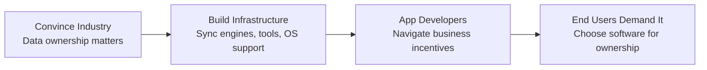

## Overview

Adam Wiggins, co-founder of Heroku and Ink & Switch, frames local-first as a technology movement following the same pattern as encrypted browsing and the open web: idealists articulate the vision, pragmatists build practical solutions, and decades later the world transforms.

## Key Arguments

### The Pattern: Idealists and Pragmatists Together

Two historical precedents illustrate the partnership:

**Cypherpunks → SSL → Let's Encrypt:** In the 1990s, export restrictions treated strong encryption as weapons technology. Cypherpunks declared privacy a digital right. Pragmatists built HTTPS into browsers with the green lock icon. Decades later, Let's Encrypt made encryption free and instant. The encrypted web we rely on today couldn't exist without both camps.

**Free Software → Open Web:** The 1989 GPL seemed pie-in-the-sky—give away source code? GCC proved it could work. The LAMP stack democratized web development. Fights over Flash versus open standards eventually led to HTML5. The web platform exists because idealists held the line on openness while pragmatists shipped working tools.

### Data Ownership as the Core Ideal

Local-first isn't about technology preferences—it's about who controls creative output. Wiggins asks pointed questions about email archives, book manuscripts, and business data:

- Can you easily make a backup?
- Can you delete data and know it's gone?
- Can you run ad-hoc scripts against it?
- What happens if you violate terms of service?
- What happens when the vendor sunsets the product?

The pragmatist says these scenarios rarely matter. The idealist says the creative work belongs to you regardless.

### The Seven Ideals: Progress Report

The [[local-first-software]] essay proposed seven ideals. Wiggins observes that modern sync engines deliver the first four almost for free:

1. ✅ No spinners, lightning-fast UI
2. ✅ Network is optional
3. ✅ Multi-device sync
4. ✅ Seamless collaboration

The remaining three remain aspirational: 5. ⏳ The Long Now (data accessible indefinitely) 6. ⏳ Privacy by default 7. ⏳ Full user control

### Where Data Lives Matters Less Than Permissions

Wiggins has shifted emphasis from "complete copy on device" to "whose permission do I need?" Programmatic access via APIs and breaking down app silos matter as much as local storage. When you can write scripts against your data and combine sources freely, you have real ownership.

### Agents Will Reignite the Data Ownership Fight

LLM agents searching across email, chat, and messages need the same data access local-first advocates have pushed for. MCP creates an LLM-friendly wrapper for APIs, but software vendors remain incentivized to lock data up. Expect Gmail MCP access to be deliberately limited—Google wants you in their UI seeing their ads with their agent.

## The Movement's Road Ahead

::

Four steps to cross the finish line:

1. **Convince the industry** these ideals matter—even as aspirational goals
2. **Build infrastructure** so the pragmatic choice also provides ownership benefits
3. **Help app developers** navigate business incentives that favor lock-in
4. **End users demand it**—the dream is a book author choosing a word processor because it guarantees ownership

## Notable Quotes

> "We became borrowers of our own data."

> "I'm increasingly caring less about where data resides and more about whose permission I need to use that data."

> "Software vendors are incentivized to keep data locked up. I don't hold that against them—it's a business incentive."

## Practical Takeaways

- Technology movements take 30+ years from first agitations to mainstream adoption
- Sync engines now deliver fast UIs and collaboration nearly for free—the pragmatic case is strong
- Agents will force data ownership fights into the mainstream soon
- Both idealism (vision) and pragmatism (implementation) play essential roles at different stages

## Connections

- [[local-first-software]] - The original essay Wiggins co-authored, defining the seven ideals this talk revisits
- [[the-past-present-and-future-of-local-first]] - Kleppmann's complementary talk from the same conference, proposing a sharper definition
- [[file-over-app]] - Steph Ango's articulation of the same ownership philosophy: apps are ephemeral, files endure
