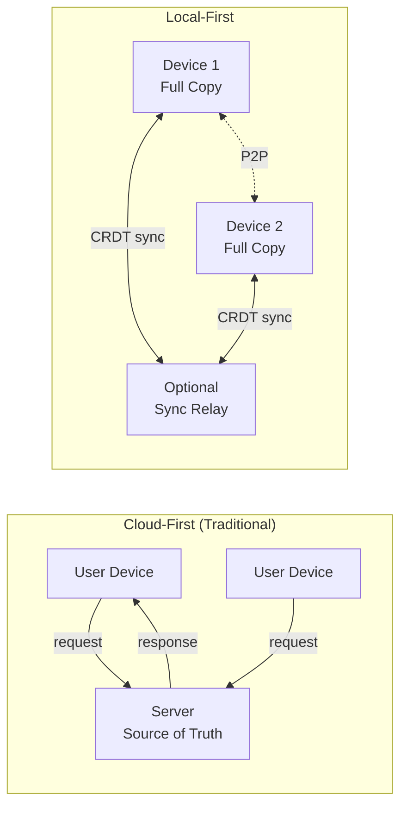

## Core Message

Cloud software made us renters of our own data. Local-first software reverses this: data lives on your device first, syncs through servers optionally, and survives even when the developer disappears. CRDTs make this possible by merging concurrent edits automatically.

## Key Takeaways

- **The spark came from frustration** - Adam Wiggins recalls music stopping mid-tunnel because the streaming app required a server connection. "Where did my playlist go? Why have we done this to ourselves?"

- **CRDTs dissolved the ownership-collaboration tradeoff** - Martin Kleppmann discovered conflict-free replicated data types through an algorithms paper and realized they could give "power back to users again."

- **The name crystallized a movement** - What started as "serverless software" became "local-first" in 2019 when Ink & Switch published the foundational essay. The name gave scattered efforts a rallying point.

- **Production apps prove the model** - Figma and Linear dominate their categories precisely because local-first architecture delivers instant responsiveness. They invested millions building custom sync engines—frameworks like Jazz now democratize access.

- **Servers become supporting cast** - Local-first doesn't mean serverless. Cloud infrastructure handles backup, discovery, and bridging between devices. The shift: servers support rather than own.

- **End-to-end encryption becomes natural** - When data lives locally and servers only sync encrypted blobs, privacy stops being a feature layered on top and becomes intrinsic to the architecture.

## Visual Model

::

## Notable Quotes

> "I was listening to music from station to station. It would go into tunnels where there was no cell service. And the music I was listening to stopped and the playlist disappeared. I thought, where did it go?"
> — Adam Wiggins

> "Your software should be instantaneously responsive to you all the time."
> — Martin Kleppmann

> "It's your data now and forever."

## Featured Voices

The documentary interviews key figures from the local-first movement:

- **Martin Kleppmann** - Associate professor at Cambridge, co-author of the foundational local-first essay
- **Adam Wiggins** - Founder of Heroku, Ink & Switch, and Muse
- **Peter van Hardenberg** - Lab director at Ink & Switch
- **Ray McKenzie** - Product manager at Ditto (sync engine company)

## Connections

- [[local-first-software]] - The foundational Ink & Switch essay that this documentary visualizes and contextualizes through interviews with its authors
- [[the-past-present-and-future-of-local-first]] - Martin Kleppmann's conference talk expanding on the definition and future vision discussed in this documentary
- [[a-gentle-introduction-to-crdts]] - Technical deep-dive into the CRDT technology that makes local-first collaboration possible
