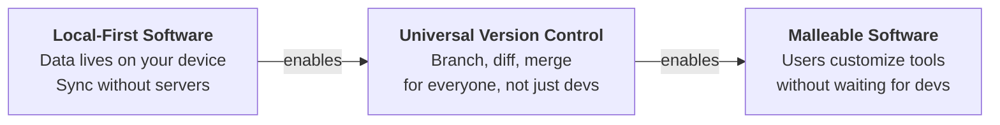
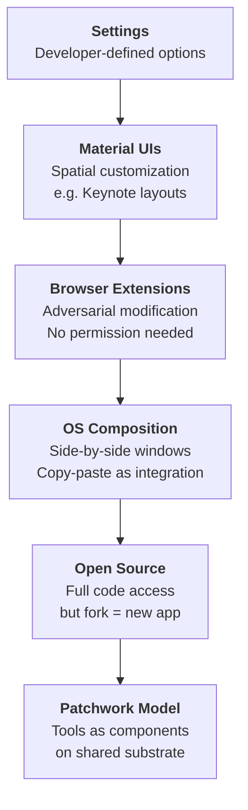

## Overview

Peter van Hardenberg opens by confessing the whole local-first movement has been "an elaborate ruse." The real agenda is a three-part master plan: local-first software enables universal version control (for everyone, not just developers), which in turn enables malleable software where users customize and extend their tools. He grounds this in a 75-year research lineage from Vannevar Bush to Licklider to Engelbart, positioning Ink & Switch not as a startup but as a continuation of the tools-for-thought tradition.

::

## Key Arguments

### The Tools-for-Thought Lineage

Peter doesn't frame local-first as a sync strategy. He frames it as the latest chapter in a research program stretching back to Vannevar Bush's Memex (1945) and Licklider's "Man-Computer Symbiosis" (1960). Even when computers filled four-story buildings and barely worked, Licklider saw that humans and computers would think together. Ink & Switch positions itself explicitly in this lineage — alongside Xerox PARC and Engelbart's Mother of All Demos.

The provocative counterfactual: computing grew from the typewriter tradition (Bell Labs teletypes), but Ivan Sutherland had a tablet and spatial manipulation (Sketchpad, the first CAD software) on a room-sized computer. What if the spatial/visual tradition had won instead of the text/terminal tradition? Ink & Switch's work on TLDraw integration and spatial tools isn't incidental — it's a historically motivated bet.

### The Shame of Cloud Workarounds

Peter catalogs how professionals actually work around cloud software's failures. A globally known media organization has journalists paste text into a CMS where editors reply in bold, then journalists copy it back out. A copy editor was taught Git and GitHub, given full repo access to a markdown essay — and proceeded to copy everything into Google Docs, do all editing there, then manually transcribe each comment back into the PR.

The lesson isn't "Git is hard." It's that people will use their own tools regardless of what you offer. And the industry should feel shame about that.

> "I say them in shame and humility that we have so utterly failed as an industry."

### Universal Version Control

Version control shouldn't require Git expertise. Writers want creative privacy before sharing drafts with editors. Designers spatialize their version history across artboards. Journalists copy documents to shadow IT systems just to work privately.

> "We are hoarding all these tools for ourselves. And how could we ever share a tool as obvious and as intuitive and as wonderful as Git?"

Automerge captures every change intrinsically. The same infrastructure that syncs changes between computers can move them between document versions — branching and merging for any document type, not just plain text.

### Patchwork: Version Control for Everyone

Their prototype editor Patchwork demonstrates the vision:

- Branch a document for private editing with automatic change tracking
- Toggle change highlighting on or off as needed
- Send branches for review with inline comments
- Merge approved changes back to main

The same capabilities extend to diagrams (via TLDraw) and spreadsheets — developers only implement highlighting, not the entire version infrastructure. Patchwork evolved from Upwelling, their 2023 prototype by McKellar, Jensen, Wagner, Cook, Sun, and Kleppmann.

### Formality on Demand

Early-stage work needs minimal friction; late-stage work needs formal review. Patchwork supports the full spectrum without forcing either. This is a named design principle, not just a feature — informal editing feels like any other editor; formal review surfaces when needed.

### AI Collaboration as Version Control

LLM collaboration is fundamentally a version control problem. An AI can wreck your document in 16 seconds flat. Version control primitives — branches, diffs, review, revert — become essential for AI collaboration, not just offline sync.

> "The AI can make problems for you in 16 seconds. That's progress."

Peter specifically calls out Anthropic's Claude artifacts as an example of AI-generated software that falls short: the app is ephemeral, cannot persist state, forgets you were there, cannot be shared. Patchwork positions itself as solving the persistence and collaboration gap that AI-generated throwaway apps leave open.

### The Spectrum of Existing Malleability

Before introducing Patchwork's model, Peter maps five levels of malleability already present in software — each with specific tradeoffs:

::

The Bank of America example is telling: someone built a browser extension that adds checkboxes to transaction records. No PM would ever sign off on that feature. But for the 200 people who use it, their life is meaningfully improved.

> "No PM at the Bank of America is going to sign off on that feature. But if you're one of those 200 people, your life is meaningfully improved."

### Malleable Software

Apps silo data and interoperate only when vendors cut business deals — Google Calendar connects to Zoom not because it serves users, but because someone signed a contract. A well-appointed woodworking shop or kitchen lets craftspeople build anything with general-purpose tools. Software should work the same way.

Patchwork is extensible: tools are React components that receive an Automerge document. Anyone can write a new tool in Cursor, push it with their CLI, and install it — affecting only their instance. No permission needed. Share tools like any other document.

Peter emphasizes that Patchwork is not a demo — they live in it. Their newsletter is written there, their Monday planning board runs there, Jeff Lit built a Monte Carlo baby-due-date predictor for a real decision. They call this research strategy "making a mess" — dogfood aggressively, let pain points emerge organically.

> "We really use this. We have this fearlessness now to make new things that are bad and maybe stupid but are interesting and kind of fun."

### Honest Self-Critique

Peter devotes significant time to what's broken. No tool versioning — collaborators get confused when a tool author pushes changes. No schema evolution (their Cambria project hasn't been reintegrated). [[safe-in-the-keyhive|Keyhive]] end-to-end encryption isn't ready for sharing beyond their team. The demo crashed live. He frames this candor as a privilege of being a lab rather than a company.

### Holistic vs. Prescriptive Technologies

The closing philosophical framework comes from Ursula Franklin, a Canadian physicist and pacifist. Franklin distinguishes prescriptive technologies (where every participant operates under central control, like bronze-age cauldron manufacturing) from holistic technologies (where a single potter with wheel and kiln has full creative agency).

Peter applies this directly: tool builders choose whether they propagate holistic or prescriptive technologies. The stakes aren't just capability — they're whether people even dream of having agency over their tools.

> "If you make tools that place them into prescription, you don't just take away their power, but in some ways you take away their dream of having power."

## Notable Quotes

> "What I dream of as the ultimate result of our work at Ink & Switch is a world where more people are tool users rather than app buyers."

> "Your scientists were so preoccupied with whether they could do it. They didn't stop to think if they should."
> — Dr. Ian Malcolm (on sync engines that only converge, ignoring the creative need for divergence)

> "If it's bad and useless, well, that's your problem."
> — on installing personal tools in Patchwork without needing permission

## Practical Takeaways

- Design sync engines for divergence and experimentation, not just convergence
- Version control primitives become critical for AI collaboration — branches, diffs, review, revert
- "Formality on demand" lets systems serve both casual and rigorous workflows
- Tools as plugins (not monolithic apps) restore user agency
- Small, personal tools that serve 200 people still matter — not everything needs a PM
- AI-generated software needs a persistent, version-controlled substrate to be useful beyond ephemeral prototypes

## Connections

- [[local-first-software]] — The foundational essay van Hardenberg co-authored; this talk reveals where that research program was always heading
- [[the-past-present-and-future-of-local-first]] — Martin Kleppmann's companion talk at the same conference, covering the technical evolution that makes this vision possible
- [[malleable-software]] — Ink & Switch's detailed research essay on the endgame Peter unveils here
- [[home-cooked-software-and-barefoot-programmers]] — Maggie Appleton's talk at the same conference argues LLMs will create "barefoot developers" who build personal tools; Peter's Patchwork is exactly the substrate they'd build on
- [[file-over-app]] — Steph Ango makes the philosophical case for data ownership; Peter operationalizes it with a platform where tools come and go but documents persist
- [[safe-in-the-keyhive]] — Brooklyn Zelenka presents Keyhive, the E2EE layer Peter acknowledges as unfinished but critical for Patchwork's sharing model
- [[the-ux-of-local-first]] — Eileen Wagner, who co-built Upwelling (Patchwork's predecessor), identifies the UX gaps that still stand between this vision and mainstream adoption
