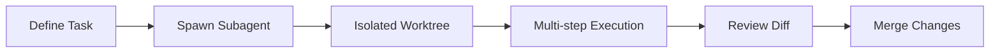

## Summary

Subagents function as isolated Copilot Chat sessions invoked via `#runSubagent`. They operate in separate Git worktrees, preventing changes from affecting your main workspace until you approve them. The key value: agents can run multi-step workflows autonomously while you continue working.

## Key Concepts

- **Isolation**: Work happens in separate worktrees, protecting your main branch
- **Autonomy**: Multi-step flows execute without constant intervention
- **Focus**: One subagent handles one task, avoiding chat pollution
- **Tools requirement**: The hammer/wrench icon must be enabled in Copilot Chat
- **No nesting**: Subagents cannot invoke other subagents

## Subagent Workflow

::

## Practical Use Cases

| Use Case                    | What the Subagent Does                                                                  |
| --------------------------- | --------------------------------------------------------------------------------------- |
| **Refactoring**             | Analyzes problematic files in isolation, proposes changes, generates reviewable diffs   |
| **Test Generation**         | Scaffolds testing framework, generates test files, runs tests, summarizes coverage gaps |
| **Security Scanning**       | Pre-release static analysis in isolated branches                                        |
| **Documentation**           | Batch JSDoc additions, README generation, formatting across codebase                    |
| **Multi-Service Debugging** | Aggregates logs and proposes hypotheses across systems                                  |

## Orchestration Patterns

Multi-step refactors benefit from structured instructions guiding analysis → proposal → application sequences. Pair Plan Mode (for strategy) with subagents (for execution) to create structured, transparent workflows.

## Safety Guidance

- Review all tool-execution prompts before approval
- Prefer isolated branches
- Treat subagent output with same scrutiny as junior developer contributions
- Restrict sensitive data exposure
- Respect organizational governance policies

## When to Use Subagents

Reserve subagents for tasks that:

- Would exceed 30 minutes of manual work
- Involve multi-file changes
- Are structured but tedious

Effective prompts specify file paths, expected outputs, and constraints clearly.

## Connections

- [[using-agents-in-vscode]] - Subagents are one execution mode within VS Code's broader agent architecture; this explains the four agent types and session management
- [[moc-vscode-ai-coding]] - The map connecting all VS Code AI tooling notes including Copilot workflows
