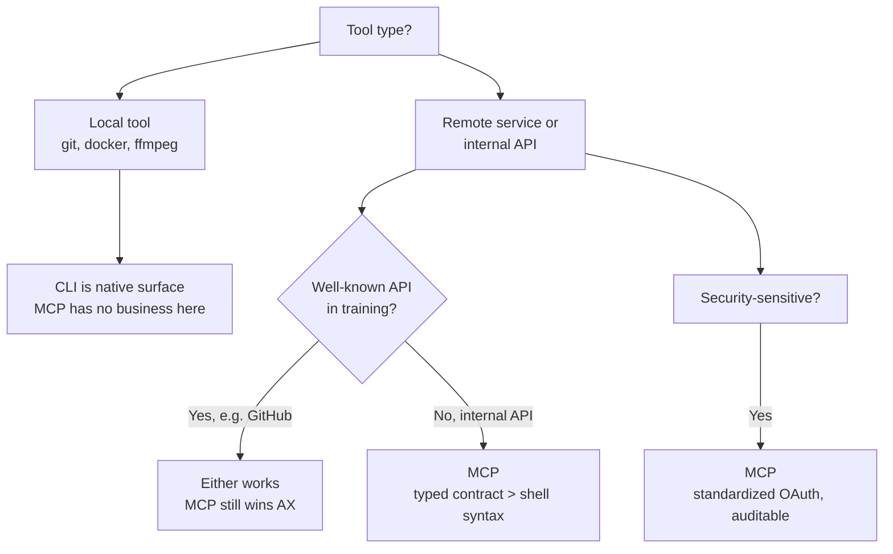

## Core Argument

The X debate treated MCP and CLI as rivals. Smithery ran 756 benchmarks holding the backend and task fixed, varying only the surface the agent sees. The answer isn't tribal — it's situational, and most arguments conflate three separate concerns.

The three questions people pretend are one:

1. **AX** — how agents discover and invoke capabilities
2. **UX** — how humans install, debug, and trust the tool
3. **Standardization** — how auth, approvals, and governance work

Most victories declared online only settle one axis.

## The Benchmark Ladder

Same API, same task, only the interface changes:

| Condition                                 | Success rate |
| ----------------------------------------- | ------------ |
| Raw curl, no docs                         | 53%          |
| Raw curl + OpenAPI specs                  | 76%          |
| CLI flat (no descriptions)                | 46%          |
| CLI tree + descriptions                   | 79%          |
| CLI + descriptions + search (826 tools)   | 88%          |
| Native MCP tools                          | 92%          |
| Native MCP (full 826-tool GitHub catalog) | 100%         |

On successful runs, CLI burned **2.9× more tokens** and **2.4× more latency** than native MCP — the cost comes from browsing with `list`/`describe`, parsing JSON, and serializing args back through a shell. MCP collapses that into structured calls.

## Key Insights

- **Specs buy correctness; native tools buy efficiency.** Docs alone lift agents from 53% → 76%, but they pay in tokens spent reading. MCP skips the reading step.
- **Descriptions matter more than hierarchy.** A tree without descriptions performed identically to a flat list (both 46%). Structure without semantic context is wasted — the agent just wanders branches blindly.
- **API familiarity changes everything.** GitHub hit 92% success on raw curl. Linear managed 17%. Singapore Bus (niche, post-cutoff data) hit 42%. The less the model has seen your API, the more the interface has to carry the load.
- **GraphQL's expressiveness is a trap.** 17% success at 5× the tokens of MCP. Models can introspect the schema but can't synthesize Linear-specific query shapes for compound tasks. Ten specific tools beat one generic tool that can do anything.
- **Harnesses should own context engineering.** Early MCP authors hand-crafted servers to compensate for weak models. That got steamrolled. The bitter lesson: don't over-optimize the interface to today's model weaknesses. The "agent-first CLI" fashion risks repeating the mistake in a new form.
- **Private = Skill. Public = MCP.** Skills carry workflow-specific behavior your team needs. MCP carries what's general to the tool itself and should be vendor-maintained.

## Where Each Wins

## Productive Tension

This contradicts [[playwright-cli-vs-mcp]], which benchmarked Playwright and found the opposite: CLI saved **4× tokens** over MCP for browser automation. Both sides claim benchmark evidence — which is actually the point of this article. The Playwright case is a _local tool_ with filesystem access, so the agent can dump accessibility snapshots to disk. Smithery's benchmark is _remote APIs_ where every tool call round-trips through the model loop. The situational answer holds: Playwright's CLI wins for the same reason git's CLI wins — it's a local tool. Neither result invalidates the other.

It also gives a qualified response to [[why-model-context-protocol-does-not-work]], which argued MCP's flaws are really LLM limitations around context bloat. Smithery agrees the bloat is real — that's why their CLI needed descriptions + search to get close to MCP. But they argue the harness is the right place to solve it, not the protocol. [[code-mode-mcp]] is the same debate from another angle: Cloudflare's answer is `search()` + `execute()` in a sandbox; Smithery's answer is "let the native harness inject MCP tools."

Three independent benchmarks in three months, all reaching different conclusions about the same protocol. The convergent takeaway: **the interface debate is downstream of API quality and the harness's context budget.** Stripe built a company on "APIs are products." If the API is well-designed, MCP is just packaging.

## Why I Saved This

Useful framing for the ongoing MCP-skepticism wave. The honest answer isn't "MCP is dead" or "MCP is essential" — it's that the question is wrong. Local tools belong in CLIs. Remote services with no training priors belong in MCP. Everything else depends on how good your harness and your API already are.

The "don't over-optimize the interface to today's model weaknesses" line is the one I'll keep coming back to. It generalizes beyond MCP — it's a principle for every abstraction built on top of LLMs right now.
