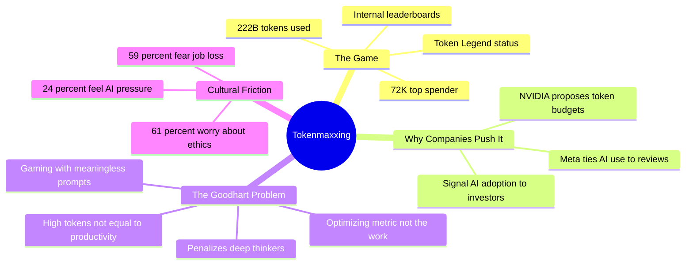

## Summary

Meta employees are competing on internal leaderboards to earn "Token Legend" status — a ranking based on how many AI tokens they consume. Meta became the first major tech company to formally tie AI usage to performance reviews in 2026. The top spender burned through $72K worth of tokens on a single account — 222.7 billion tokens, enough to fill Wikipedia 33 times over.

The trend, dubbed "tokenmaxxing," has spread beyond Meta. NVIDIA's Jensen Huang proposed offering engineers token budgets alongside base salaries, calling them "one of the recruiting tools in Silicon Valley." The message from management is clear: use AI or fall behind.

## The Goodhart Problem

This is Goodhart's law in real time: "When a measure becomes a target, it ceases to be a good measure." Token consumption tells you nothing about whether someone solved a hard problem or just ran loops of meaningless prompts. The metric rewards volume, not judgment.

The uncomfortable question: what happens to the developer who thinks deeply for two hours, writes a clean solution, and barely touches the AI? Under this system, they look less productive than someone who spams prompts all day.

## The Numbers Behind the Hype

A MetLife study paints a more nuanced picture of how workers actually feel:

- **61%** worry about ethical and safety risks of AI at work
- **59%** fear AI will make their jobs obsolete
- **24%** feel pressured competing with AI tools
- **67%** of employers acknowledge AI creates management friction

Yet a Gensler survey of 16,400 workers found that "AI Power Users" (30% of employees) actually spend _less_ time working alone and _more_ time learning and socializing. The heaviest AI users aren't isolated prompt-machines — they're the most collaborative people in the office.

## Why This Matters

There's a real tension here. AI tools genuinely accelerate certain work — reducing boilerplate, speeding up research, handling the mundane. But turning token consumption into a leaderboard sport misses the point entirely. The value isn't in how many tokens you burn. It's in what you build with them.

The companies that get AI adoption right will measure outcomes, not inputs. The ones that get it wrong will optimize for the metric and wonder why the work didn't improve.

## Connections

- [[the-end-of-coding-andrej-karpathy-on-agents-autoresearch-and-the-loopy-era-of-ai]] — Karpathy frames productivity as "tokens commanded per second," which is exactly the philosophy Meta is now formalizing into performance reviews
- [[what-silicon-valley-gets-wrong-about-ai]] — Gergely Orosz's critique of AI hype vs. reality maps perfectly onto the tokenmaxxing phenomenon: confusing adoption metrics with actual productivity gains
