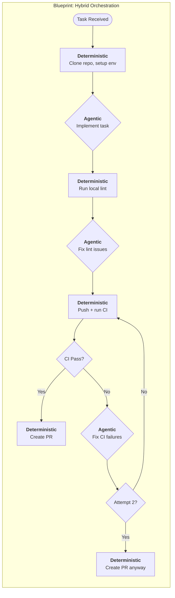

## Summary

Part 2 of Stripe's Minions series goes deeper on the infrastructure that makes autonomous coding work at scale. The headline: they've grown from 1,000 to 1,300+ merged PRs per week. But the real insight isn't the number — it's the architectural pattern that got them there.

The key concept is **Blueprints** — a hybrid orchestration model that puts LLMs in contained boxes. Instead of giving agents full autonomy over the entire workflow, Blueprints split tasks into deterministic nodes (git operations, linting, CI) and agentic nodes (code generation, fixing failures). The LLM handles what it's good at. Everything else stays predictable.

This is the same pattern [[12-factor-agents]] advocates, but now we're seeing it validated at serious scale.

## Key Insights

- **Blueprints are the real innovation.** Hybrid orchestration that mixes deterministic and agentic steps. Setup, lint, push, and PR creation are hardcoded. Code generation and fixing are agentic. This reduces token usage, improves reliability, and lets teams customize workflows without touching agent internals. The phrase that captures it: putting LLMs in contained boxes.

::

- **Toolshed grew from 400 to 500 MCP tools.** Stripe's centralized MCP server now houses nearly 500 tools for documentation, tickets, build statuses, and code intelligence. The tool discovery layer matters more than any individual tool — agents get curated subsets, not the full firehose.

- **Rule files bridge humans and agents.** Stripe uses Cursor's standardized rule file format with directory-scoped and pattern-specific rules. The same rules work across Minions, Cursor, and Claude Code. No separate agent configuration — what works for humans works for agents.

- **Hard limits on CI iterations prevent waste.** One full CI run with automatic fixes, an optional second attempt, then stop. This is the pragmatic insight most agent builders miss: knowing when to stop matters as much as knowing how to fix. Diminishing returns hit fast when CI loops run unchecked.

- **Security through existing infrastructure.** Devboxes run in QA environments with no production access. A security controls framework restricts destructive MCP tool usage. The counterintuitive move: building for human safety first made agent safety nearly free.

## Connections

- [[minions-stripes-one-shot-end-to-end-coding-agents]] — Part 1 covers the foundational system (devboxes, Goose fork, MCP). Part 2 goes deeper on orchestration with Blueprints and shows the system scaling from 1,000 to 1,300+ weekly PRs.
- [[12-factor-agents]] — Blueprints are the 12-factor hybrid pattern at production scale. Deterministic workflows handle predictable operations while LLMs make strategic decisions — exactly what 12-factor advocates.
- [[building-effective-agents]] — Anthropic argues for simple composable patterns. Blueprints validate this: the orchestration layer is straightforward deterministic-then-agentic steps, not a complex framework.
- [[the-importance-of-agent-harness-in-2026]] — Toolshed growing to 500 tools reinforces the agent harness thesis. The model is commoditized; the harness (Blueprints + Toolshed + devboxes) is the competitive advantage.
