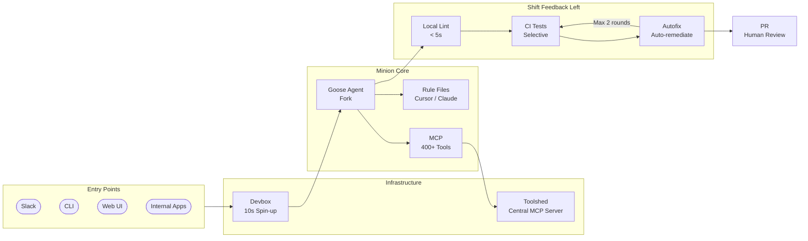

## Summary

Stripe built Minions because off-the-shelf coding agents can't handle their reality: hundreds of millions of lines of Ruby with Sorbet typing, extensive homegrown libraries, and a platform processing over $1 trillion annually. The result is a fully autonomous system that ships 1,000+ merged PRs weekly — all code generated by agents, all reviewed by humans.

The interesting bet here: Stripe didn't try to make agents understand their codebase from scratch. They built infrastructure that gives agents the same environment human engineers use, then layered on aggressive automated feedback to catch mistakes before humans ever see the PR.

::

## Key Insights

- **Custom agent forks over generic tools.** Stripe uses a customized fork of Block's Goose agent, interleaving agentic creativity with deterministic operations like git, linting, and testing. This isn't "plug in an API" — it's deep integration work that respects the boundaries between what LLMs are good at and what should stay deterministic.

- **Devboxes are the secret weapon.** Pre-warmed isolated machines spin up in 10 seconds, identical to engineer workstations. Isolated from production and the internet, they enable massive parallelization without permission checks. Engineers routinely run multiple minions simultaneously — especially during on-call rotations for resolving batches of small issues.

- **400+ tools via a central MCP server ("Toolshed").** Instead of giving agents raw access, Stripe curates tool subsets through Toolshed — connecting minions to internal docs, ticket details, build statuses, and Sourcegraph code intelligence. The curation layer is key: agents get what they need without drowning in tool sprawl.

- **"Shift feedback left" with hard limits.** Local lint executes in under 5 seconds. CI runs selective tests from Stripe's 3M+ test battery. Autofixes apply automatically where possible. But critically, there's a 2-round maximum on CI cycles — balancing completeness against token costs and diminishing returns. Knowing when to stop matters as much as knowing how to start.

- **Rule files bridge agent and human conventions.** Minions consume the same coding rule files from Cursor and Claude Code that human engineers use, with conditional application based on subdirectories. The philosophy: tools that work for humans translate to tools that work for agents.

- **1,000+ merged PRs weekly, but pragmatic about limits.** Incomplete runs still produce valuable starting points. The goal is zero-human-code PRs, but the current reality acknowledges that some tasks need human refinement. This honesty about limitations is refreshing compared to the hype cycle.

## Connections

- [[harness-engineering-leveraging-codex-in-an-agent-first-world]] — OpenAI's parallel story: Codex producing 1,500 PRs on a million-line codebase with zero human-authored code. Same thesis (agents write, humans review), different infrastructure choices.
- [[building-effective-agents]] — Anthropic argues for simple composable patterns over complex frameworks. Minions validates this: the core is a fork of Goose plus deterministic tooling, not a novel framework.
- [[the-importance-of-agent-harness-in-2026]] — Stripe's Devbox + Toolshed architecture is exactly the "agent harness" Philipp Schmid describes. The harness — not the model — is the competitive moat.
- [[12-factor-agents]] — Factor agents advocates mixing deterministic workflows with strategic LLM decision-making. Minions does exactly this: git, lint, and test execution stay deterministic while the agent handles code generation.
