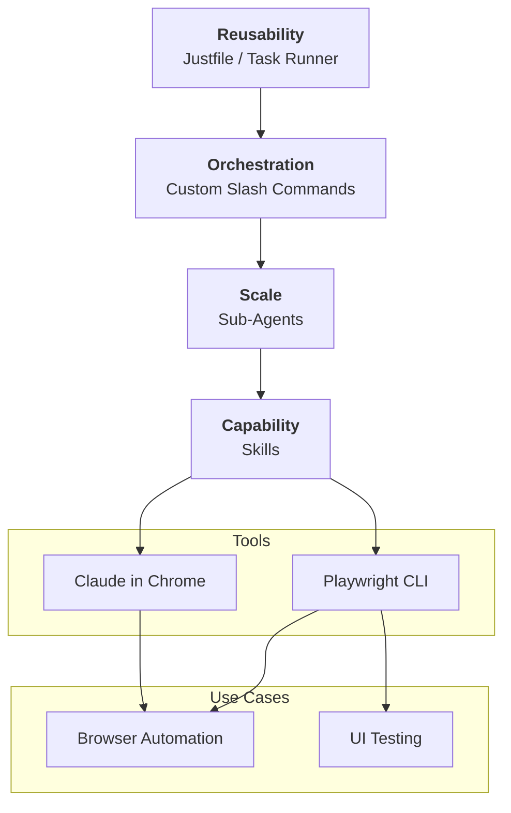

IndyDevDan lays out a layered architecture for browser automation that goes well beyond the "just write a skill" mindset most people are stuck in. The core insight: skills are the raw capability layer, but without agents to scale them, commands to orchestrate them, and a task runner to make them repeatable, you're solving individual problems instead of classes of problems.

## The 4-Layer Stack

::

1. **Skills** (Capability) — The foundation. Raw tools like a Playwright browser skill or a Claude-in-Chrome skill. This is where most people stop, and it's barely the beginning.
2. **Sub-agents** (Scale) — Specialized agents built on top of skills. A browser QA agent that takes a user story, works through it step-by-step, takes screenshots, and reports pass/fail. You can parallelize these — three agents running three user stories simultaneously.
3. **Commands** (Orchestration) — Custom slash commands that wire agents together. The `/ui-review` command spawns a team of agents, each validating a different user story, then merges results. This is where "higher order prompts" live — prompts that take other prompts as parameters.
4. **Justfile** (Reusability) — A task runner at the top that gives you and your team a single entry point. `j ui-review`, `j automate amazon`, `j chrome-browse`. One command to kick off any workflow.

## Key Takeaways

- **CLIs over MCP servers.** MCP servers chew tokens and lock you into their opinion. CLIs are cheaper, more flexible, and let you build your own opinionated layer on top. This is why Playwright CLI beats Playwright MCP for agent-driven testing.
- **Screenshot trails matter.** Every step in an agentic UI test produces a screenshot. When something fails, you get a visual breadcrumb trail of exactly what the agent saw. Traditional test frameworks give you stack traces — agents give you receipts.
- **Agentic UI testing vs. traditional tests.** The selling point: write a user story in plain English, point it at a URL, and let agents validate it. No test configuration, no selectors, no framework ceremony. The trade-off is non-determinism, but for many workflows that's acceptable.
- **Higher order prompts (HOPs).** A prompt that accepts another prompt as a parameter — like a function that takes a function. The consistent pieces (output directory, reporting format, screenshot behavior) live in the HOP. The specific workflow steps live in the inner prompt. Separation of orchestration from execution.
- **Don't outsource learning.** The sharpest line in the video: "Agentic engineers know what their agents are doing, and they know it so well, they don't have to look. Vibe coders don't know, and they don't look." Using someone else's skills and plugins without understanding the layers underneath means you'll always be limited by what they built.

## Notable Quotes

> "Code is fully commoditized. Anyone can generate code. That is not an advantage anymore. What is an advantage is your specific solution to the problem you're solving."

> "If you can't look at a library, pull it into a skill, build it on your own, scale it with some sub agents, and then orchestrate it with a prompt — you will constantly be limited."

> "There are entire classes of problems that you don't need to solve anymore if you teach your agents to solve that problem."

## Connections

- [[how-to-use-playwright-skills-for-agentic-testing]] — The Goose team's take on the same problem: Playwright + AI agents for browser testing. Dan's approach adds three layers on top of what that video covers at the skill level alone.
- [[the-complete-guide-to-building-skills-for-claude]] — Anthropic's official skill guide covers the foundational layer of Dan's stack. This video shows what comes after you've mastered skills: agents, orchestration, and reusability.
