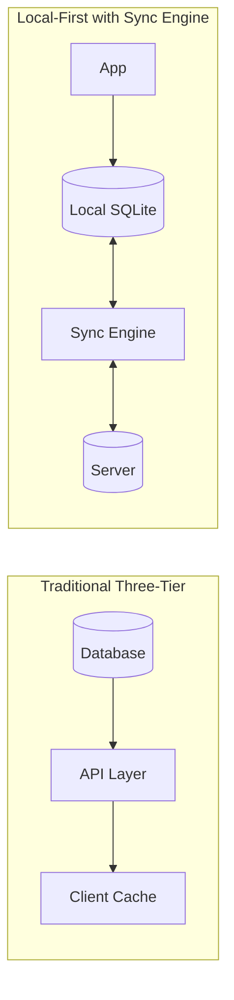

## Overview

Johannes Schickling argues that native app quality comes down to data architecture, not platform. The talk opens with Linear as inspiration—apps that just work, even offline, without spinners. He proposes sync engines as the declarative revolution for data management, paralleling what React did for DOM manipulation.

## Key Arguments

### Native Means Data, Not Platform

Four qualities define native-feeling apps: native UI, platform integration, speed, and data behavior. The first three get attention; the fourth determines whether an app can function in an elevator without connectivity. Apple Notes works everywhere because the data layer supports it.

### The Three-Tier Architecture Problem

Traditional web apps treat the database as the single source of truth. The API and client become caches, requiring constant synchronization: pagination, hydration, optimistic mutations, cache invalidation. Hundreds of lines of boilerplate just for a simple notes app.

### Sync Engines as the Solution

What if declarative queries replaced imperative data fetching? Instead of managing server round-trips, express what data you want and let the system handle synchronization. This is how Linear works under the hood. The concept parallels React's DOM abstraction—moving from jQuery-style manipulation to declarative components.

### Bringing the Database to the Client

The mental shift: instead of querying a remote database through layers of API, bring a smaller version of the database directly into the app. Users don't need the entire database—just their slice. Modern devices have storage to spare.

## Architecture Model

::

## LiveStore Design

Schickling's implementation combines reactive SQLite with event sourcing:

- **SQLite as state layer** - A real database in the browser avoids recreating query engines in JavaScript. Complex filtering maps naturally to SQL.
- **Event sourcing for sync** - State derives from immutable events, like Git commits. Pull and push events across clients; every client converges to the same state.
- **Pluggable adapters** - Works across React, Vue, Solid, Svelte; deploys to web, React Native, Electron, Tauri.

The API is synchronous—queries return data immediately, no loading states. Events commit locally and sync in the background.

## Notable Quotes

> "We're currently still stuck in the jQuery-esque era when it comes to data management."
> — Johannes Schickling

> "Next frame or money back."
> — Schickling's mentor on performance standards

> "Events are the most accurate representation of state. Everything else is a lossy abstraction."
> — David Khourshid (cited)

## Practical Takeaways

- Evaluate whether your app's architecture prevents native-quality experiences
- Consider SQLite in the browser for complex client-side state
- Event sourcing provides replayability and simplifies multi-client sync
- Loading states often signal architectural problems, not network realities
- MCP integration enables AI agents to interact with app data through the same sync layer

## Connections

- [[livestore]] - The framework presented in this talk, with technical details on the reactive SQLite and event sourcing implementation
- [[local-first-software]] - The foundational essay establishing the seven ideals that Schickling references when discussing native app qualities
- [[superhuman-is-built-for-speed]] - Schickling explicitly compares Overtone to Superhuman's quality bar; both prioritize sub-100ms interactions through local-first data
