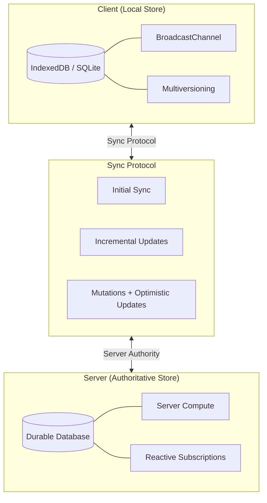

## The Pattern That Keeps Emerging

Jayakar takes the nine-dimension taxonomy from [[a-map-of-sync]] and zooms into one specific region of the map: apps with ~100MB datasets, ~1Hz update rates, rich object graphs, and a need for both offline support and server-side programmability. Linear, Figma, Asana — three teams that independently built the same architecture. They call it the object sync engine.

The core claim: for collaborative productivity apps, the right design is three components wired together. A local store for instant UI. A server store for authority, durability, and compute. A sync protocol that bridges them. Not CRDTs, not pure server-first — a pragmatic middle ground where the server decides what's true but the client never waits for it.

This lands squarely in the "server-authoritative with full offline" quadrant I mapped in [[sync-engines-for-vue-developers]]. Replicache pioneered this model, Zero evolved it, and now Jayakar is articulating the general pattern behind all of them.

## The Three Components

### Local Store

The client needs its own persistent database — IndexedDB today, SQLite eventually. Key requirements beyond storage:

- **Cross-tab coordination** via BroadcastChannel — multiple tabs must share state without conflicts
- **Multiversioning** — different browser tabs may run different code versions of the app, each expecting a different schema
- **Session persistence** — data survives page refreshes so the app boots instantly

This is the "no spinners" guarantee. Every read hits local storage. Every write commits locally first.

### Server Store

The server is not just a relay — it's where the real work happens:

- **Authoritative truth** — the server resolves conflicts by being the single source of truth
- **Durability** — data survives device loss
- **Server-side compute** — search indexing, AI workloads, aggregations that don't belong on the client
- **Scale** — handles data that exceeds any single client's storage

Convex's angle: their database was designed from day one as a reactive database with first-class query subscriptions and serializable transactions. Most databases bolt on reactivity as an afterthought.

### Sync Protocol

Three operations that must all work well:

1. **Initial sync** — efficiently downloading a working dataset on first load
2. **Incremental sync** — minimal bandwidth updates as data changes
3. **Mutations** — optimistic local writes that reconcile with server authority

The hard part: you write mutations twice. Once on the client (optimistic, instant), once on the server (authoritative, validated). The server version wins. The client rebases pending mutations on top of new server state — the same Git-like rebase model Replicache introduced.

::

## How Convex Compares to Others

The article walks through Replicache, LunaDB (Asana), and Linear's implementations. The interesting finding: they all converge on the same architecture despite building independently.

- **Replicache** — IndexedDB local store, backend-agnostic, three-endpoint protocol (`/pull`, `/push`, `/poke`). The pioneer.
- **LunaDB (Asana)** — GraphQL schema, MySQL backend, invalidator service tailing replication logs. Fragment-based UI dependencies.
- **Linear** — Separate sync server and query server, log-tailing architecture, GraphQL interface.
- **Convex** — JavaScript/TypeScript native, code-defined local schemas, programmable sync table fetching with authorization enforcement.

The schemas intentionally diverge between client and server. The local schema is a subset — a working set optimized for the UI. The server schema holds everything. Sync rules determine what each client receives.

## What's Coming

Jayakar outlines four protocol improvements Convex is building:

1. **Finer-grained incremental updates** — reducing delta sizes
2. **Client-side ID allocation** — no server roundtrip just to get an ID
3. **Subscription resumption** — reconnect without re-downloading everything
4. **Query chaining** — eliminating waterfall dependencies where one query depends on another's results

Client-side ID allocation is particularly interesting. Today, creating a new record means waiting for the server to assign an ID before you can reference it elsewhere. With client-generated IDs, you can build entire object graphs optimistically and sync them in one batch.

## Connections

- [[a-map-of-sync]] — Same author's nine-dimension taxonomy for the sync space; this article zooms into one specific region of that map and builds an engine for it
- [[sync-engines-for-vue-developers]] — My comprehensive comparison covers Convex alongside six other engines; Jayakar's article provides the deeper architectural rationale behind Convex's design choices
- [[ux-and-dx-with-sync-engines]] — The "no spinners" UX pattern that object sync engines enable is exactly what Assmann describes as the core benefit of sync architectures
