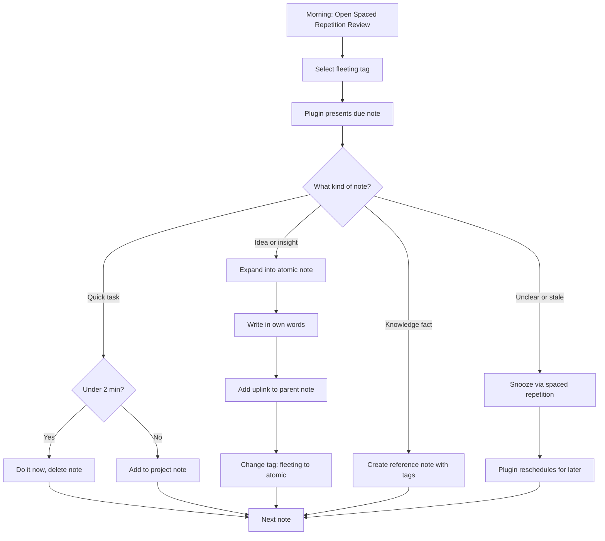

Most note-taking guides obsess over capture and trail off when it comes to what happens next. Tris calls this out directly: who cares about your beautifully filed notes if you never do anything with them? Part II of his FLAP system (Fleeting, Literature, Atomic, Projects) focuses entirely on the processing step — turning raw captures into atomic notes through a daily practice.

## The Software Metaphor for Notes

Tris borrows from software engineering: good modules have **high cohesion** and **low coupling**. Atomic notes follow the same principle. Each note works well on its own (cohesive), but doesn't require reading other notes to understand (loosely coupled). He calls atomic notes "the compiler artifacts of our learning before they have been linked together into their final form."

This framing resonates — it's exactly how [[evergreen-notes]] describes the concept of notes as discrete objects you can manipulate and recombine. The terminology differs (atomic vs. evergreen), but the design principle is identical.

## Single Trusted System

Borrowed from David Allen's _Getting Things Done_: fleeting notes must live in **one place**. Multiple inboxes create the same anxiety as multiple social media feeds — you can never be sure you've checked everything. The system only works if you trust it completely, and trust requires a single source.

## Spaced Repetition as Backlog Triage

The most original insight in the video. Instead of using spaced repetition for memorization, Tris repurposes it to manage his fleeting note backlog. Each morning, the Obsidian spaced repetition plugin surfaces only the notes rated most urgent — not the entire list. Notes you can't process get snoozed, and the algorithm handles scheduling.

The benefit: it scales. A raw list of 200 fleeting notes is paralyzing. Spaced repetition surfaces 5-10 per day based on your own urgency ratings. After a few days, only the consistently "hard" (urgent) items remain.

::

## Trees Over Graphs

The knowledge graph looks impressive but doesn't scale past 30-40 notes — too crowded to read names. Tris uses **uplinks** instead: each atomic note points to exactly one parent note, creating a tree structure browsable with a scroll wheel (via the Breadcrumbs/Vert folder plugin). The original Zettelkasten worked the same way — paper cards filed behind related cards in a linear box, not a visual graph.

This challenges the default assumption in PKM that link graphs are the primary navigation tool. [[how-i-use-obsidian]] takes a different approach — Steph Ango uses flat structure with emergent links — but both reject folder hierarchies.

## The Four-Tag System

Tris runs his entire Obsidian vault with no folders and four tags: `fleeting`, `literature`, `atomic`, `project`. File names do the heavy lifting — human-readable summaries that jog your memory without opening the note. No numeric IDs, no date stamps.

## Notable Quotes

> "Atomic notes are the compiler artifacts of our learning before they have been linked together into their final form."

> "If you just take notes but don't do anything with them, they won't get you to where you need to be."

> "Before you can write an essay from scratch, you must first invent the universe." — misquoting Carl Sagan

## Connections

- [[how-to-take-smart-notes]] — Tris explicitly builds on Sönke Ahrens' Zettelkasten framework and cites Niklas Luhmann's 90,000-note card file; his atomic notes are permanent notes by another name
- [[evergreen-notes]] — Same core concept (atomic, titled, composable notes) described by Steph Ango; Tris adds the processing workflow that turns captures into these notes
- [[building-a-second-brain-and-zettelkasten]] — Tris's FLAP system sits at the intersection of both approaches: GTD-style inbox processing (single trusted system) combined with Zettelkasten's atomic note structure
- [[how-i-use-obsidian]] — Both show practical Obsidian setups but differ on structure: Steph uses flat organization with emergent links, Tris uses uplinks to build an explicit tree
