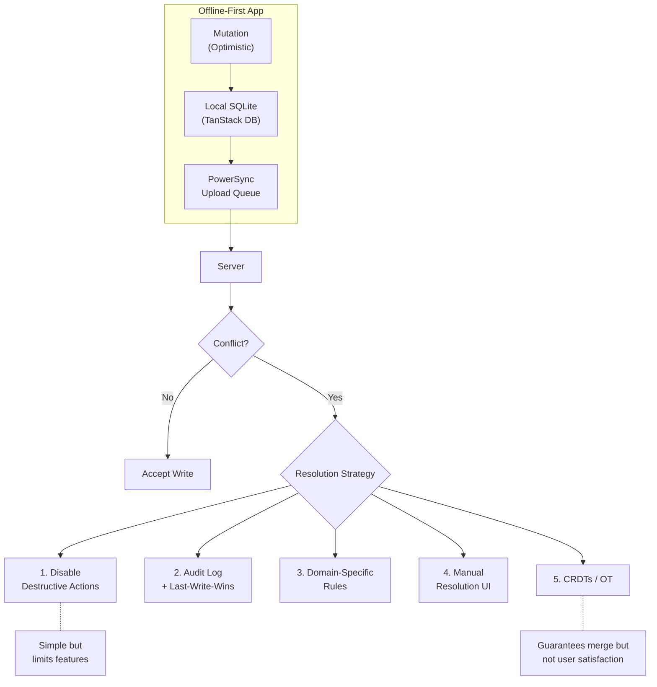

## The Argument

Distributed systems theory says offline writes are inherently dangerous — you can't reliably order changes across disconnected nodes. Dev Agrawal's counterpoint: theory overstates the problem. In practice, most offline scenarios dodge conflicts entirely because users modify different data subsets or touch different fields on the same record. The engineering challenge isn't preventing all conflicts — it's choosing the right resolution strategy for the small percentage that actually occur.

The article builds a ticket-tracking demo with TanStack DB on the client and PowerSync handling sync, then walks through five escalating conflict resolution strategies. The progression from "just disable destructive actions offline" to "CRDTs for automatic merging" is the most useful part — a practical ladder instead of the usual binary "use CRDTs or don't" debate.

## Three Categories of Offline Writes

The article breaks offline modifications into three scenarios, and only the last one causes real trouble:

1. **Non-overlapping data** — offline users modify exclusive data subsets. Creating new tickets, adding comments. Safe by definition.
2. **Orthogonal field edits** — multiple users modify the same record but different fields. User A changes the title while User B changes the status. Usually safe with field-level merging.
3. **Same-field collision** — two users change the same field on the same record while offline. This is where conflict resolution actually matters.

The insight worth keeping: categories 1 and 2 cover the vast majority of real-world offline usage. Design your data model to maximize non-overlapping writes and you sidestep most conflict complexity before writing a single line of resolution logic.

## Five Conflict Resolution Strategies

The real value — a graduated escalation instead of one-size-fits-all:

**1. Disable destructive actions offline.** Block deletes and irreversible operations when disconnected. Simple, limits capability but guarantees safety. Good default starting point.

**2. Audit log + last-write-wins.** Accept that LWW will occasionally overwrite someone's change, but maintain a full activity log so users can see what happened and recover. Trades perfection for visibility.

**3. Domain-specific rules.** Encode business logic into resolution — if a ticket was marked "done" on the server but an offline user moved it to "in progress", the "done" status wins. Requires domain knowledge but handles most real cases correctly.

**4. Manual resolution UI.** Show users a diff when conflicts are detected, let humans decide. Essential for sensitive data where automated resolution isn't trustworthy.

**5. CRDTs / Operational Transforms.** Automerge, Yjs — automatic merging of concurrent changes. Guarantees convergence but not user satisfaction. The article recommends combining CRDTs with manual resolution for critical paths.

The progression matters more than any individual strategy. Start with strategy 1, add strategies as the pain demands it.



::

## The TanStack DB + PowerSync Stack

PowerSync treats the server as authoritative — all clients converge to server state after writes are accepted. TanStack DB provides the client-side query layer with typed collections and live queries. The `uploadData` hook is where conflict handling lives — each pending mutation hits your server function, and you decide how to merge.

```typescript
const ticketsQuery = useLiveQuery((q) =>
  q
    .from({ ticket: ticketsCollection })
    .orderBy(({ ticket }) => ticket.updated_at, "desc")
    .select(({ ticket }) => ({
      id: ticket.id,
      title: ticket.title,
      status: ticket.status,
    })),
);
```

Mutations go directly to collections. PowerSync queues them and syncs in the background:

```typescript
ticketsCollection.insert({
  id: crypto.randomUUID(),
  title: "New ticket",
  status: "open",
});
```

The architecture is clean: read from local SQLite (instant), write optimistically to collections, let PowerSync handle the sync queue. No loading spinners, no cache invalidation — the same promise every sync engine makes, but with TanStack DB's typed query API on top.

## Connections

- [[unleashing-the-power-of-sync]] — Same author, prior article. That one introduced PowerSync's architecture with a chat app; this one zooms into the hardest part: what happens when offline writes conflict
- [[an-interactive-guide-to-tanstack-db]] — Covers TanStack DB's collections and live queries in depth. This article shows what happens when you pair those primitives with PowerSync as the sync backend
- [[sync-engines-for-vue-developers]] — Alexander's overview of the sync engine landscape. PowerSync occupies the "full Postgres sync" slot — this article demonstrates its conflict resolution story, which the overview only sketched
