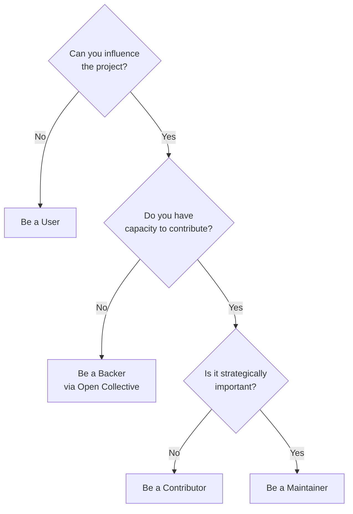

## Overview

Two open-source maintainers (MvvmCross and ReactiveUI) argue that companies need to stop treating open source as free labor and start thinking about protecting their software supply chain. Open source is "mates trading favors with mates"—yet consumers expect commercial-grade SLAs from volunteers.

## Key Arguments

### Open Source Isn't Free

The open source definition from 20 years ago focused on consumer freedoms and releasing maintainers from liability. The cost of maintenance was never considered. Heartbleed demonstrated the consequences: billions of dollars in damage because companies built on a critical SSL library maintained by a small team that received funding only for new features, never technical debt.

### Maintainers Don't Owe You Anything

The "as-is" clause in open source licenses means maintainers have zero obligation past releasing their code. Responding to GitHub issues, writing documentation, answering Stack Overflow questions—all of this is going above and beyond. Yet consumers regularly demand support for decade-old frameworks while contributing nothing in return.

### The Sustainability Problem

Open source traditionally attracts white males aged 18-25 who have time to volunteer. When maintainers have families, contributions drop. Without sustainability, the cycle continues: no mentors, no diversity, no institutional knowledge transfer.

## The Contribution Decision Tree

::

## Ways to Contribute

Contributions extend far beyond code commits:

| Level          | Examples                                                             |
| -------------- | -------------------------------------------------------------------- |
| **Financial**  | Open Collective, Patreon (prefer Open Collective for tax efficiency) |
| **Time**       | Open Source Friday—reserve sprint time for employee contributions    |
| **Management** | Triage boards, prioritization, issue reproduction                    |
| **Community**  | Documentation, blog posts, design work                               |
| **Code**       | Bug fixes, features, pull requests                                   |

The only bad contribution is no contribution.

## Notable Quotes

> "Maintainers are unpaid vendors held to an SLA when there is no SLA."
> — Geoffrey Huntley

> "At its core, open source is mates trading favors with mates."
> — Nick Randolph

## Practical Takeaways

- Audit your dependencies and categorize by strategic importance
- Use Open Collective for financial contributions (not Patreon) because funds go to a nonprofit, not individual maintainers
- Reserve 20% time (one day per two-week sprint) for open source contribution
- Reduce contribution friction: create "developer experience" tags, code owners files, and working playground projects
- Don't chase the green GitHub graph—it leads to burnout

## Connections

- [[mitigating-supply-chain-attacks-with-pnpm]] - Technical implementation of supply chain protection that addresses the same infrastructure vulnerability problem this talk describes
