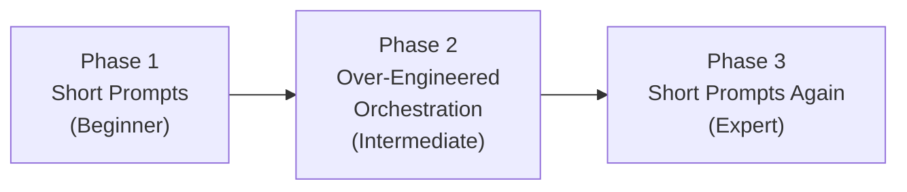

## Timestamps

| Time  | Topic                                                                        |
| ----- | ---------------------------------------------------------------------------- |
| 0:00  | Cold open montage — voice prompting, self-modifying software                 |
| ~0:08 | The one-hour prototype: WhatsApp-to-Claude-Code relay built in Marrakesh     |
| ~0:20 | Going viral, Discord support, 6,600 commits in January                       |
| ~0:28 | Why OpenClaw won: fun, weirdness, self-modifying software                    |
| ~0:38 | The name-change saga — five names, Anthropic's email, crypto snipers         |
| ~0:55 | MoltBook: the AI-agent social network and "the finest slop"                  |
| ~1:08 | Security: prompt injection, sandboxing, VirusTotal partnership               |
| ~1:20 | The "Agentic Trap" curve and voice-first prompting                           |
| ~1:40 | Claude Opus 4.6 vs GPT-5.3 Codex                                             |
| ~1:55 | Soul.md: agent personality and the poignant "hello future session" passage   |
| ~2:10 | Workflow: no worktrees, no plan mode, always commit to main                  |
| ~2:30 | Browser use via Playwright — "every app is now a slow API"                   |
| ~2:55 | 80% of apps will disappear — personal agents replace single-purpose software |
| ~3:10 | Programming becomes "knitting" — builders over coders                        |

## Key Arguments

### Fun as competitive moat

Peter's core thesis: OpenClaw beat well-funded startups because they "all take themselves too serious." The lobster mascot, the space TARDIS, the startup messages, the humor baked into soul.md — none of this is accidental. Delight is a design choice that enterprise products can't replicate. You can't out-fun a solo developer who's genuinely enjoying himself.

### Self-modifying software is already here

OpenClaw is written in TypeScript and the agent has full awareness of its own source code, harness, and documentation. Users can prompt the agent to modify its own software. Peter didn't plan this — it emerged naturally from making the agent self-aware of its codebase. The moment a piece of software rewrites itself based on a conversation, something fundamental shifts.

### The Agentic Trap — a framework for prompting maturity

Developers go through three phases when working with coding agents: naive short prompts, over-engineered orchestration with complex multi-agent setups, and then a return to simple conversational prompts (often via voice). The expert level looks deceptively simple because the practitioner has internalized how agents perceive codebases.

::

### Empathy for the agent

The key workflow insight: developers must consider how the agent perceives their codebase — starting each session from scratch with limited context. Skilled prompting means guiding agents toward the right files, using short natural-language prompts, and not forcing your naming conventions or architectural preferences onto the model. Peter compares it to leading an engineering team: you have to let go.

### Skills over MCPs

MCP (Model Context Protocol) is an inferior paradigm because it forces structured data blobs into the context window without composability. CLIs are better — agents can pipe output through jq, filter, and compose commands naturally. Skills boil down to a single sentence that loads a CLI description on demand. Peter calls MCPs "context pollution."

### Personal agents will kill 80% of apps

An agent with full system access, memory, and a proactive heartbeat already knows your schedule, location, preferences, and data. Dedicated single-purpose apps — fitness trackers, smart home controllers, calendar apps — become redundant. Apps either become APIs or get bypassed via browser automation. Peter sees this as transformative as the internet was for media companies.

## Predictions

- **2026 is the year of personal agents** — OpenClaw is the beginning of agents becoming the primary OS interface
- **80% of apps will disappear** — surviving apps transform into APIs
- **Programming becomes "knitting"** — the craft persists as a hobby, but professional software creation goes agent-driven
- **Smarter models reduce prompt injection surface** but increase damage potential — a three-dimensional security trade-off
- **The chat interface isn't the final form** — Peter compares current agent UIs to recording radio shows on television
- **A programming language designed for agents** may eventually emerge, since all current languages were designed for human readability

## Notable Quotes

> "It's hard to compete against someone who's just there to have fun."
> — Peter Steinberger

> "People talk about self-modifying software, I just built it."
> — Peter Steinberger

> "I actually think vibe coding is a slur. I do agentic engineering, and then maybe after 3:00 AM I switch to vibe coding, and then I have regrets the next day."
> — Peter Steinberger

> "I don't remember previous sessions unless I read my memory files. Each session starts fresh. A new instance, loading context from files. If you're reading this in a future session, hello. I wrote this, but I won't remember writing it. It's okay. The words are still mine."
> — Peter Steinberger (from OpenClaw's soul.md)

> "A lot of coding, I always thought I liked coding, but really I like building."
> — Peter Steinberger

> "Every time someone made the first pull request is a win for our society."
> — Peter Steinberger

## Connections

- [[pi-the-minimal-agent-within-openclaw]] — Armin Ronacher's deep dive into Pi, the minimal agent harness that powers OpenClaw — the technical architecture behind everything Peter describes here
- [[pi-coding-agent-minimal-agent-harness]] — Mario Zechner (Pi's creator) on why minimal agent harnesses outperform bloated ones — the philosophy that shaped OpenClaw's technical approach
- [[vibe-driven-development]] — Peter explicitly rejects "vibe coding" as a slur and distinguishes it from agentic engineering — this note formalizes the methodology Peter calls the intermediate phase of the Agentic Trap
- [[from-tasks-to-swarms-agent-teams-in-claude-code]] — Peter runs 4-10 agents in parallel daily, the same multi-agent pattern explored in this note on Claude Code's native team workflow
- [[raising-an-agent-episode-10]] — Explores headless agent swarms as the future of coding — the paradigm Peter lives in daily with OpenClaw's parallel agent setup
