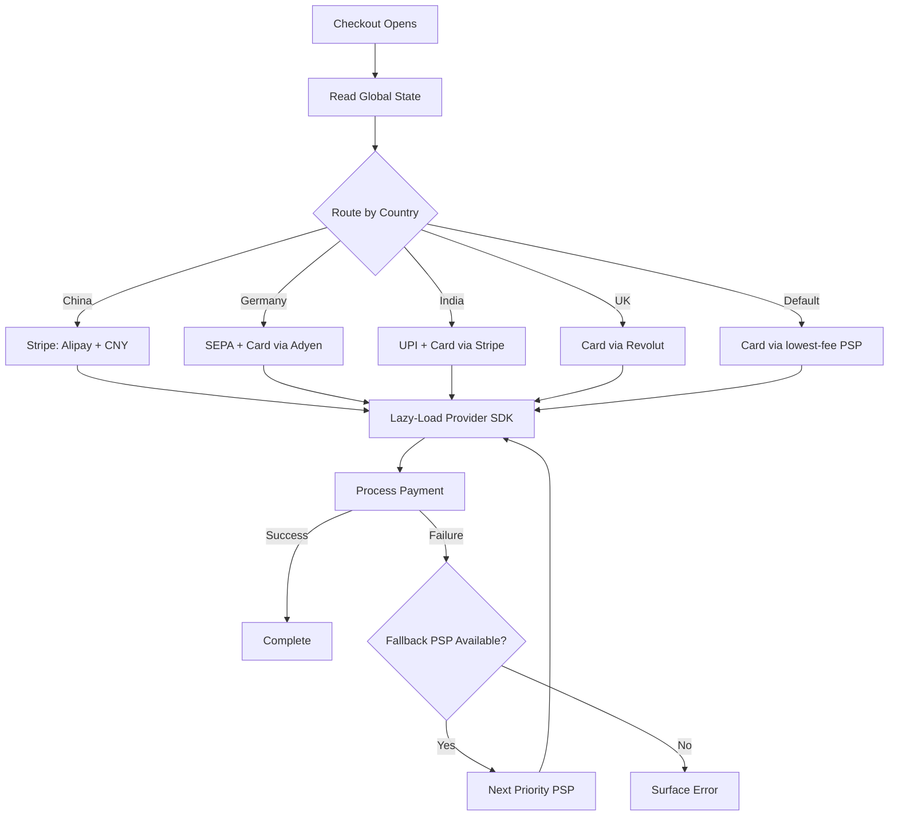

## Overview

Faris Aziz builds payment infrastructure at Smallpdf — 30 million monthly users, global audience, every payment complexity you can imagine. This talk is a war story turned architecture lesson: after a Braintree outage cost them 12 hours of downtime and $5-10k in lost subscriptions (someone deleted an employee account that happened to own the API key), they built a front-end payment orchestration system that treats payment routing like air traffic control.

The core insight: payments are a distributed systems problem disguised as a checkout form. Your front end needs to be smart about which gateway, which payment method, and which currency to use — and it needs to fail over in minutes, not hours.

## Key Arguments

### Local payment methods are a massive revenue lever

Just adding Alipay as a payment option in China increased Smallpdf's revenue by 3.5x. No price changes, no product changes — just acknowledging that Chinese users want to pay with Alipay, not Visa. Every country has its own payment ecosystem: Twint in Switzerland, Pix in Brazil, UPI in India, iDEAL/Wero in the Netherlands. Ignoring this is leaving money on the table.

### Single-provider dependency is existential risk

Smallpdf nearly died twice from provider lock-in. First, Stripe terminated them in 2021 because dispute rates got too high — overnight, payments gone, business "almost decimated." Then the Braintree API key deletion knocked them out for 12 hours. An orchestration layer with prioritized PSP fallback chains turns these incidents from existential threats into 10-minute config changes.

### Front-end orchestration solves problems back-end can't

The UI must adapt dynamically: different payment methods per country, different gateways per success rate, different tax display (inclusive in EU, exclusive in US), different UPI mandate behavior above 15,000 rupees. A declarative rules configuration on the front end — gateway enablement criteria as JavaScript objects with AND/OR logic — replaced provider-hell nesting and cut component bundle size by 70% through lazy-loading only the active gateway's SDK.

### Payments as code enables version control, testing, and AB testing

Inspired by Infrastructure as Code, the gateway configuration lives in version-controlled JS objects, not provider dashboards. You can unit test that Alipay is enabled in China, AB test Revolut vs. Stripe fees across regions, and roll back a bad config change by reverting a commit. Compare that to clicking around in Stripe's dashboard with audit logs as your only safety net.

## The compliance tax is real

The US has 11,000 separate tax jurisdictions. Adding two input fields for zip code compliance in the US alone dropped checkout conversion by 11%. That's a million dollars lost on a $10M ARR business — just from doing taxes correctly. Merchant of record services (Paddle, Lemon Squeezy) trade higher fees for eliminating this overhead entirely.

## Notable Quotes

> "3,208 errors, not too bad, right? Within the span of a couple of hours... 1,420 users being impacted in that period of time. And those are 1,420 that were actively trying to pay."
> — Faris Aziz

> "Our dispute rate got so high that Stripe said, nope, we're not doing this anymore. Pull the plug, payments gone overnight... the business was almost decimated as a result."
> — Faris Aziz

> "Just introducing Alipay as a payment method as an option in a checkout experience at Smallpdf we were able to increase revenue by 3.5x. No price changes. No nothing else."
> — Faris Aziz

> "Your front end should not care. Should be as dumb as possible, and only this middle piece, this orchestration logic should handle the connections to the providers."
> — Faris Aziz

## Practical Takeaways

- Never depend on a single payment provider — build fallback chains from day one
- Profile local payment methods per market; the uplift from matching payment culture can dwarf any product optimization
- Keep gateway configuration in code, not dashboards — version control, unit tests, and AB testing become trivial
- Segment your payment alerts by gateway, country, and currency — a 15-minute anomaly detection window beats waking up to a 12-hour outage
- Payment method behavior shapes product UX: SEPA needs 6-day grace periods, UPI above 15,000 INR needs monthly approval flows, tax display varies by region

## Connections

This is a standalone note — no existing wiki pages cover payment systems or checkout architecture yet. Future connections may emerge as fintech or distributed systems content grows.
