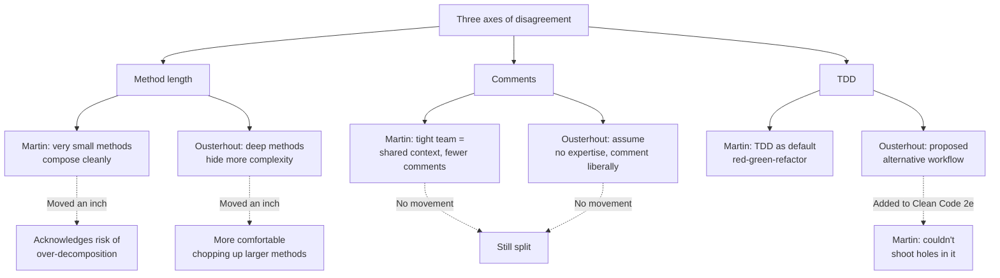

## The Setup

Book Overflow introduced Ousterhout and Martin in late 2024 hoping for a live debate. Martin declined live, proposed written. Ousterhout was disappointed, agreed grudgingly, and later admitted Martin was "completely right" — the written format let them delete dead-end arguments, revise with code examples, and actually produce something. The result now ships as an appendix to the second edition of _Clean Code_.

This episode is the follow-up: the only public conversation between the two.

## The Three Axes of Disagreement

The memorable framing: "ten miles apart, maybe now we're nine and a half."

## Key Arguments

### Audience determines how much explanation is owed

Martin: when you know your readers — three or four engineers on a tight team sharing the same mental model — you have license to lean on that shared context. Terse names, fewer comments, more assumed background. When the code is public or the team is rotating, you "shift from professor to third-grade teacher."

Ousterhout doesn't buy the license. He argues that even on tight teams, nobody actually holds the whole system in memory. He openly admits forgetting his own code months later. So: write as if no significant prior expertise is assumed, and the code will be readable by a wider population.

This is the root of the comments disagreement. Martin's case for sparse commenting relies on the shared-context assumption Ousterhout rejects.

### Cognitive load is the design target

Ousterhout's primary design metric: minimize what a reader must hold in their head. Deep modules — rich functionality behind a small interface — exist because they let callers work without knowing the insides. [[deep-and-shallow-modules]] is the long-form of this argument.

Martin agrees that code is written for humans. His exact phrasing: "The machine is an observer, a bystander." Where they diverge is what humans need. Martin trusts the reader to carry context; Ousterhout assumes the reader is a future version of themselves who has forgotten.

### Short methods: the last mile of disagreement

Martin still favors very small methods as the core Clean Code doctrine. Ousterhout still favors longer, deeper methods. The debate shifted each of them slightly:

- **Martin** admits more awareness of over-decomposition risks — a method chopped too fine can force callers to trace across files to understand one behavior.
- **Ousterhout** finds more cases where he'd now decompose than before the debate.

Neither budged enough to matter in practice. But the convergence line — "nine miles apart instead of ten" — is a useful way to think about disagreements in general. Moving an inch is a real update; moving a mile is rare.

### TDD: the variant Martin couldn't refute

Ousterhout proposed a TDD alternative Martin hadn't considered. Martin thought about it, tried to find the hole, couldn't, and added it to the second edition of _Clean Code_ as a legitimate option — with Ousterhout credited. He still wouldn't adopt it as his default practice.

This is the most concrete win of the whole debate: a specific technique now recommended by Martin that came directly from Ousterhout.

### The prime-generator exercise

Both re-implemented the same prime-generator problem under their own philosophies. The code got the debate out of the realm of assertion and into the realm of artifact. Comparing the two implementations is where the short-vs-long argument stops being abstract.

### Written form beats live form for hard ideas

Both credit the format — iteration, deletion of tit-for-tat tangents, time to revise code examples — as why the debate produced anything useful. Ousterhout's retroactive admission that Martin was right about this is the second-order insight of the episode: for hard disagreements with high-ego participants, async + editable beats live.

## Points of Agreement

- **Code is written for humans.** Martin: "The machine is an observer, a bystander."
- **Both shifted, slightly.** Ousterhout decomposes more now; Martin accepted a TDD variant.
- **Programmers don't read enough.** Dijkstra, Parnas, DeMarco, Page-Jones, Booch, Meyer — a generation of foundational work is invisible to current practitioners. Martin on Parnas and Dijkstra, Ousterhout on Parnas's "On the Criteria to Be Used in Decomposing Systems into Modules" as the single paper that opened his eyes to software design.
- **Software design is undertaught.** Ousterhout's Stanford course is "probably the only one of its kind worldwide" — and it lapses when he retires at the end of 2026. Nobody has picked it up.
- **Reasoned disagreement is productive.** Both treat intellectual combat as the mechanism for updating beliefs.

## Notable Quotes

> "I like to think of myself as serially opinionated. I tend to have pretty strong opinions at any given point in time, but I hope others will have to be the judge of whether this is really true. I would hope that I would change my opinions when I encounter superior arguments."
> — John Ousterhout

> "Reasoned and informed disagreement, that's on the road to enlightenment."
> — John Ousterhout

> "You are writing for other people. You are not writing for the machine. The machine is an observer, a bystander."
> — Robert Martin

> "Move me an inch, not a mile, but an inch is good."
> — Robert Martin

> "Within a few months of writing something, I've forgotten what I wrote myself."
> — John Ousterhout, defending low-assumption code

> "Twenty miles wide and a quarter of an inch deep."
> — Ousterhout, on social-media-driven discourse

> "If not me, who? If not now, when?"
> — Martin, on deciding to write _Clean Code_ despite feeling unqualified

> "Leave your ego at home so other people can say things that maybe completely conflict with your opinions. You don't take it personally. It's just a fun intellectual argument to see whose ideas can withstand scrutiny."
> — John Ousterhout

## What They're Working On Next

- **Martin:** Final manuscript of _Clean Code_ 2nd edition at end of month; book ships around August 2026. Then flying his airplane while he thinks about what's next.
- **Ousterhout:** Retiring from Stanford at end of 2026, staying on as emeritus. Working on **Homa**, a TCP replacement for data center applications. Currently upstreaming the Linux kernel driver — "getting beat up on by the Linux developers, totally fairly."

## Why I Care

Two things stick.

**First: the convergence economics.** Two people who have each written one of the most-cited books on their view of software design spent months in written disagreement and moved exactly one inch. That's the ceiling on what to expect from a good-faith debate between people who already know what they think. It's not nothing — the TDD variant and the small-methods risk acknowledgement are real updates — but it reframes "changing minds" as a much smaller target than it usually gets framed as. An inch is good. An inch is what you get.

**Second: the shared-context assumption is load-bearing.** Most code-style arguments I've had in Vue/TS codebases — "do we need this comment?", "should this be extracted?" — trace back to an unspoken disagreement about how much context the next reader will have. Ousterhout's "assume no expertise" and Martin's "know your audience" aren't really code-style positions; they're assumptions about team stability and documentation habits. In a world where LLMs read the code as often as humans do, Ousterhout's position gets stronger by default — the reader has no prior context, ever.

Also worth sitting with: the lament about unread history. Both Ousterhout and Martin keep pointing at Parnas, Dijkstra, DeMarco, design patterns. The "archaic, irrelevant" dismissal of the Gang of Four is Martin's example of social-media-driven shallow reading. This is the same pathology [[the-wet-codebase]] names from a different angle — DRY got stripped of its context and turned into a rule. Every principle eventually gets cargo-culted by people who didn't read the source.

## Connections

- [[deep-and-shallow-modules]] — This is the long-form of Ousterhout's half of the method-length debate. The "cost = interface, benefit = hidden functionality" framing is the criterion he's defending against Martin's small-methods rule. Read the two together to see the same argument in book form and in live debate form.
- [[the-wet-codebase]] — Abramov's anti-DRY-as-dogma argument is the same shape as Ousterhout's anti-small-methods-as-dogma argument. Both attack the reflexive application of a rule (DRY, tiny methods) that was useful in context and became a ratchet without it. Productive tension: Abramov's "inline when the third case arrives" is closer to Ousterhout's deep methods than to Martin's Clean Code.
- [[tidy-first]] — Kent Beck's economic framing of refactoring gives you the missing axis the Ousterhout/Martin debate doesn't address: _when_ to make a change. Their debate is about what "good" looks like; Beck's is about when the cost of the tidying beats the cost of deferring it.
- [[refactoring-improving-the-design-of-existing-code]] — Fowler's catalog is what both are arguing about in the abstract. Extract Method (Martin's favorite) and Inline (Ousterhout's corrective) are mirror moves from the same book, and which one you reach for is the whole debate in miniature.
- [[refactoring-not-on-the-backlog]] — Jeffries' argument that cleanup has to happen continuously is the operational layer beneath both Ousterhout and Martin: neither philosophy survives without engineers who feel licensed to restructure code as they touch it.
