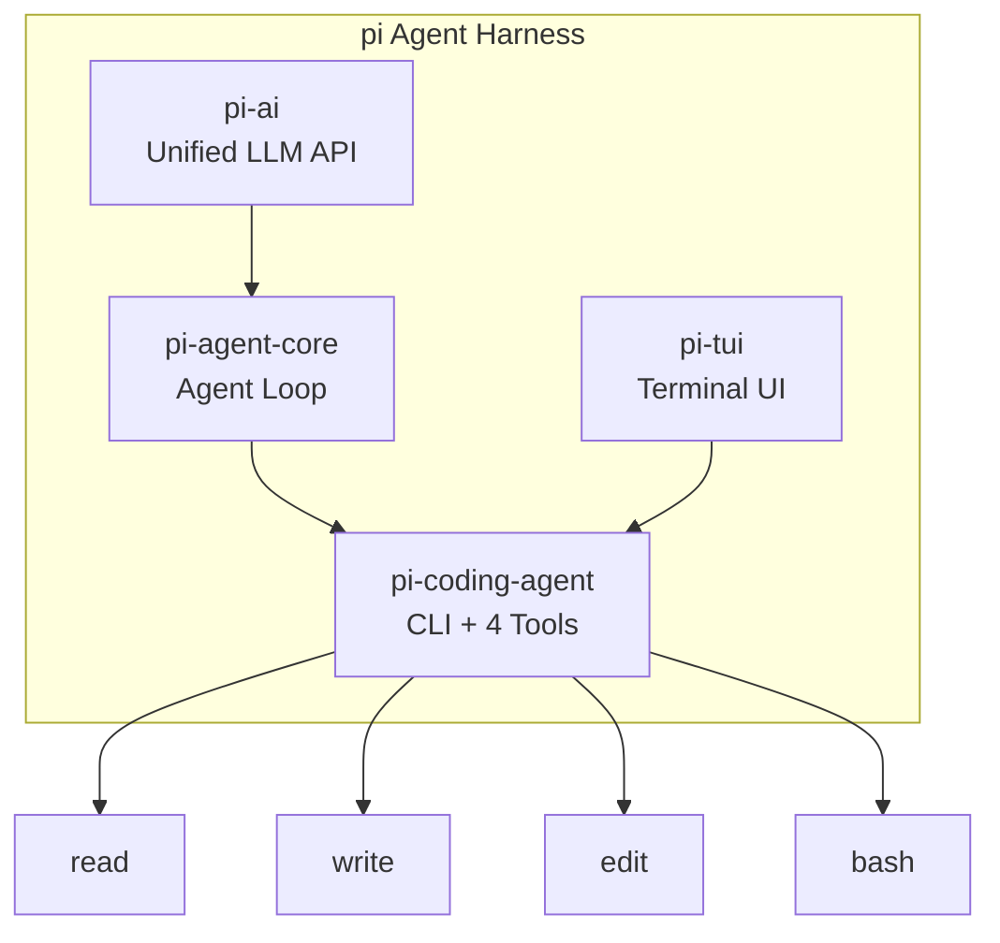

## Summary

Mario Zechner built pi, a minimal coding agent harness split into four packages: a unified LLM API, an agent loop core, a terminal UI framework, and the CLI itself. His guiding principle—"if I don't need it, it won't be built"—produces a system that competes with Cursor and Codex on Terminal-Bench 2.0 despite radically less complexity. The article doubles as an architectural teardown and a design philosophy manifesto.

## Key Concepts

### Four-Package Architecture

pi splits into focused packages rather than a monolith:

- **pi-ai** — Unified API across Anthropic, OpenAI, Google, xAI, and Groq, with cross-provider context handoff and token/cost tracking
- **pi-agent-core** — Agent loop orchestration with event streaming and transport abstraction
- **pi-tui** — Retained-mode terminal UI with differential rendering (redraws only changed lines)
- **pi-coding-agent** — The CLI itself, under 1,000 tokens of system prompt and four tools

### Radical Minimalism in System Prompts

The system prompt totals fewer than 1,000 tokens. Zechner argues frontier models have been RL-trained enough to understand coding agents inherently—long system prompts just waste context.

### Four Tools Only

The entire tool surface: `read`, `write`, `edit`, `bash`. No search tool, no sub-agents, no background processes. The thesis: models handle tool orchestration well when the toolset stays small and composable.

### Opinionated Design Rejections

Each omission comes with a rationale:

- **No MCP support** — MCP servers consume 13.7k–18k tokens of context per server. CLI tools with README files provide progressive disclosure without the cost.
- **No plan mode** — Collaborative planning through editable PLAN.md files gives better observability than ephemeral planning modes.
- **No sub-agents** — Mistakes in sub-agents become invisible. Separate sessions preserve transparency.
- **No built-in to-dos** — File-based task tracking via markdown persists across sessions and remains visible.
- **No background bash** — Synchronous execution; tmux substitutes for process management.

### YOLO Mode as Default

Full filesystem access without permission prompts. Zechner's argument: if an LLM has access to tools that can read data and execute code, sandboxing is whack-a-mole. The only real protection would be cutting off all network access, which makes agents mostly useless.

## Code Snippets

### Differential Rendering Algorithm

The terminal UI avoids full redraws by tracking state line-by-line.

```text
1. Find first differing line from previous render state
2. Move cursor to that position
3. Redraw from there to end of content
4. Handle scrollback buffer constraints
```

Uses synchronized output escape sequences to eliminate flicker—a retained-mode approach rather than the immediate-mode pattern most TUIs use.

## Architecture



::

✓ Diagram added: graph TD - Four-package architecture with tool surface

## Connections

- [[unrolling-the-codex-agent-loop]] — Both articles dissect the agent loop architecture, but Zechner argues against the complexity Codex adds around context compaction and sub-agents
- [[how-to-build-a-coding-agent]] — Shares the thesis that coding agents are fundamentally simple loops, though Huntley's workshop adds tools incrementally while Zechner caps the toolset at four
- [[12-factor-agents]] — Contrasting philosophy: 12 Factor Agents advocates micro-agents in deterministic workflows, while pi rejects sub-agents entirely in favor of session-level transparency
