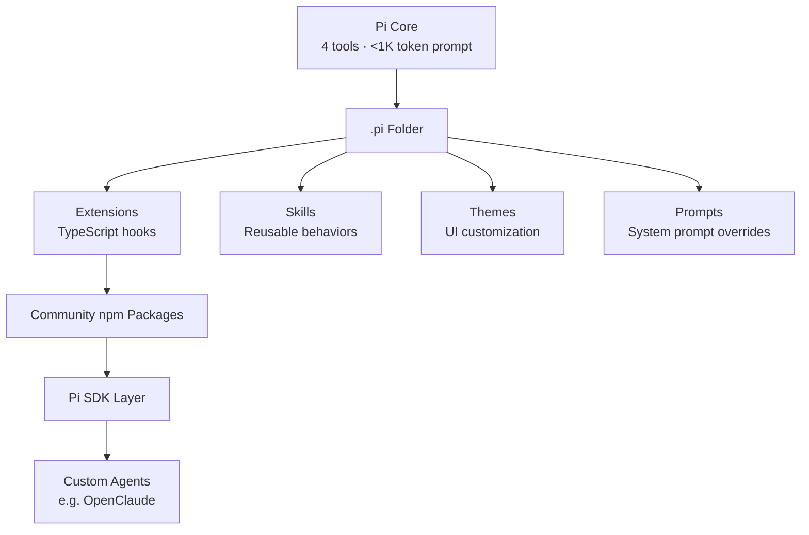

Etisha Garg walks through Pi agent feature by feature, and the video works as a practical complement to IndyDevDan's more philosophical take. Where Dan argued about _why_ the harness layer matters, Etisha shows _what it feels like_ to actually use Pi day-to-day — the model switching, the session branching, the extension reloading.

The argument that sticks: existing coding agents are bloating their context windows with system prompts the model doesn't need. Claude Code burns ~10K tokens on its system prompt. Pi uses fewer than 1,000. Mario Zechner's research claim — that frontier models are already RL-trained to understand agentic coding tasks — is the theoretical foundation. If the model already knows what a coding agent is, a minimal system prompt isn't a compromise. It's the correct design.

## System Prompt Token Budget

| Agent       | System Prompt Tokens |
| ----------- | -------------------- |
| Claude Code | ~10,000              |
| OpenCode    | ~7,000               |
| Codex       | ~3,000               |
| Pi          | <1,000               |

The implication: every token spent on system prompt is a token stolen from your actual work context. At 200K context windows this feels negligible — until you're working on a large codebase and every token matters.

## The Session Tree Model

Pi's most distinctive feature is session management. Instead of flat conversation histories, sessions are stored as JSON trees — each prompt is a node with an ID and parent ID. You can navigate back to any prior node with `/tree`, branch from that point with a different prompt, and fork entire sessions with `/fork`.

This is git for agent conversations. When an agent goes down the wrong path, you don't start over — you branch back to the last good node and try a different approach. That's a workflow Claude Code simply doesn't support.

## Multi-Provider Freedom

Pi supports 15+ providers and 100+ models. Mid-session model switching via `/model` with context handoff. The `/login` command handles subscription passthrough for Anthropic, OpenAI, and Gemini — though Etisha flags that Anthropic has gotten stricter about third-party usage of Claude subscriptions.

This matters for cost optimization and experimentation. Use a cheap model for boilerplate, switch to Opus for the hard parts. No agent lock-in.

## Extensibility by Subtraction

The design philosophy: ship nothing, let users add everything. No built-in plan mode — build it as a TypeScript extension. No sub-agents — install a community npm package. No MCP — add it via extension. The `/reload` command hot-loads new extensions without restarting the session.

Etisha demos two custom extensions: a plan mode extension she built herself, and a snake game that runs while the agent works. The snake game is silly — but it proves the extension system is powerful enough to support arbitrary UI widgets in the terminal.

Her closing line captures it well: "Unlike Claude Code, I don't have to change my workflow whenever there is a new update. Whatever I want, I can add. Whatever I don't want, I can remove."

## Notable Quotes

> "The user does not have full clarity or full visibility into what is happening under the hood — that is the observability part — and everything is still a black box."

> "Frontier models have been RL-trained expensively and they already know what a coding agent is. That's why he has written a very minimal system prompt and it has been working pretty well."

> "Unlike Claude Code, I don't have to change my workflow whenever there is a new update. This is very minimal and whatever I want I can add to it. Whatever I don't want I can remove from it."

## Connections

- [[the-pi-coding-agent-the-only-real-claude-code-competitor]] — IndyDevDan's deeper technical dive into the same tool. Dan focuses on the _philosophy_ of harness control and extension architecture; Etisha focuses on the _experience_ of daily usage and feature walkthrough. Together they give the full picture.
- [[pi-coding-agent-minimal-agent-harness]] — Mario Zechner's own writeup on building Pi. The primary source for the "frontier models don't need large system prompts" claim that Etisha references throughout the video.
- [[pi-the-minimal-agent-within-openclaw]] — Armin Ronacher's perspective on Pi as the engine inside OpenClaw. Shows Pi's SDK layer in production — the bottom of the architecture diagram above.
