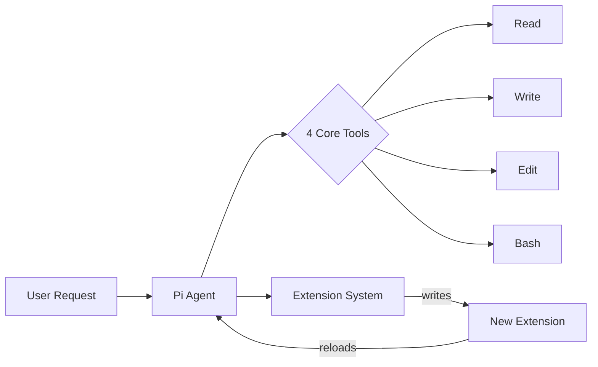

## Summary

Armin Ronacher endorses Pi, a minimal coding agent by Mario Zechner that powers OpenClaw. Where other agents pile on features, Pi strips down to four tools—Read, Write, Edit, Bash—plus one superpower: it can extend itself.

## Key Concepts

### Radical Minimalism

Pi's system prompt is the shortest of any coding agent Ronacher has encountered. It compensates with an extension system for persistent state across sessions.

The key constraint: only four tools. Read, Write, Edit, Bash. That's it.

### Self-Extension Over MCP

Rather than integrating Model Context Protocol directly, Pi takes a different approach. When you need new functionality, you ask the agent to write it. The agent creates the extension, reloads, tests, and iterates in a loop.

This inverts the typical plugin model. The agent doesn't consume tools—it builds them.

### Custom Extensions in Practice

Ronacher built several extensions for his workflow:

- **`/answer`** — Reformats agent questions into structured input dialogs
- **`/todos`** — Manages task lists as markdown files
- **`/review`** — Enables code review in branched sessions
- **`/files`** — Tracks referenced files with quick-access features

Each extension emerged from real friction, built by the agent itself.

## Visual Model

::

## Why It Works

Pi embodies a principle Ronacher sees as the future: software that builds more software. Instead of pre-building every possible feature, you build the capability to build features.

> "It doesn't flicker. It doesn't randomly break."
> — Armin Ronacher

OpenClaw's viral success validates this philosophy.

## Connections

- [[building-code-editing-agents-the-emperor-has-no-clothes]] — Geoffrey Huntley makes a similar argument about agent simplicity: they're just loops with tools, and the model does the heavy lifting
- [[im-boris-and-i-created-claude-code]] — Claude Code's skills system follows a related pattern where agents extend themselves through CLAUDE.md and custom commands
