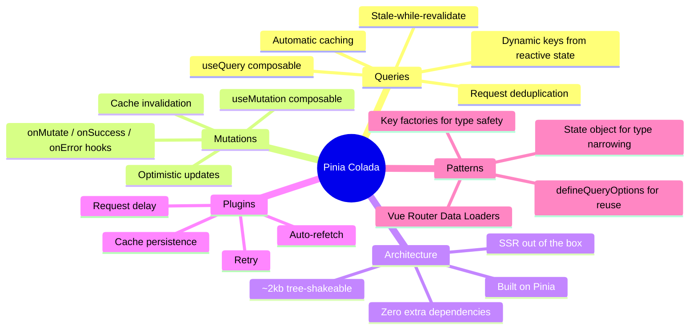

## Why This Exists

Every Vue developer has written the same boilerplate: a `ref` for data, a `ref` for error, a `ref` for loading, an `onMounted` that fetches, and some ad-hoc cache invalidation. Pinia Colada eliminates that entire category of repetitive code by providing a declarative layer for async state — queries for reads, mutations for writes.

Eduardo San Martin Morote (posva) built this on top of Pinia, which he also created. The result is a library that feels native to the Vue ecosystem rather than a React pattern ported over.

## How It Works



::

### Queries: Declarative Reads

`useQuery` takes a **key** (for cache identity) and a **query function** (any async operation). It returns reactive `data`, `error`, and `status` refs that update automatically. The `state` object groups these together for proper TypeScript narrowing — something the individual refs can't do.

Keys can be dynamic functions that depend on reactive state (route params, search filters), and queries re-execute automatically when dependencies change. The `enabled` option lets you pause queries until prerequisites are met.

`refresh()` respects the cache and deduplicates. `refetch()` bypasses cache entirely. Both return caught promises — no unhandled rejections.

### Mutations: Writes with Optimistic Updates

`useMutation` handles POST/PUT/DELETE operations. Unlike queries, mutations aren't global by default — they're scoped to the component. Two execution methods: `mutate` (fire-and-forget, errors caught) and `mutateAsync` (returns a promise for manual control).

The real power is cache integration. After a mutation succeeds, you can invalidate related queries to trigger fresh fetches, or apply optimistic updates to skip the round-trip entirely.

### The Composable Pattern

`defineQueryOptions` centralizes query configuration with key factories — the same pattern TanStack Query popularized, but with Vue's type inference:

```typescript
export const DOCUMENT_QUERY_KEYS = {
  root: ["documents"] as const,
  byId: (id: string) => [...DOCUMENT_QUERY_KEYS.root, id] as const,
};
```

`defineMutation` wraps `useMutation` for reuse across components. Both patterns keep async logic out of components and into dedicated files — separation of concerns applied to data fetching.

## What Makes It Interesting

**~2kb, zero dependencies beyond Pinia.** Most data-fetching libraries bloat the bundle. Pinia Colada is fully tree-shakeable — you pay only for the features you use.

**Plugin system.** Auto-refetch, retry, cache persistence, and request delay are all opt-in plugins. The architecture is extensible without being heavy by default.

**SSR built in.** No special configuration needed for server-side rendering — a nod to the Nuxt ecosystem where posva's other libraries (Vue Router, Pinia) already live.

**Vue Router Data Loaders.** Tight integration with route-level data loading, which positions Pinia Colada as the data layer for the entire navigation lifecycle, not just component-level fetching.

## The Sync Engine Tension

Pinia Colada optimizes the traditional pattern: fetch from server, cache on client, invalidate when stale. It's the best version of request/response data management for Vue. But it's worth noting that sync engines like Replicache or Zero take a fundamentally different approach — they eliminate the fetch cycle entirely by maintaining a local replica that syncs in the background.

For most apps that talk to REST APIs or GraphQL, Pinia Colada is the right abstraction. For apps that need instant offline-first interactions, the sync engine paradigm offers something Pinia Colada doesn't try to be.

## Connections

- [[sync-engines-for-vue-developers]] — Explores the alternative paradigm where you don't fetch at all. Pinia Colada represents the "optimized fetch" approach; sync engines represent "don't fetch"
- [[mastering-vue-3-composables-style-guide]] — Pinia Colada is a case study in excellent composable design: `useQuery` and `useMutation` follow every principle in the style guide (clear naming, object arguments, reactive returns)
- [[ux-and-dx-with-sync-engines]] — Directly calls out TanStack Query patterns (which Pinia Colada mirrors) as the baseline that sync engines aim to surpass
