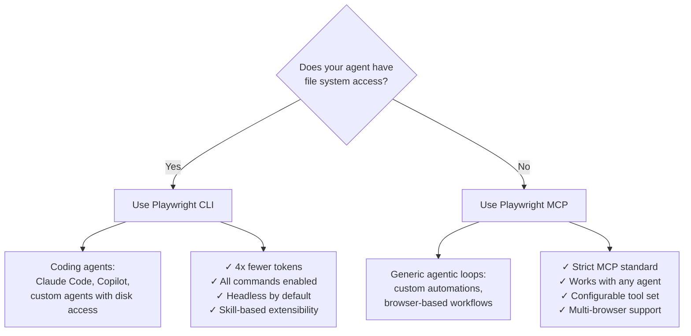

## Key Takeaways

- **Playwright CLI is a new tool** in the Playwright family designed specifically for coding agents like Claude Code and GitHub Copilot.
- **Token efficiency is the core advantage.** In a head-to-head demo, the same browser task consumed 114K tokens via MCP but only 26.8K via CLI — a 4x reduction.
- **The mechanism is simple.** MCP pipes accessibility snapshots and screenshot bytes directly into the LLM context. CLI writes everything to files on disk, letting the agent decide what to read.
- **CLI exposes more capabilities.** MCP limits its default toolset to avoid context bloat. CLI faces no such constraint, so all commands ship enabled.
- **Use CLI for coding agents.** When your agent has file system access (Claude Code, Copilot), CLI is the clear winner.
- **Use MCP for generic agentic loops.** When you're authoring a custom automation without file access, MCP's strict standard still makes sense.

## Why MCP Wastes Tokens

MCP follows a request-response cycle where every result — accessibility snapshots, screenshots, DOM content — flows back into the LLM context window. Even when the agent only needs to save a screenshot to disk, MCP returns the image bytes to the model first. The result: context fills up with data the LLM never needed to reason about.

## How CLI Solves It

CLI takes a file-first approach. Every output (snapshots, screenshots, page content) gets written to disk. The coding agent then decides whether to read those files into context or skip them entirely. For the screenshot-saving task in the demo, CLI navigated to a page and saved a screenshot without ever loading either into the LLM context.

## Decision Framework



::

## CLI Setup

```bash
# Install globally
npm install -g playwright-cli

# Initialize workspace (creates .playwright/ folder)
playwright-cli install

# Install skills for Claude Code
playwright-cli install-skills
```

Each workspace gets its own browser set via the `.playwright/` directory, so different projects stay isolated.

## Connections

- [[context-efficient-backpressure]] - Playwright CLI applies the same principle: keep data out of the LLM context until the agent actually needs it
- [[the-context-window-problem]] - Demonstrates exactly why piping all browser data into context (MCP's approach) creates a scaling bottleneck
- [[understanding-claude-code-full-stack-mcp-skills-subagents-hooks]] - CLI's skill-based architecture mirrors the skills pattern in Claude Code's tool ecosystem
