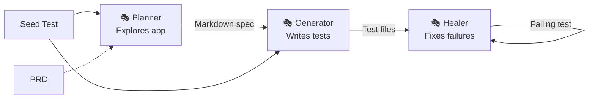

## Summary

Playwright now ships first-party test agents that formalize the plan→generate→heal loop many teams were building ad hoc. Three agents compose into an agentic pipeline: the **planner** explores your app and writes a structured Markdown spec, the **generator** turns that spec into executable Playwright tests with live selector verification, and the **healer** replays failing tests and patches them until they pass. The key insight: Markdown specs act as the contract between agents, making the pipeline human-auditable at every step.

## Key Concepts

- **Markdown as contract.** The planner outputs structured Markdown specs, not code. This makes the test plan readable, editable, and version-controllable before any test code exists. The generator consumes these specs — so the human reviews intent, not implementation.
- **Seed tests bootstrap context.** A `seed.spec.ts` file provides the ready-to-use `page` context — fixtures, global setup, project dependencies. Both planner and generator use it, which keeps generated tests consistent with the project's actual test infrastructure.
- **Self-healing loop.** The healer doesn't just report failures — it replays steps, inspects the current DOM, patches locators or waits, and re-runs until passing. If it concludes the feature itself is broken (not just the test), it skips instead of looping forever.
- **Agent definitions are regenerated, not maintained.** Running `playwright init-agents --loop=claude` drops MCP tools and instructions into the project. These should be regenerated on every Playwright update — they're artifacts, not config to hand-edit.



## Code Snippets

### Initialize Agents

Drop agent definitions into a project for your coding tool of choice.

```bash
npx playwright init-agents --loop=claude
npx playwright init-agents --loop=vscode
```

### Generated Test Output

The generator produces standard Playwright tests with role-based locators and assertion-heavy verification.

```typescript
import { test, expect } from "../fixtures";

test.describe("Adding New Todos", () => {
  test("Add Valid Todo", async ({ page }) => {
    const todoInput = page.getByRole("textbox", {
      name: "What needs to be done?",
    });
    await todoInput.fill("Buy groceries");
    await todoInput.press("Enter");

    await expect(page.getByText("Buy groceries")).toBeVisible();
    await expect(page.getByText("1 item left")).toBeVisible();
  });
});
```

## Connections

- [[how-to-use-playwright-skills-for-agentic-testing]] - Shows the lower-level CLI skills these agents build on top of — the plumbing beneath the pipeline
- [[playwright-cli-vs-mcp]] - Explains the architectural choice underpinning these agents: CLI writes browser data to disk instead of flooding LLM context
- [[claude-code-with-playwright]] - A community-built 4-agent test pipeline that Playwright's official three-agent approach now formalizes and simplifies
- [[autonomous-qa-testing-ai-agents-claude-code]] - Another multi-agent QA pipeline; Playwright's first-party agents reduce the custom orchestration these teams had to build themselves
