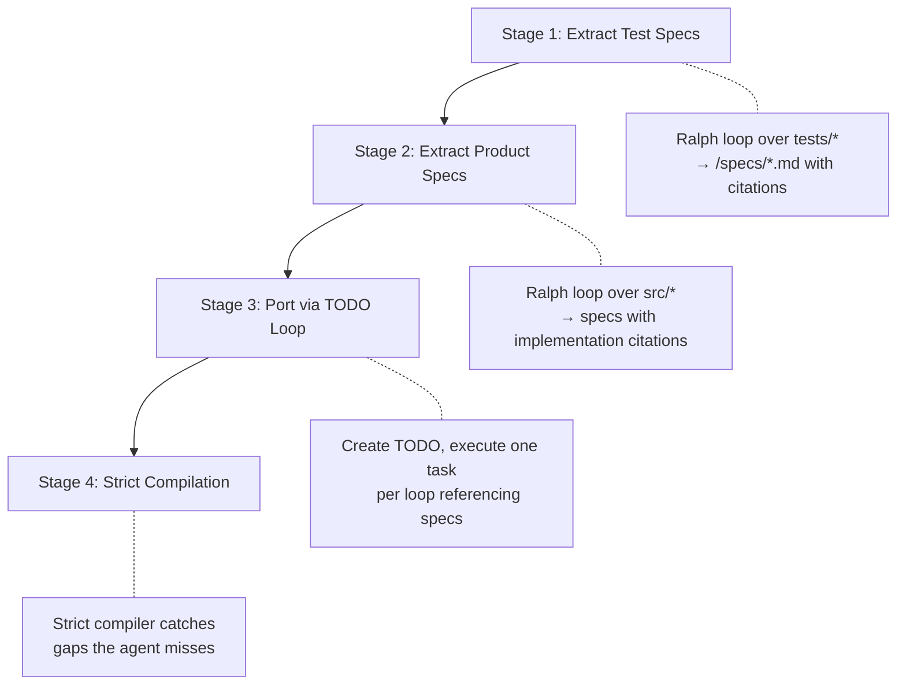

## Summary

Huntley's argument is deceptively simple: don't try to translate code line-by-line. Instead, extract the _intent_ — tests become specs, source becomes cited specifications — and then rebuild from those specs in the target language. The agent never needs to "understand" the source language. It just reads specs and writes code until the strict compiler stops complaining.

The key insight is that reducing a codebase to specs is the same as writing PRDs. Once you have language-agnostic specifications with citations back to the original implementation, porting is just "build this from a spec" — something agentic loops already handle well.

::

## The Four-Stage Process

1. **Extract test specs** — A Ralph loop compresses all tests into `/specs/*.md`, documenting behavior with citations pointing back to the original test files. Each spec describes _what_ the code should do, not _how_ it does it.

2. **Extract product specs** — A second Ralph loop does the same for `src/*`, ensuring each specification cites the original implementation. Now you have a complete behavioral description of the codebase decoupled from any language.

3. **Port via TODO loop** — Within the same repo, create a TODO file and run a classic Ralph loop: one task at a time, most important first. The agent reads specs, follows citations to study the original implementation when needed, and writes the target-language code.

4. **Strict compilation** — Configure the target language for strict compilation. The compiler becomes the final verifier, catching whatever the agent missed.

## Why This Works

The citations in the specs are the clever part. They "tease the `file_read` tool to study the original implementation during stage 3." The agent doesn't need the entire source codebase in context — it pulls in specific files on demand, guided by the spec citations. Specs become a kind of retrieval-augmented generation over the original codebase.

## Connections

- [[ai-assisted-development]] — Huntley's porting workflow is a concrete example of agentic coding taken to its logical endpoint: the agent doesn't assist with porting, it _does_ the porting
- [[seven-years-to-typescript-migrating-11000-files-at-patreon]] — Patreon spent seven years migrating 11,000 files to TypeScript; Huntley's approach suggests this kind of migration could collapse to days with spec-first agent loops
- [[from-ides-to-ai-agents-with-steve-yegge]] — Yegge's thesis that AI-enabled small teams will rival large company output maps directly to this: porting used to require dedicated migration teams
