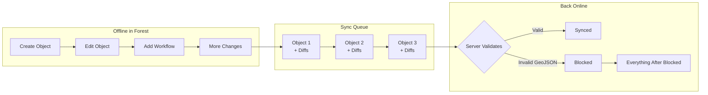

## Overview

Alexander Thiele, Head of Engineering at OCELL, tells a three-act story of how he kept stumbling into local-first. Act one: at Doodle in 2014, his team estimated 150 story points to add offline support and threw it in the trash. Act two: his personal Shift App was bleeding server costs until migrating to local-first dropped them to zero — saving him from going broke. Act three: OCELL, where foresters walk into forests at dawn and don't come back until evening. No cell signal. No choice. The app must be local-first.

This is the kind of talk that matters more than any CRDT demo — a practitioner shipping real offline-first software to people who can't afford sync failures, dealing with messy edge cases that academic presentations skip.

## Key Arguments

### Foresters Don't Have Internet — And That's the Entire Point

Germany is 30% forest — 11 million hectares. Foresters manage these areas daily: mapping tree stands, marking calamities, creating workflows. They work all day in the forest and return to civilization at the end of the shift. OCELL's Flutter app must handle a full day's work without a single server round-trip.

### The Sync Queue Architecture

OCELL's sync model chains objects in a queue. When a forester creates an object (say, a forest stand polygon), all subsequent edits attach as diffs to that initial object. The queue syncs left-to-right when connectivity returns. Each independent object gets its own sync element, and dependent changes chain to the original.

::

### The Cascading Failure Problem

The nastiest edge case: MongoDB rejects an invalid GeoJSON polygon (self-intersecting or incomplete). Because everything downstream depends on that initial object, the entire queue blocks. The sync engine retries every minute, hitting the same wall. Meanwhile the forester sees "0 of 150 objects synchronized" and calls support.

The fix options are all bad:

- **Server-side:** Accept and auto-correct the polygon — but downstream diffs might break against the corrected shape
- **Client-side:** Rewrite the queue — but modifying one element cascades through all dependent changes
- **Drop it:** Lose the user's work

OCELL's current solution? The customer success team manually recreates the object and asks the forester to log out (which drops local changes). Honest, ugly, real.

### "Sync Later" Is the Killer UX Pattern

The most underrated insight: almost every error class resolves with "just sync later." No internet? Sync later. Server error? Deploy a fix, sync later. Database outage? Sync later. Invalid session token? Sync later. From the user's perspective, the queue just silently waits and resolves itself. The forester keeps working regardless.

## Notable Quotes

> "I was almost broke. So offline-first saved me in this case."
> — Alexander Thiele, on his Shift App's migration to local-first

## Practical Takeaways

- Local-first isn't just a developer preference — for field workers in low-connectivity environments, it's the only viable architecture
- A linear sync queue (diffs chained to initial objects) is pragmatic but creates cascading failure risks when the server rejects the root object
- "Sync later" absorbs an enormous range of failure modes gracefully from the user's perspective
- Real-world local-first problems that rarely appear in demos: duplicate local IDs, permission changes while offline, out-of-memory from 100K+ local objects, 10+ minute initial data loads
- Flutter's single codebase gives them Android, iOS, and web — the web app became local-first as a free side effect

## Connections

- [[what-is-local-first-web-development]] — Alexander's own overview of the paradigm; Thiele's talk provides one of the grittiest real-world case studies of what that actually looks like in production
- [[unexpected-benefits-of-going-local-first]] — Tuomas Artman's Linear talk from the same conference paints local-first as a productivity multiplier; Thiele's forestry reality check shows the other side where sync failures still require manual intervention
- [[why-local-first-apps-havent-become-popular]] — Bambini argues syncing is genuinely hard; OCELL's cascading GeoJSON failure is a concrete, painful proof of that claim
- [[local-first-software-pragmatism-vs-idealism]] — Adam Wiggins' talk from the same conference frames local-first as a movement needing both idealists and pragmatists; Thiele is firmly in the pragmatist camp, shipping imperfect-but-working solutions
