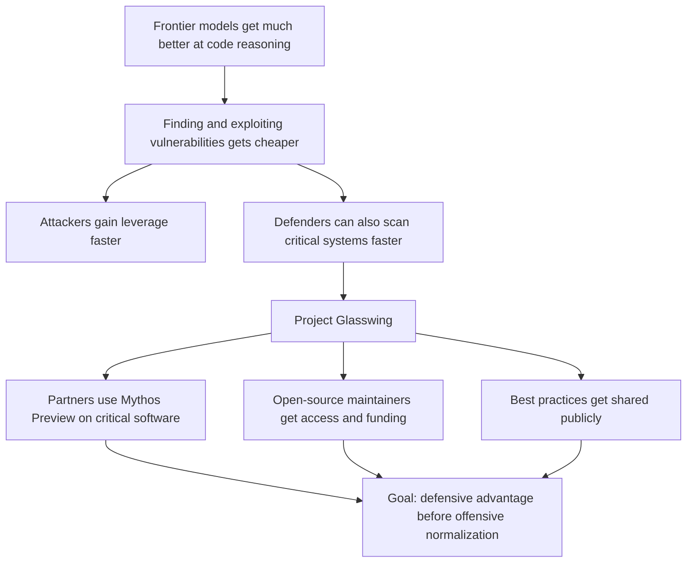

Anthropic is basically saying the quiet part out loud: we already crossed the threshold where frontier models can do serious vulnerability research, so the real question is who operationalizes that capability first.

That matters because this isn't framed as "AI might help security someday." It's framed as "the offensive window is opening now, and defense needs industrial-scale assistance." Project Glasswing is Anthropic's attempt to make defensive use the default before offensive use becomes cheap and routine.

::

## Summary

The core claim: cyber defense can no longer rely on slow human review plus legacy tooling. If Anthropic is right about Mythos Preview's capability jump, vulnerability research is entering the same phase coding already entered last year: the bottleneck shifts from raw execution to supervision, prioritization, and safe deployment.

What makes the note worth keeping is the policy and infrastructure angle. Anthropic isn't just publishing eval numbers. It's trying to build a coalition around critical software, disclosure norms, and open-source hardening before the capability diff leaks into the open market.

## What Actually Changed

- **AI cyber capability crossed a threshold** - Anthropic claims Mythos Preview found thousands of high-severity vulnerabilities, including bugs in major operating systems, browsers, the Linux kernel, FFmpeg, and OpenBSD. If that holds up, "best human hackers plus time" is no longer the right baseline.
- **The cost curve matters more than the benchmark curve** - The important shift isn't just better benchmark scores. It's that the time, expertise, and labor needed to discover exploitable flaws keeps collapsing. That compresses the gap between discovery and exploitation.
- **Defense now looks like deployment, not just research** - Glasswing is operational. Partners are using the model against real foundational systems. Anthropic also says 40+ additional infrastructure organizations can use it on first-party and open-source code.
- **Open source is the weakest strategic link** - This part tracks. Critical infrastructure depends on underfunded maintainers, and attackers only need one neglected dependency. Anthropic's credits plus direct donations are an admission that model access alone won't solve the response burden.
- **This is also a safety story** - Anthropic says Mythos Preview is too risky for general release and wants to refine safeguards on a less dangerous upcoming Opus model first. That tells you how seriously they take offensive misuse, or at least how seriously they want the ecosystem to take it.

## Why I Care

This is one of the first major AI-company announcements that treats software security as the main event rather than a footnote to productivity. That's the right framing. We spent the last year celebrating that models can write code. The uncomfortable follow-up is that models can also read decades of brittle code and find the cracks faster than our review processes can keep up.

The practical implication for AI-assisted development is hard to miss: more generated code means more attack surface unless verification, sandboxing, and automated hardening improve at the same speed. Shipping faster without changing the security model is how you get a very expensive lesson.

## Connections

- [[how-ai-is-transforming-work-at-anthropic]] - Anthropic's internal research showed AI changing how engineers work inside the company. Glasswing is the external version of the same story: capability gains are now large enough to reshape operational reality, not just personal productivity.
- [[llm-predictions-for-2026]] - Simon Willison predicted a near-term security incident from coding agents. Glasswing reads like the institutional response to that exact risk: assume the capability jump is real, then move defenses up the curve immediately.
- [[hardening-github-actions]] - That guide covers concrete workflow hardening patterns. Glasswing explains why those operational details are becoming more urgent: attackers get better tooling too, and CI/CD systems sit directly on the blast radius.
- [[claude-code-is-amazing-until-it-deletes-production]] - Same underlying tension in a narrower frame. Powerful coding agents create leverage and risk at the same time; Glasswing scales that concern from individual repos to critical infrastructure.
