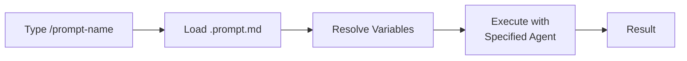

## Summary

Prompt files are Markdown documents with a `.prompt.md` extension that define reusable prompts for GitHub Copilot. Unlike custom instructions that apply to all requests, prompt files activate on demand for specific tasks.

## File Structure

A prompt file consists of two sections:

### YAML Frontmatter (Optional)

```yaml
---
description: Brief prompt summary
name: Display name (used after / in chat)
argument-hint: Guidance for user interaction
agent: ask | edit | agent | custom-agent-name
model: Language model selection
tools: ["tool1", "tool2"]
---
```

### Body

The prompt text sent to the LLM. Reference workspace files with relative Markdown links. Reference tools with `#tool:<tool-name>` syntax.

## How Prompt Files Work



::

## Scope Types

| Scope         | Location           | Availability                             |
| ------------- | ------------------ | ---------------------------------------- |
| **Workspace** | `.github/prompts/` | Single project only                      |
| **User**      | VS Code profile    | All workspaces (syncs via Settings Sync) |

## Variable Support

Prompt files support placeholder variables that resolve at runtime:

- **Workspace**: `${workspaceFolder}`, `${workspaceFolderBasename}`
- **Selection**: `${selection}`, `${selectedText}`
- **File context**: `${file}`, `${fileBasename}`, `${fileDirname}`
- **User input**: `${input:variableName}`, `${input:variableName:placeholder}`

## Code Snippets

### Complete Prompt File Example

```yaml
---
agent: 'agent'
model: GPT-4o
tools: ['githubRepo', 'search/codebase']
description: 'Generate a new React form component'
---
Your goal is to generate a new React form component based on templates in #tool:githubRepo contoso/react-templates.

Ask for the form name and fields if not provided.

Requirements for the form:
* Use form design system components
* Use react-hook-form for state management
* Always define TypeScript types
* Prefer uncontrolled components using register
```

## Key Distinction

Custom instructions (`.github/copilot-instructions.md`) apply globally to all requests. Prompt files activate on demand for specific tasks—they're task-specific workflows, not general guidelines.

## Connections

- [[context-engineering-guide-vscode]] - The broader context engineering framework that prompt files complement; custom instructions handle global context while prompt files handle task-specific workflows
- [[introducing-agent-skills-in-vs-code]] - Agent Skills are conceptually similar: portable, on-demand workflows that extend AI capabilities with specialized knowledge
