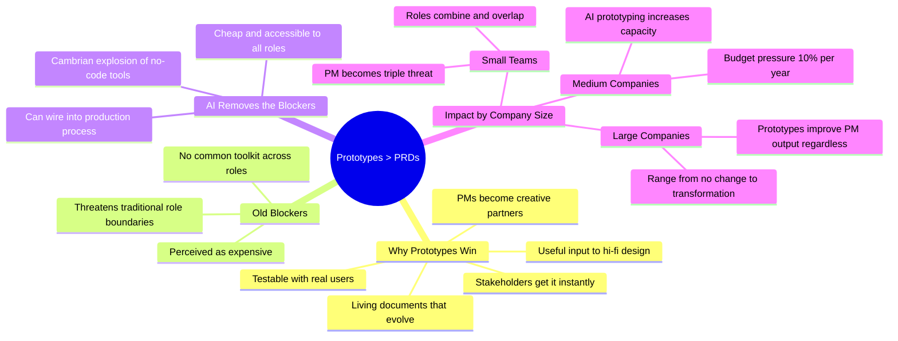

## Summary

Dan Mason makes a straightforward case: PRDs have always been inferior to prototypes for communicating product intent, but cost and tooling fragmentation kept prototypes out of most workflows. AI coding tools (bolt.new, v0.dev, Replit) obliterate both objections. The cost is near zero, the tools work for PMs and designers and engineers alike, and you can even wire prototypes into production.

The real argument isn't about prototypes vs. documents — it's about what happens to the PM role when building becomes cheap. Mason thinks PMs who learn AI prototyping become triple threats: product sense plus design instinct plus delivery capability. Those who don't are increasingly vulnerable as teams shrink and budgets tighten.

::

## Key Points

- **Prototypes beat PRDs for stakeholder alignment.** Stakeholders don't read documents. They won't connect your PRD's tactics to the vision. A prototype communicates intent instantly — and you can test it with real users before committing engineering time.

- **The historical cost argument is dead.** Prototypes were expensive because they required pulling designers or engineers away from production. AI no-code tools make prototyping nearly free and accessible to any role. The "perceived as expensive" objection no longer holds.

- **PMs should learn to prototype as career insurance.** Small teams are combining roles. Medium companies are cutting 10% budgets annually. Large companies range from stasis to transformation. In every scenario, a PM who delivers prototypes instead of PRDs is more valuable and harder to replace.

- **The triple threat PM.** Mason's ideal: product sense + design instinct + delivery capability. AI prototyping is the first step toward this. You don't need to replace your engineer or designer — but you collaborate better when you can show instead of describe.

- **Team size is shrinking regardless.** Mason's side note hits hard: arguing for more headcount gets harder when tiny teams are outperforming scaled organizations. The response isn't to stockpile engineers — it's to remove distractions and invest in giving small teams space.

> "PRDs contribute to the perception that product managers are paper pushers, not part of the creative process in the same way design and eng are — whereas prototypes can put PMs on even footing."

## Connections

- [[home-cooked-software-and-barefoot-programmers]] - Maggie Appleton's "barefoot developers" are what happens when Mason's logic extends beyond PMs — AI tools enabling non-engineers to build real software, not just prototypes
- [[your-startup-idea-is-their-weekend-holiday]] - Andreas Klinger makes the same underlying observation from the startup angle: when building software is trivially easy, the code isn't the moat — the decisions and taste are
- [[2026-the-year-the-ide-died]] - Yegge and Kim's "leaders who ship" examples (Fidelity's Dr. Top Pal vibe-coding a 5-month project in 5 days) are the extreme version of Mason's PM prototyping vision
