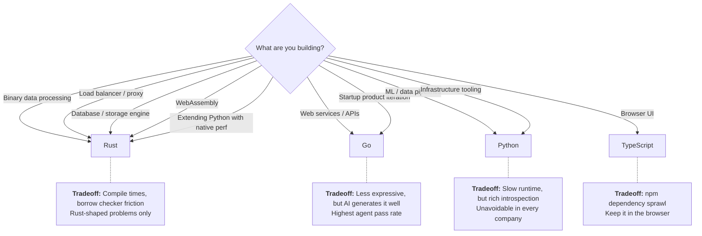

## Timestamps

| Time   | Topic                                                              |
| ------ | ------------------------------------------------------------------ |
| 00:00  | Introduction                                                       |
| ~02:00 | Python 2 to 3 migration: lessons learned                           |
| ~08:00 | Comparing Python, Rust, Go, TypeScript tradeoffs                   |
| ~16:00 | Why Armin chose Go for his new startup                             |
| ~24:00 | The npm dependency problem and why unified codebases are overrated |
| ~28:00 | AI code generation reducing the need for one-language stacks       |
| ~30:00 | Using AI agents at a two-person startup — 80% agent-generated code |
| ~36:00 | What changed Armin's mind on AI tools                              |
| ~42:00 | What AI changes and doesn't change about software engineering      |
| ~46:00 | Language choice matters MORE with AI                               |
| ~50:00 | Agentic coding addiction and the slot machine effect               |
| ~56:00 | Error handling lessons from 10 years at Sentry                     |
| ~64:00 | TypeScript didn't measurably reduce JavaScript error rates         |
| ~74:00 | Language design: performance vs. debuggability                     |
| ~78:00 | Advice for engineers joining startups                              |

## Key Arguments

### The "Split Brain" Programmer

Armin describes two programmers living inside him: one who does "Swiss watchmaking of source code" for open-source libraries — craft, API design, long-term durability — and one who builds products at startups where none of that matters and speed to market dominates. The right language depends on which brain is driving. This framing explains why the same person can love Rust for Flask-level library work and choose Go for a startup.

### Rust Is for Rust-Shaped Problems, Not Startups

> "What makes Rust amazing for crafting really cool open source code also makes it a sub-optimal programming language for a startup."

Compile times, the borrow checker, and verbosity kill iteration speed. Rust earns its place when the problem demands it: binary data processing, load balancers, databases, WebAssembly, extending Python with native performance. At Sentry, Rust was pragmatic for native symbol processing (the alternative was C++), but was likely overextended into ingestion where it added unnecessary friction.

### Go Wins on Pragmatism and AI Compatibility

Armin benchmarked AI writing the same program across languages — Go had the highest pass rate. Go's thin abstractions mean fewer places for the model to get confused. For web services, Go hits the right tradeoff between developer speed and runtime performance. Modern Python has grown so complex that Go is actually simpler for many server tasks.

> "I made it write a certain type of program in different languages 10 times and see how often did it pass and I just noticed that it did so much better on Go than it did on Python."

### npm Is the Problem, Not TypeScript

> "I'm a low dependency kind of guy. I feel like it's impossible for me to build productive in the JavaScript ecosystem with under 500 dependencies and that makes me uneasy."

The "unified frontend-backend codebase" argument is weakening. Code generation (OpenAPI specs, SDK generators like Stainless) bridges language boundaries cheaply. AI makes the bridging even cheaper — so the main justification for server-side TypeScript is evaporating.

### AI Coding: From Skeptic to 80% Agent-Generated

The turning point between February and May 2025: AI agents started handling work Armin hated but knew was necessary. Debugging AWS permission chains, building internal visualizers, creating reproduction cases. Over 80% of the code in his new startup is agent-generated.

> "I know for a fact that I get this tool in 30 minutes on the side from Claude. It's around 5,000 lines of code and it looks better and has pretty UI and everything."

But he's clear-eyed about the risk:

> "It is a slot machine. It has this instant gratification of something happened and you can kick it off again and kick it off again."

### Language Choice Matters More with AI, Not Less

AI quality varies dramatically by target language. The runtime tradeoffs — garbage collection, memory model, concurrency model — don't disappear because a machine writes the code. Armin predicts someone will build a new language optimized for human-AI collaborative programming. Current languages weren't designed for a workflow where both humans review and machines generate.

### TypeScript Didn't Reduce Error Rates

The expected reduction in null-related errors from TypeScript adoption was offset by increasing application complexity — microservices with misaligned versions, React hydration errors, the sheer growth of code volume. The error monitoring business is safe because code volume and complexity grow faster than type systems can reduce errors.

::

## Predictions

- **A new language for human-AI collaboration** — Current languages weren't designed for a workflow where machines generate and humans review. Someone will rebalance the tradeoffs.
- **Python remains unavoidable** — ML, data processing, and infrastructure tooling ensure Python lives in every company, even when it's not the primary backend language.
- **AI dramatically increases the total number of programmers** — Non-technical people use AI as a gateway into programming (Armin's air traffic controller anecdote).
- **Error volumes grow, not shrink** — More code deployed by more people means more errors, regardless of AI and type systems.
- **The human stays in the loop longer than we want** — The need for human review prevents output from collapsing to machine-only formats.

## Notable Quotes

> "If you fully delegate everything that you're doing to a machine, then the person that doesn't do that has an edge on you. Because there's going to be some innovation that is not in these things yet."

> "The human will stay in the loop longer than we want and in many more cases than we want."

> "I thought Python was the most amazing language ever for building web services because I could inspect every process and it didn't make it any slower. But now I know that's also why Python was slow to begin with."

## Connections

- [[the-creator-of-claudbot-i-ship-code-i-dont-read]] — Same podcast, directly overlapping theme. Steinberger talks about shipping code he doesn't read, while Ronacher describes 80% agent-generated code. Both are experienced founders wrestling with how much to delegate to AI — but Ronacher is more cautious about the slot machine effect.
- [[the-third-golden-age-of-software-engineering-thanks-to-ai-with-grady-booch]] — Booch frames AI as the next abstraction layer in software engineering history. Ronacher's prediction about a new language for human-AI collaboration is essentially asking: what does that abstraction layer look like concretely?
- [[head-of-claude-code-what-happens-after-coding-is-solved]] — Claude Code's vision of developers as reviewers and orchestrators matches Ronacher's actual lived experience at his two-person startup. He's already operating in the future that episode speculates about.
- [[home-cooked-software-and-barefoot-programmers]] — Ronacher's air traffic controller anecdote — non-programmers using AI to code — directly validates Appleton's "barefoot developers" thesis. The floor is rising.
