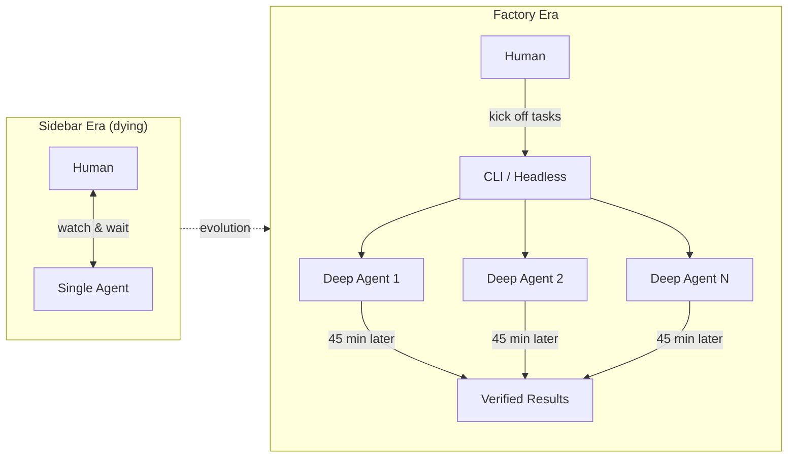

## Core Argument

The one-on-one sidebar assistant is reaching its ceiling. Models like GPT-5.2 Codex Medium work best when sent off autonomously for 45+ minutes, not babied through ping-pong interactions. AMP is killing its VS Code extension to force this shift: from watching a single agent in an editor to orchestrating a factory of parallel agents from the CLI.

## Key Takeaways

- **Agent "modes" are not model selectors.** Deep mode (GPT-5.2 Codex Medium) is lazy at quick assistant tasks but extraordinary at scoped, long-running research. Smart mode (Opus 4.5) excels at fast interactive tasks. Rush mode (Haiku) handles trivial work. Each mode reshapes the UX, not just the backend.

- **Skills are the winning abstraction.** Unlike MCPs, custom commands, or sub-agents, skills—small instruction documents encoding domain-specific knowledge—have durably stuck. AMP uses them for GCloud log analysis, BigQuery queries, and release procedures. The compounding effect accelerates: every skill added makes the next task cheaper to delegate.

- **Optimizing for agents degrades human DX—and that's the point.** AMP built Zveltch Check, a Zig-based Svelte type checker that made agents faster but broke VS Code integration. They chose the agent experience, creating a self-reinforcing flywheel: degraded human paths push more work through agents, which justifies further optimization.

- **AMP is killing its VS Code extension.** The sidebar limits parallelism, acts as a crutch, and attracts users who want an assistant rather than a factory. A 60-day sunset forces both the team and users onto CLI-based multi-agent workflows.

- **Manual context management is dying.** Auto-compaction—automatic summarization of context windows—makes long-running agents viable. Agents re-research lost context after compaction rather than requiring humans to manage thread state.

## The Factory Model

::

## AMP's Three Agent Modes

| Mode  | Model                | Use Case                        | Interaction Style               |
| ----- | -------------------- | ------------------------------- | ------------------------------- |
| Smart | Opus 4.5             | Fast interactive tasks          | Back-and-forth assistant        |
| Rush  | Haiku                | Trivial, quick tasks            | Fire and forget                 |
| Deep  | GPT-5.2 Codex Medium | Long research, big scoped tasks | Send off, check in 45 min later |

## Predictions Made

- **The sidebar will be obsolete within months** — AMP sets a 60-day self-destruct timer on their VS Code extension
- **Agent parallelism is the primary productivity lever** — not smarter single-agent interactions
- **Auto-compaction replaces manual thread management** — models will re-research context naturally
- **Cursor and editor-bound tools will be forced out of the editor** — the fastest-growing startup is already hearing "VS Code is holding you back"
- **Traditional SaaS playbooks break down** when the market shifts every 2-6 weeks

## Notable Quotes

> "I think the time of you one-on-one with an agent in a sidebar going back and forth — I think that's coming to an end."
> — Torsten

> "For the 1% of developers that want to be most ahead, that want to be coding like how everyone else will be in the future... they only need to do the last 20% of their work in the editor and we think we can get that to 10% or 1%."
> — Quinn

> "We had this difficult decision — which is more important: to preserve the human dev experience or to preserve the agent dev experience?"
> — Torsten

> "We want to be the most radically on the frontier one. We want to rip things out way faster than anyone else. We want to carry less baggage than anyone else."
> — Quinn

## Resources Mentioned

- **Zveltch Check** — Open-source Zig-based Svelte type checker built for agent speed
- **Pi** — Minimal agent framework by [[pi-coding-agent-minimal-agent-harness|Mario Zechner]], referenced as exemplar of radical independence
- **Peter Steinberger** — Built OpenClaw/ClaudeBot on Pi, vocal advocate for GPT-5.2 Codex
- **Sourcegraph** — Company AMP spun off from (all 19 AMP employees are ex-Sourcegraph)

## Connections

- [[raising-an-agent-episode-9]] — Previous episode in the same series; introduces the "factory" mental model that Episode 10 doubles down on by killing the sidebar
- [[the-importance-of-agent-harness-in-2026]] — AMP's modes and skills are a concrete implementation of the agent harness architecture this article describes
- [[pi-coding-agent-minimal-agent-harness]] — Mario Zechner's Pi agent is directly mentioned as an exemplar of the minimal, autonomous approach AMP champions
- [[anthropic-just-dropped-agent-swarms]] — Claude Code's agent teams implement the same parallel multi-agent pattern AMP advocates with their factory model
