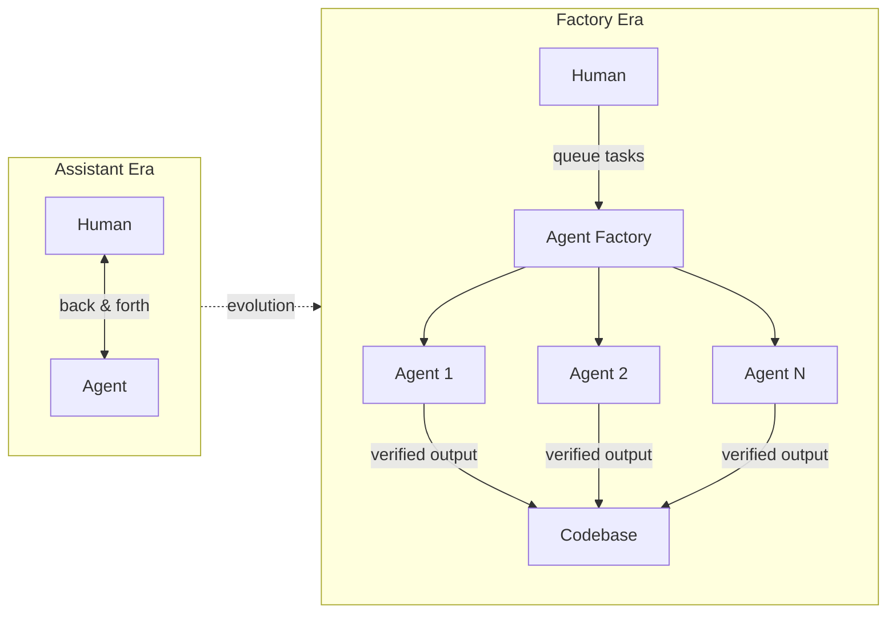

## Core Argument

"The assistant is dead, long live the factory." Agents writing code is now table stakes. The differentiator is whether your codebase is built _for_ agents—with feedback loops, testability, and verification baked in.

## Key Takeaways

- **Model capability outpaces expectations.** Opus 4.5 and Gemini 3 changed the game. Skeptics (including Karpathy) reversed their views after trying frontier models in modern harnesses.

- **Smart models are faster AND cheaper.** Measuring "task completion" rather than token cost reveals that frontier models outperform fast-but-dumb alternatives.

- **Longer leash, not tighter control.** Instead of back-and-forth assistant interactions, give agents full autonomy to investigate, implement, test, and iterate.

- **Agent-native codebases are competitive advantage.** The 2026 equivalent of "can someone ship on day one?" is "can an agent ship in 10 minutes?"

- **Build feedback loops INTO applications.** Example: Adding `--capture` CLI flags to applications so agents can screenshot their own output and verify visually.

- **Dev tooling assumptions are broken.** Linear tickets, pull request reviews, emoji reactions—all built for humans who invested effort. Agents change that equation.

## The Factory Mental Model

::

## Making Codebases Agent-Native

The Joel Spolski checklist for 2026: Can an agent ship something in the first 10 minutes?

Requirements for agent-ready codebases:

1. **Feedback loops** - Agents must verify their own changes
2. **CLI accessibility** - Expose data through commands, not just UIs
3. **Automated testing** - CI that agents can run and interpret
4. **Documentation** - AGENTS.md explaining how to use the codebase
5. **Sandboxed execution** - Isolated environments for parallel agent work

> "Think of your codebase as an application. Does the agent know how to use it?"

## Notable Quotes

> "Writing code is over... Opus 4.5 can do a file."

> "If you're using a coding agent and it's not pushing you to make changes to everything in how you build software, then it's probably not pushing you enough."

> "Instead of creating a Linear ticket, we just send off an agent."

## On Model Selection

AMP intentionally has no model selector. The reasoning:

- Forces everyone onto the frontier
- Prevents optimizing for outdated capabilities
- Reduces combinatorial complexity
- Enables learning from unified usage patterns

> "If you're not working on an agent, do you really want to spend your time exploring the strengths and weaknesses of seven different models?"

## Connections

- [[12-factor-agents]] - Shares the philosophy that agents need focused context and clear feedback loops
- [[the-importance-of-agent-harness-in-2026]] - Directly discusses the harness architecture Amp is building
- [[building-effective-agents]] - Anthropic's complementary guide on composable agent patterns
