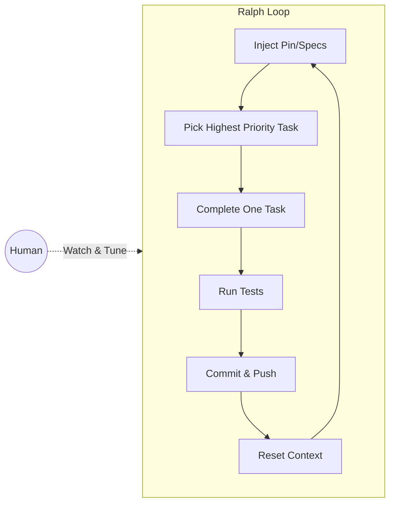

Geoffrey Huntley, the creator of Ralph, walks through the technique from absolute first principles. The goal: help developers understand the fundamentals before jumping to power tools.

## The Economics Shift

Running Ralph in a 24-hour loop costs roughly $10.42/hour in API fees. In that time, you output multiple days or weeks of traditional software development work. The economics of software development have fundamentally changed.

But to get these results, you need to understand the fundamentals first. Don't start with a jackhammer—learn to use a screwdriver.

## Core Insight: Context Windows Are Arrays

The fundamental mental model: context windows are arrays.

- When you chat with the LLM, you allocate to the array
- When it executes tools, it auto-allocates to the array
- The LLM is a sliding window over this array
- **The less that window needs to slide, the better**

There's no server-side memory. The array _is_ the memory. So allocate less, and be deliberate about what goes in.

## Deterministically Malicking the Array

Ralph avoids context rot by deterministically controlling what enters the context window. Each loop iteration:

1. Starts with a fresh context
2. Injects the "pin" (specs, objectives, frame of reference)
3. Works on exactly one task
4. Commits and resets

The "pin" is a lookup table that links to specifications. It includes generative words that improve search tool hit rates—the more descriptors, the better the LLM finds relevant context instead of inventing.

## Building Specs Through Conversation

> "Would you believe I don't create my specs. I generate them. Then I review them and edit them by hand."

The workflow is like shaping clay on a pottery wheel:

1. Start a conversation with the LLM
2. Give it high-level direction ("I want analytics like PostHog")
3. Let it interview you, asking questions
4. Shape the specification through back-and-forth
5. Export to a spec file
6. Let Ralph rip on that spec

This preserves the conversation as the source of truth—you can resume planning later.

## The Ralph Loop

The core implementation is simple:

```bash
while true; do
  cat prompt.md | claude --dangerously-skip-permissions
done
```

The prompt tells Claude to:

1. Study the specs lookup table
2. Find the implementation plan
3. Pick the most important task
4. Complete it
5. Update the plan
6. Commit and push

## Software Development vs. Software Engineering

Huntley draws a distinction:

- **Software development**: Now fundamentally automated with bash loops
- **Software engineering**: Keeping the locomotive on the rails

The new job is engineering back pressure to keep the generative function on track. You're a locomotive engineer now—not carrying cargo by hand onto the ship.

## Diagram



::

## Key Quotes

> "If the idea of running Ralph makes you want to ralph, listen to it. Then engineer away those concerns. That is now the job."

> "We're no longer carrying cargo by hand onto the ship. The shipping containers are here."

## Loom: The Bigger Picture

Huntley's project "Loom" embodies these principles:

- Self-evolutionary software
- Humans on the loop, not in the loop
- Autonomous "weavers" that deploy without code review
- Feature experiments and analytics built-in
- Optimizing for machine-to-machine communication (why use JSON when you control the stack?)

## Connections

- [[ralph-wiggum-technique-guide]] - Comprehensive guide building on these first principles
- [[ralph-wiggum-and-why-claude-codes-implementation-isnt-it]] - Huntley and Horthy explain why Anthropic's plugin differs from pure Ralph
- [[ralph-wiggum-as-a-software-engineer]] - Original article introducing the technique
- [[context-engineering-guide]] - The array-allocation mental model in broader context
