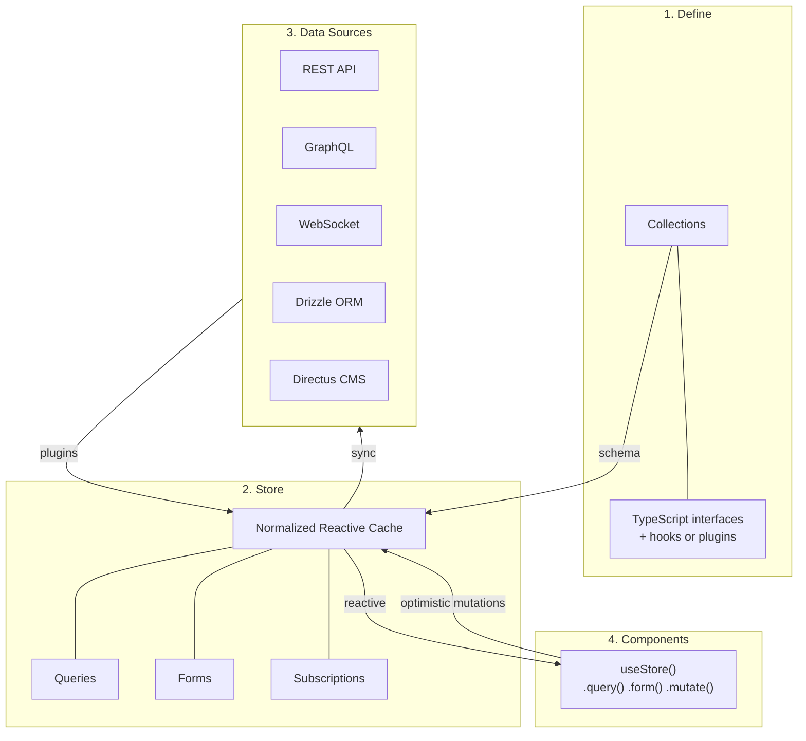

## Summary

rstore (formerly Airstore) is Guillaume Chau's answer to a problem Directus hit building their studio app: you need query caching, cache normalization, real-time updates, form mutations, and offline support — but no single Vue library handles all five. Pinia does state. Pinia Colada adds query caching. Apollo normalizes caches but only for GraphQL. rstore bundles the lot into one reactive normalized cache with a plugin system that works with any data source.

The key distinction from sync engines like Zero or LiveStore: rstore doesn't own the sync protocol. It's the client-side data layer that sits between your components and whatever backend you choose. Plug in REST, GraphQL, Drizzle ORM, Directus — or build your own plugin. The normalized cache keeps all components in sync regardless of where the data comes from.

## How It Works

Three steps:

1. **Define collections** — TypeScript interfaces describing your data models, with hooks for CRUD operations
2. **Configure plugins** — Data source adapters that handle fetching and mutations
3. **Query and mutate** — Components use `useStore()` to access collections, run live queries, and create form objects



::

## Code Snippets

### Defining a Collection (Nuxt)

Drop a file in `app/rstore/` and Nuxt auto-scans it.

```typescript
// app/rstore/todo.ts
export default RStoreSchema.withItemType<Todo>().defineCollection({
  name: "todos",
  hooks: {
    fetchFirst: ({ key }) => $fetch(`/api/todos/${key}`),
    fetchMany: ({ params }) => $fetch("/api/todos", { query: params }),
    create: ({ item }) => $fetch("/api/todos", { method: "POST", body: item }),
    update: ({ key, item }) => $fetch(`/api/todos/${key}`, { method: "PATCH", body: item }),
    delete: ({ key }) => $fetch(`/api/todos/${key}`, { method: "DELETE" }),
  },
});
```

### Querying Data

```typescript
const store = useStore();
const { data: todos } = store.todos.query((q) => q.many());
```

Queries are reactive and co-located with the components that consume them. The normalized cache deduplicates — fetch a user in a list, and their detail page already has the data.

## Key Design Decisions

- **Normalized cache, not query cache** — Entities stored individually, not per-query. Update a user once, every component sees it.
- **Optimistic mutations** — UI updates instantly, syncs to server in the background. If the server rejects, the cache rolls back.
- **Plugin architecture over protocol lock-in** — Unlike Apollo (GraphQL only) or TanStack Query (query-level caching), rstore normalizes across any data source.
- **Built-in forms** — Create reactive form copies from cached data. Edit without corrupting the cache. `$save()` reconciles both sides.
- **WebSocket subscriptions** — Subscribe to real-time updates per collection, not just poll or refetch.

## Where It Sits in the Vue Data Landscape

The critical design difference: rstore computes reads client-side. Filtering, sorting, all of it runs against the local cache. Pinia Colada and TanStack Query are server-first — they cache query results from the server. rstore stores normalized entities locally and derives everything from them. That's the same local-first read pattern sync engines use, without requiring you to adopt a sync protocol.

|                 | rstore                            | Pinia        | Pinia Colada     | Apollo              |
| --------------- | --------------------------------- | ------------ | ---------------- | ------------------- |
| **Cache type**  | Normalized reactive               | Manual       | Query-based      | Normalized reactive |
| **Read model**  | Local-first (client-side compute) | N/A          | Server-first     | Server-first        |
| **Data source** | Any (plugins)                     | Any (manual) | Any (in queries) | GraphQL only        |
| **Forms**       | Built-in                          | Manual       | No               | No                  |
| **Offline**     | Yes                               | Manual       | No               | Limited             |

Multiple plugins can stack — read from IndexedDB first, fall back to REST, sync in the background. The mutation history enables replay for sync engines, bridging the gap between rstore's cache layer and a full sync protocol when you're ready for one.

## Connections

- [[building-performative-and-reliable-applications-with-multiple-data-sources]] — Rijk van Zanten's Vue.js Amsterdam talk that introduced this library under its original name "Airstore," walking through the five pain points that motivated building it
- [[sync-engines-for-vue-developers]] — Positions rstore as the pluggable cache layer that can sit in front of any sync engine, rather than being a sync engine itself
- [[local-first-software]] — rstore borrows local-first principles (client-side reads, optimistic writes, offline support) without requiring a full CRDT or event-sourcing architecture
