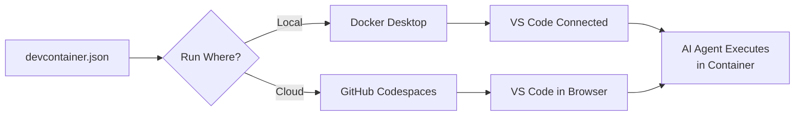

## Key Takeaways

- Dev containers bundle your entire development environment (libraries, SDKs, runtimes) into a secure, self-contained container
- The same configuration works locally via Docker Desktop and in the cloud via GitHub Codespaces
- AI coding agents execute commands inside the container, creating a safe sandbox for experimentation
- VS Code maintains your personal settings and extensions while connecting to different containerized environments

## Dev Container Workflow



::

## Getting Started

1. **Install prerequisites**: Dev Containers extension + Docker Desktop
2. **Try a sample**: Remote Explorer → Try a Dev Container Sample
3. **Add to existing project**: Command palette → "Add Dev Container Configuration Files"
4. **Let Copilot configure it**: Ask the agent to customize based on your project's dependencies

## Configuration Structure

```text
.devcontainer/
└── devcontainer.json    # Image, extensions, ports, post-create commands
```

Key configuration options:

- `image` or `dockerfile`: Base container environment
- `customizations.vscode.extensions`: Extensions installed in container
- `forwardPorts`: Ports exposed to local machine
- `postCreateCommand`: Setup scripts to run after container creation

## Code Snippets

### Basic devcontainer.json

```json
{
  "name": "Node.js",
  "image": "mcr.microsoft.com/devcontainers/javascript-node:22",
  "forwardPorts": [3000, 9000],
  "postCreateCommand": "npm install",
  "customizations": {
    "vscode": {
      "extensions": ["dbaeumer.vscode-eslint"]
    }
  }
}
```

## Why This Matters for AI Agents

When AI agents execute commands (builds, tests, file operations), everything happens inside the container. This provides:

- **Safety**: Agent can't accidentally modify your host system
- **Reproducibility**: Same environment across machines and team members
- **Isolation**: Multiple projects with conflicting dependencies don't interfere

## Notable Quotes

> "Wouldn't it be awesome if either when I'm coding or an agent is executing commands that everything is happening completely separated off from my machine, creating a safe environment for any type of work or experimentation?"

> "Dev containers create that private secure development environment and all the dependencies that I want for complete customization."

## Connections

- [[introducing-agent-skills-in-vs-code]] - Same author exploring another VS Code AI capability: portable instruction folders that transform agents into domain-specific experts
