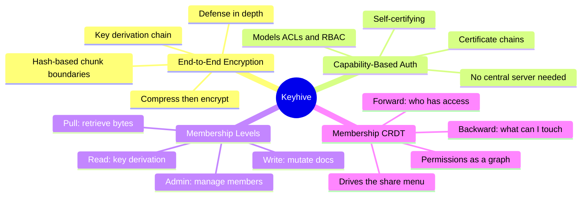
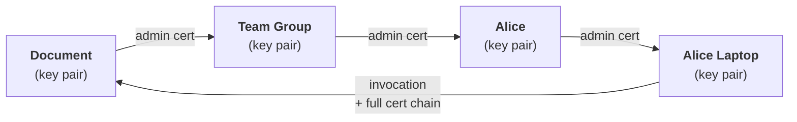

## Overview

The hardest unsolved problem in local-first isn't sync — it's auth. Cloud apps lean on a central server that sits on the hot path of every request, checking tokens and enforcing rules. Remove that server and the whole model collapses. Brooklyn Zelenka presents Keyhive, a research project from Ink & Switch, that flips the architecture: instead of "auth's place" (server checks everything), local-first requires "auth's data" (permissions travel with the encrypted bytes). The result is a system where a sync server can store your data without ever reading it, and the share button still works exactly like you'd expect.

::

## Key Arguments

### Auth Must Live Below Data, Not Above It

In cloud apps, the stack is: database at the bottom, compute in the middle, auth on top as a plugin. Local-first inverts this. Auth has to live at the bottom because encrypted data is useless without the right keys, and those keys need to exist before data arrives. You encrypt before sending, decrypt after receiving. Auth isn't middleware anymore — it's the foundation layer.

### Encryption Alone Isn't Enough — You Need Defense in Depth

Keyhive's E2EE uses a clever chunking strategy: hash each operation, use trailing zeros as probabilistic chunk boundaries (so all participants chunk consistently without coordinating), compress each chunk, then encrypt it. This preserves Automerge's compression benefits while keeping sync servers blind to content. But Zelenka is honest: encryption can be broken, and more likely, someone will just accidentally post a key to GitHub. So Keyhive layers defenses — encrypt the bytes AND restrict who receives them.

### Capabilities Replace the Central Auth Server

Instead of rules on a central server, Keyhive uses capability-based certificates. Every entity — document, user, device, team — has a key pair. A document signs a certificate granting write access to a team, the team delegates to a user, the user delegates to their device. When the device writes, the invocation includes the full certificate chain back to the document. Anyone can verify it, anywhere, without calling home to any server.

::

### Permissions Are a CRDT, Not a Rule Engine

The collection of all certificates forms a membership CRDT that distributes alongside the data. To answer "who has access to this document?" you traverse the graph forward to find all leaf devices. To answer "what can I access?" you traverse backward. This is what drives the familiar share menu UI. No server needed — just graph traversal over locally-replicated certificates.

## Notable Quotes

> "What if Signal worked for everything else — things that aren't just messaging?"
> — Brooklyn Zelenka

> "Once it's decrypted and somebody has a copy of it, they have a copy of it. Having a defense-in-depth strategy is your only option."
> — Brooklyn Zelenka

## Practical Takeaways

- Four permission levels cover most apps: pull (retrieve bytes), read (key derivation), write (mutate), admin (manage members)
- There's no distinction between users, devices, groups, and documents at the capability layer — everything is just a key pair that can delegate to or receive delegation from other key pairs
- The system can model ACLs, RBAC, and other traditional auth models — capabilities are strictly more expressive
- Keyhive is open source and in alpha — real code exists, but not production-ready yet
- Sync servers become interchangeable because they can't read your data anyway — you can swap them as they come and go

## Connections

- [[local-first-software]] — The original Ink & Switch essay identified auth as an open problem; Keyhive is their answer five years later
- [[the-past-present-and-future-of-local-first]] — Kleppmann's talk at the same conference series traced the evolution that led to projects like Keyhive
- [[the-big-questions-of-local-first]] — The panel debated unresolved challenges in local-first; access control was a recurring theme that Keyhive directly addresses
- [[a-gentle-introduction-to-crdts]] — Keyhive extends the CRDT concept beyond data sync into permissions — the membership graph itself is a CRDT
