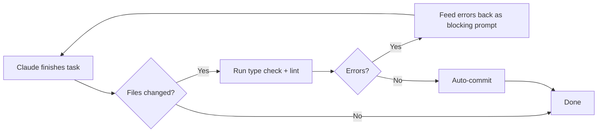

## Key Takeaways

- Every AI session starts from zero memory. The quality gap between good and bad output traces back to how much application context the model has at the start.
- Senior engineers gain the most from AI not by writing code faster, but by delegating investigation, blame tracing, documentation, and orientation tasks — the work that consumes hours but requires no creativity.
- "Easier to edit than author" — even flawed AI output beats a blank canvas. Humans recognize errors faster than they generate ideas from scratch.

## Technique 1: Context Loading via Mermaid Diagrams

The core problem: Claude has no idea how your application works when it starts. Developers set up rules and CLAUDE.md files, but those rarely describe how components connect, how authentication flows, or what database operations trigger what side effects. The result is bad edits — Claude modifies file A without understanding the ripple effect on file B.

Lindquist's solution is to generate mermaid diagrams that compress the entire application architecture into a token-efficient format. Mermaid is a standard for rendering diagrams inside markdown — it describes database operations, authentication flows, event channels, and user interactions as small lines of structured text. A human struggles to parse a large mermaid diagram visually, but an AI consumes it instantly.

The diagrams live in an `ai/diagrams/` directory and get injected at session startup:

```bash
claude --append-system-prompt "$(cat ai/diagrams/*.md)"
```

This reads every `.md` file in the diagrams directory, concatenates them, and feeds the result into Claude's system prompt before any user interaction begins. The AI now understands authentication flows, database operations, and component relationships without a single file read or codebase exploration.

**When to generate diagrams:** After a pull request merges — once a feature works as expected, prompt Claude to diagram it. For existing legacy codebases, retrofit diagrams as a one-time investment. Don't diagram upfront when starting from scratch — spike things out, get it working, then diagram.

**The token trade-off is real but worth it.** Loading diagrams consumes tokens upfront. Lindquist argues the time saved on faster, more reliable output far outweighs the cost. Without diagrams, Claude wastes tokens on exploratory file reads and often still misunderstands the architecture.

**Windsurf's "Code Maps"** follow the same concept — pre-computed compressed representations of a codebase for AI consumption.

## Technique 2: Shell Aliases for One-Letter Workflows

Because Lindquist launches Claude Code sessions repeatedly throughout the day, he maps common configurations to single-character shell aliases:

```bash
# In .zshrc or .bashrc
alias x="claude --dangerously-skip-permissions"
alias h="claude --model haiku"
alias cdi="claude --append-system-prompt \"\$(cat ai/diagrams/*.md)\""
```

- `x` — Bypasses all permission prompts for autonomous operation
- `h` — Launches with Haiku for fast, cheap tasks that don't need full reasoning
- `cdi` — Starts a diagram-preloaded session with full application context

This extends to project-specific aliases. You could define `cc-auth` that loads only authentication diagrams, or `cc-api` that loads API endpoint maps. The key insight: explore `claude --help` to discover the full surface area of system commands — most engineers only use the chat interface and miss flags like `--append-system-prompt`, model selection, and permission modes.

## Technique 3: Stop Hooks for Autonomous Quality Loops

This is the most impactful technique in the episode. Instead of hoping Claude produces clean code and then manually running type checks, Lindquist wires a stop hook that fires every time Claude finishes a task. The hook creates an autonomous feedback loop that catches and fixes errors before you even see them.

### Configuration

Register the hook in `.claude/settings.local.json` (personal, gitignored) or `.claude/settings.json` (team-shared, committed):

```json
{
  "hooks": {
    "stop": [
      {
        "command": "bun run claude-hooks/index.ts"
      }
    ]
  }
}
```

### How the hook works step by step

The hook script (TypeScript, using `@anthropic-ai/claude-code-sdk` for type definitions) runs this logic:

1. **Check for file changes.** If Claude's last turn didn't modify any files, the hook does nothing.
2. **Run type check.** If files changed, execute `bun type check --quiet`. The `--quiet` flag is critical — without it, TypeScript's stdout output would interfere with the hook's communication channel back to Claude.
3. **If errors exist:** Send a JSON object via `console.log` with `"block": true` and a prompt like `"Please fix the TypeScript errors: <error output>"`. Claude receives the errors, resumes its session, and attempts a fix.
4. **If no errors:** Send a prompt instructing Claude to stage changed files and commit (excluding sensitive files like `.env`).
5. **The hook fires again** after Claude's fix attempt. This creates a recursive loop — the stop hook runs, finds remaining errors, feeds them back, Claude fixes, the hook fires again — until all checks pass and it auto-commits.

### The console.log gotcha

Only `console.log` output gets read by Claude as hook input. Any other logging (`console.error`, `console.warn`) goes to stderr and doesn't interfere. Every developer who builds hooks falls into this trap: a library logs something to stdout, Claude receives garbage input, and the hook breaks. Always pass `--quiet` flags to subprocess commands and use `console.error` for your own debug output.

### What to put in stop hooks beyond type checks

Lindquist treats stop hooks as the pre-commit/pre-push CI that runs before code even reaches the pipeline:

- **Formatting** — Auto-fix style issues
- **Linting** — Catch code quality violations
- **File length constraints** — Flag files that grew too large
- **Circular dependency checks** — Verify imports don't create cycles
- **Duplicate code detection** — Find code that should be extracted into shared functions
- **Code complexity analysis** — Flag overly complex functions

### Scaling hooks across teams

`settings.json` gets committed to the repo — every engineer on the team gets the same hooks automatically. `settings.local.json` stays gitignored for personal customizations. An engineering leader should assign someone to configure baseline hooks for key repositories, so every developer benefits from automated quality gates when using Claude Code.



::

## Technique 4: Building Personal CLI Tools

Lindquist advocates building every idea you have as a small CLI tool. His example: "Sketch," a wrapper around Gemini CLI that generates website design mockups. You answer a few terminal prompts (store type, page, color scheme, number of variations) and it calls Gemini with pre-loaded prompts to generate images.

The philosophy has two parts. First, building CLI tools with AI assistance is dramatically easier than it used to be — nice multi-select menus, ASCII logos, and interactive prompts take minutes instead of hours. Second, the constrained UI space of the terminal prevents you from getting distracted building a web interface. You stay focused on the core functionality — five questions, tab through answers, get output.

The practical pattern: start a new terminal in an empty folder, dictate a brain dump of what you want, let Claude scaffold the CLI, and iterate. Even if the first pass is wrong, you can iterate on something. You can't iterate on nothing.

## Technique 5: The "Second Set of Eyes" Reset

When a Claude session drifts off course and one correction prompt doesn't fix it, Lindquist uses this recovery workflow:

1. **Export the conversation** using Claude Code's export command
2. **Feed the conversation plus relevant code files** into a different model (ChatGPT Pro, Gemini Deep Think)
3. **Ask the second model to critique** the conversation — where did it go wrong? What did the original model misunderstand?
4. **Revert to the last good commit**
5. **Restart Claude Code** with a revised prompt informed by the critique

The second model isn't invested in the original conversation. It acts as an objective reviewer, spotting the underlying misalignment that caused drift. Trying to steer a drifted session back on course rarely works — the model has an internal trajectory it keeps pulling toward.

**Planning mode has largely eliminated this problem.** Both Lindquist and Vo note that recent planning modes in Claude Code and Cursor prevent most conversational drift. Use planning mode as the default for anything beyond a single-file change.

## Technique 6: AI for Investigation, Not Just Code Generation

The mental model Vo proposes: imagine you have infinite junior-to-mid-career talent, always available, who would do the work you'd do if you had unlimited time and no meetings. When a ticket comes in, what would you delegate before writing a single line of code?

- Trace who wrote the code and why via `git blame` summaries
- Surface every debug path in the affected area
- Assess risks and security implications using pre-loaded diagrams
- Write a tech spec with callouts for risky changes
- Generate documentation for what you just built
- Create customer-facing support docs from internal engineering docs

This reframes AI coding tools from "write code for me" to "do the investigation, orientation, and documentation that I'd skip because I don't have time." The code generation is almost secondary — the real value is eliminating the hours spent orienting yourself before you even start coding.

## Notable Quotes

> "Every time an AI starts it has no memory, no idea of what's going on in your application, and people try and set up lots of rules... but they usually don't include a lot of how does my application work and how do the pieces fit."
> — John Lindquist

> "It's easier to edit than author. So let's get the authoring out of the way, and then even if you completely revise the whole thing, it's a much easier starting point."
> — John Lindquist

> "Think about if I gave you infinite junior to mid-career talent who is always available, who would do the work you would do if you had unlimited amount of time and no meetings."
> — Claire Vo

> "If things go off the rails... toss a second set of eyes on the entire conversation where that AI isn't invested in that conversation. It's instead critiquing the conversation."
> — John Lindquist, on using a separate model to audit a stuck session

## Connections

- [[understanding-claude-code-full-stack-mcp-skills-subagents-hooks]] — Comprehensive breakdown of hooks, MCP, skills, and subagents that provides the architectural context for the stop hook patterns discussed here
- [[claude-code-notification-hooks]] — Practical hook implementation example that complements the stop hook automation demonstrated by Lindquist
- [[writing-a-good-claude-md]] — Foundation for the CLAUDE.md configuration approach that pairs with the diagram-based context loading strategy
- [[im-boris-and-i-created-claude-code]] — Boris Cherny's parallel worktree workflow and self-improving CLAUDE.md patterns align with Lindquist's automation philosophy
- [[self-improving-skills-in-claude-code]] — The mistake-to-pattern extraction loop mirrors the stop hook's automated error correction cycle
- [[context-efficient-backpressure]] — Addresses the same core problem of context waste, with complementary techniques like `run_silent()` for reducing verbose output
- [[dont-outsource-your-thinking-claude-code]] — Balances the automation enthusiasm with disciplined task selection and cross-model validation
- [[thread-based-engineering-how-to-ship-like-boris-cherny]] — Framework for parallel Claude sessions that extends the "infinite junior talent" mental model into a structured methodology
