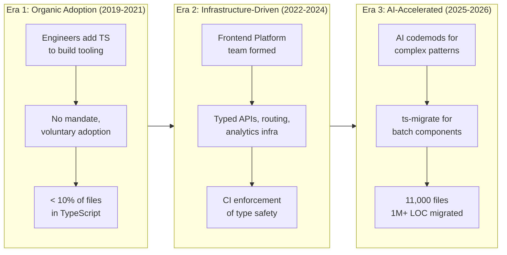

## Summary

Patreon migrated 11,000 JavaScript files — over a million lines of code — to TypeScript across seven years. The migration wasn't a single heroic push. It evolved through three distinct eras, each unlocking the next: voluntary adoption proved the value, platform investment made it tractable, and AI codemods finished what humans never would have.

The real insight isn't about TypeScript. It's about how large-scale technical change actually works in practice — you can't skip the boring infrastructure phase, and AI is a force multiplier, not a magic wand.

::

## Key Insights

- **Organic adoption is necessary but insufficient.** In 2019, a few adventurous engineers added TypeScript support to Patreon's build tooling with no official mandate. By late 2021, less than 10% of files were in TypeScript — and even fewer were meaningfully typed. Syntax without safety. Voluntary adoption proves the value proposition but doesn't finish the job.

- **Infrastructure is the unlock, not the migration itself.** When Patreon formed a dedicated frontend platform team in early 2022 with developer experience as a core charter, they prioritized typing the shared systems first: APIs, routing, analytics. Once the infrastructure was typed, migrating individual files became dramatically easier. Era 2's investment was the foundation that made Era 3 possible.

- **Legacy patterns are the real enemy.** Patreon's codebase carried patterns from 2013 — untyped global state and deeply nested Higher-Order Components. These aren't just "old code." They're patterns that resist automated migration because they encode implicit contracts that no tool can infer.

- **AI codemods handle what AST transforms can't.** As GPT-4 and Claude matured, Patreon used AI to write codemods that handled patterns ts-migrate couldn't reach. The key difference: AI brings semantic understanding, not just syntactic pattern matching. It can reason about what a function is supposed to do, not just what it looks like.

- **The multi-tool strategy.** No single tool migrated Patreon. They used ts-migrate for batch React component conversions, AI codemods for complex patterns, localized AI fixes for low-risk files, and advanced AI workflows for production-critical code. Each tool matched to the right problem.

- **AI as force multiplier, not replacement.** The most important lesson: AI dramatically accelerated the migration but human judgment remained essential for architecture decisions, complex patterns, and final review. Expecting AI to handle everything is the same mistake as expecting organic adoption to finish the job.

## Connections

- [[ai-assisted-development]] — Patreon's use of AI codemods is one of the strongest real-world examples of AI augmenting (not replacing) developer workflows at scale
- [[migrating-nuxt-test-utils-v4-vitest-v4]] — Same pattern at smaller scale: infrastructure migrations require careful dependency alignment before the actual migration becomes tractable
