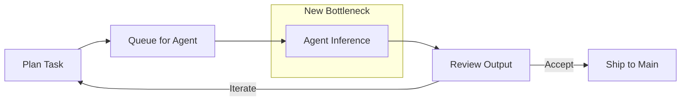

## Summary

Peter Steinberger argues that working code "out of the box" has shifted from impressive to expected. His software output is now limited primarily by inference time—how fast the model can think—not by his own coding speed. The implication: developers who optimize their workflow around this new bottleneck ship dramatically faster.

## Key Insights

**Watch the stream, don't read the code.** Steinberger rarely reads code anymore. He watches the agent's output stream and inspects key parts when needed. Code review transforms from line-by-line scrutiny to pattern recognition at velocity.

**Stack selection matters more than ever.** His preferred languages (TypeScript, Go, Swift) were chosen partly for AI compatibility. Go became viable specifically because agents handle its verbosity—a language barrier that previously blocked adoption.

**Knowledge cutoff creates real competitive advantage.** GPT 5.2's August 2025 cutoff versus Opus's March 2025 represents five months of library updates, API changes, and best practices that affect practical coding results.

**Project documentation as memory.** Since models have no memory between sessions, structured markdown files (`CLAUDE.md`, per-project instructions) become the highest-leverage investment. He also uses cross-project references to copy proven patterns from successful codebases.

**Queue work, don't babysit.** With 3-8 simultaneous projects, he queues tasks for agents and reviews results rather than watching each execution. The multiplexing pattern: plan, queue, return to review.

## Workflow

Steinberger describes several key patterns:

- **No plan mode** — Collaborative exploration with the model rather than upfront planning
- **Never revert** — Iterate direction through conversation instead of git reset
- **Commit to main** — Skip feature branches; the agent moves fast enough that isolation creates overhead
- **Refactor ad-hoc** — No cleanup cycles; fix things when you touch them

## Tools Mentioned

- **Codex** (GPT 5.2) — His primary agent; reads entire codebases before editing, reducing rework
- **Oracle** — CLI tool for deep research; models query multiple websites and synthesize
- **Clawdis** — Personal AI assistant with system-wide access (screen, messages, home automation)
- **VibeTunnel** — Terminal multiplexer rewritten from TypeScript to Zig in a single session

## Diagram

The article describes an iterative development loop where the bottleneck has shifted:

::

## Notable Quotes

> "These days I don't read much code anymore. I watch the stream and sometimes look at key parts."

> "The amount of software I can create is now mostly limited by inference time."

> "Building software is like walking up a mountain. You don't go straight up, you circle around it and take turns."

## Connections

- [[im-done-jeffrey-way-on-ai-and-coding]] — Jeffrey Way describes a similar transformation: bugs that took half a day now take five minutes, and programming has become more enjoyable despite business model disruption
- [[complete-guide-to-claude-md]] — Steinberger's emphasis on project documentation aligns with the CLAUDE.md pattern for persisting context across sessions
- [[context-engineering-guide]] — The broader discipline of structuring information for AI systems, which Steinberger applies through his per-project documentation approach
