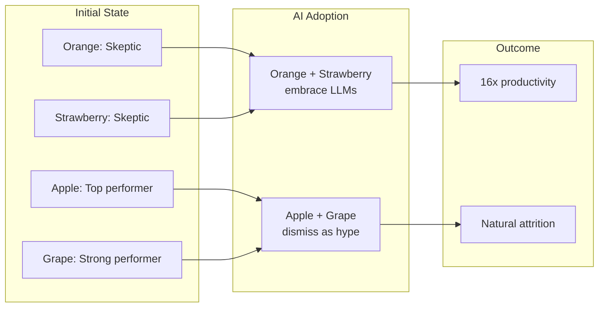

## Summary

The term "ngmi" (not gonna make it) applies to software developers who dismiss AI tools as hype. Rather than mass layoffs, Huntley predicts natural attrition: AI-adopting developers will deliver at levels that make non-adopters uncompetitive by comparison.

## The Fruit Developer Parable

Huntley illustrates this through seven developers named after fruits. Initial skeptics Orange and Strawberry embrace LLMs and achieve 16x productivity gains. Former top performers Apple and Grape dismiss the tools as hype—and gradually slip in the rankings. By the end, those who refused to adapt exit the job market entirely.

::

## Key Mechanism: Natural Selection Over Mass Layoffs

Companies don't need to fire anyone. When some developers output dramatically more, baseline expectations shift. Those who don't adapt become unable to contribute at the new expected level. Technical founders implementing AI workflows report this self-selection happening without deliberate workforce cuts.

## The Commoditization Shift

AI capabilities have become available via credit card purchase. Every company can access the same tools simultaneously. This creates industry-wide performance recalibration rather than isolated competitive advantages.

## The Opportunity Frame

For high-agency individuals, this represents unprecedented opportunity. The article ends with an emerging pattern in job requirements: listings now emphasize "programming LLMs" rather than just consuming their output.

## Connections

- [[deliberate-intentional-practice-with-ai]] - Same author argues the path to AI competence requires deliberate practice, not just exposure at work—the prescription for avoiding the "ngmi" fate described here
- [[how-ai-will-change-software-engineering]] - Martin Fowler describes the same industry shift from a different angle: AI as the biggest change since assembly to high-level languages
