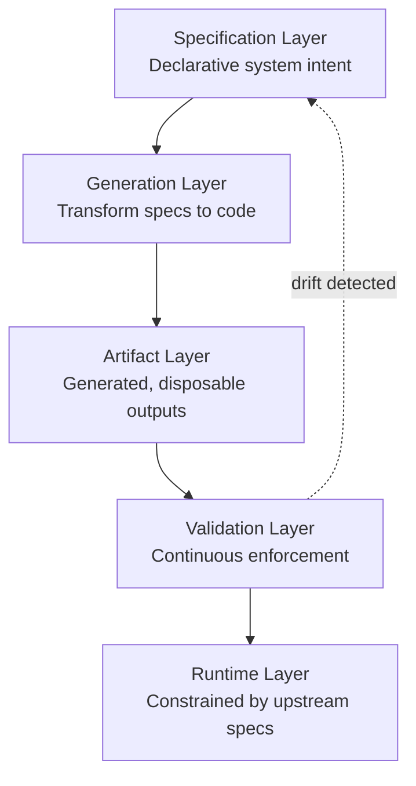

## Summary

Spec-Driven Development (SDD) represents a fundamental inversion: specifications become canonical truth while code becomes merely where that truth is realized. Engineers define intent declaratively, and platforms materialize execution through generation and validation. This mirrors earlier abstraction shifts like garbage collection removing manual memory management.

## The Five-Layer Execution Model



::

The model flows from declarative intent at the top to operationalized system at the bottom. Drift detection creates a feedback loop—violations surface at validation and propagate back to specification review.

## Key Concepts

- **Architectural inversion** — Traditional development treats code as ultimate authority. SDD inverts this: specifications govern, implementations derive
- **Drift detection by default** — Embedded validators in CI pipelines and runtime enforcement layers catch undeclared API fields, silently omitted required fields, and security scope degradation
- **SpecOps capabilities** — Five essential disciplines: spec authoring, formal validation, deterministic generation, continuous conformance monitoring, and governed evolution
- **Human-in-the-loop at higher abstraction** — Humans remain custodians of domain semantics and risk tolerance while machines handle enforcement within bounded approval boundaries

## Code Snippets

### Specification Example

How declarative intent looks in practice—defining what must be true rather than how to build it.

```yaml
service: Orders
api:
  POST /orders:
    request:
      Order:
        id: uuid
        quantity: int > 0
    responses:
      201: OrderAccepted
      400: ValidationError

policies:
  compatibility: backward-only
  security:
    auth: mTLS
```

## Engineering Trade-offs

**Benefits:**

- Architectural determinism replaces emergent behavior
- Drift prevention before runtime rather than post-facto discovery
- Multi-language parity through unified specifications

**Costs:**

- Specifications become primary complexity surfaces requiring schema engineering discipline
- Code generators enter the trusted computing base
- Runtime enforcement introduces measurable computational overhead
- Requires cognitive reorientation toward contract-first reasoning

## Connections

- [[spec-driven-development-with-ai]] — GitHub's Spec Kit operationalizes a similar philosophy: stable intent (specification) separated from flexible implementation
- [[building-evolutionary-architectures]] — Neal Ford's fitness functions parallel SDD's validation layer—both wire architectural checks into CI to prevent drift
- [[fitness-function-driven-architecture-and-agentic-ai]] — Extends architectural governance to enterprise scale, using MCP to separate intent from implementation details
