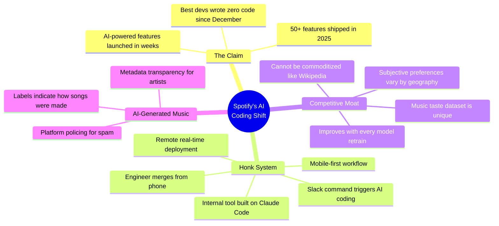

## Summary

Spotify co-CEO Gustav Söderström dropped a bombshell during Q4 earnings: the company's best developers haven't written a single line of code since December. They're using an internal system called "Honk" — built on Claude Code — that lets engineers direct AI to fix bugs and build features from their phones via Slack, then merge to production before they even arrive at the office.

This isn't a lab experiment. Spotify shipped 50+ features in 2025 and just launched AI-powered Prompted Playlists, Page Match for audiobooks, and About This Song — all at a pace that would've been impossible with traditional dev workflows.

::

## What's Actually Interesting

The Honk workflow is the real story. An engineer on their morning commute opens Slack, tells Claude to fix a bug or add a feature to the iOS app, gets a new build pushed back to them on Slack, and merges it to production — all before arriving at the office. That's not "AI-assisted coding." That's AI-as-the-coder with humans as reviewers and deployers.

The second angle worth tracking: Spotify is building a music taste dataset they claim no one else has. Ask what "workout music" is and you get different answers by geography — Americans say hip-hop, Scandinavians say heavy metal. This subjective, culturally-specific data can't be scraped from Wikipedia or commoditized by other LLMs. Every model retrain improves it. That's a genuine moat in an era where most data advantages are evaporating.

## The Tension

Söderström frames this as the beginning, not the end. But there's a question he doesn't answer: what happens to the developers who _aren't_ the "best"? If the top engineers are directing AI from their phones, what's the workflow for everyone else? Anthropic's own research found that AI coding creates a supervision paradox — you need deep skills to oversee AI, but those skills erode if you stop writing code. Spotify's "best developers" might be fine. The rest of the org is the interesting test case.

Also worth noting: Spotify is specifically using Claude Code, not Copilot, not Cursor. For a company at this scale to bet on a specific agent tool and build internal infrastructure around it — that's a strong signal about where enterprise AI coding is heading.

## Connections

- [[how-ai-is-transforming-work-at-anthropic]] - Anthropic's internal research on AI coding productivity directly validates Spotify's claims — but also surfaces the skill atrophy risk that Söderström glosses over
- [[the-ai-vampire]] - Yegge's piece about AI productivity creating a value capture war is the dark mirror of Spotify's earnings call optimism — same 10x productivity, different framing of who benefits
- [[ai-codes-better-than-me-now-what]] - Lee Robinson reached the same conclusion individually that Spotify is now institutionalizing: coding agents have surpassed human coding ability, the job is now direction and review
