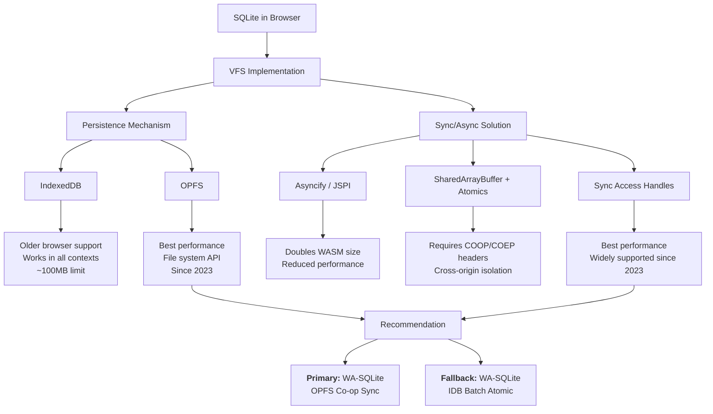

## Overview

Conrad Hofmeyr has been building on SQLite for 16 years — starting with offline-first health worker apps in Africa, eventually spinning out PowerSync as a standalone sync engine. This talk is a deep technical survey of how SQLite persistence actually works in browsers: the storage primitives, the async hacks, the projects that got us here, and what to use in production today.

The punchline: it's finally not hacky. OPFS and synchronous file access handles (both widely supported since 2023) solved the two core problems — persistent storage and the sync/async impedance mismatch between SQLite's C API and browser JavaScript.

## Why SQLite in the Browser

The only native persistent database in browsers is IndexedDB — an object-oriented store available since 2015 that's widely considered slow, scales poorly to large datasets, and requires substantial tooling on top to be useful. Projects like Zero prove you can build impressive things on IndexedDB, but you're fighting the abstraction the whole way.

SQLite brings real database capabilities: powerful querying, easy-to-use transactions, views, triggers, common table expressions, advanced indexing, JSON functions, and ACID properties. Its ecosystem includes extensions for vectors, full-text search, encryption, and GIS data. The maturity is unmatched — a 600-to-1 test-to-code ratio, battle-hardened across an estimated trillion copies in active use.

Three reasons to want a persistent client-side database specifically:

1. **Offline support** — data is already local, no network needed
2. **Snappiness with large datasets** — too much data to fit in memory? Query it from disk
3. **State management** — use the database as the state layer, automatically persisted across page reloads

### What About Web SQL?

Chrome tried to standardize SQLite as Web SQL in 2010, but Mozilla refused to support it. Conrad argues that was the right call — SQLite's scope is too large to codify into a web standard, and Web SQL shipped with annoying limitations. WebAssembly (available in all major browsers since 2017) turned out to be the better path: run whatever SQLite build you want, compiled to WASM.

### Alternative Projects Worth Watching

- **PGlite** (ElectricSQL) — a stripped-down Postgres that runs in the browser via WASM
- **Turso** — working on a complete rewrite of SQLite in Rust

## The SQLite Project Landscape

Conrad presents a useful mental model for how SQLite projects layer:

1. **Core C library** — the SQLite build itself, compiled for a specific architecture with chosen compile options and extensions
2. **Language bindings** — projects that expose SQLite APIs in JavaScript (or Dart, Kotlin, etc.) via FFI
3. **Higher-level abstractions** — transaction management, concurrency via connection pooling, worker setup
4. **ORMs and query builders** — the highest-level developer interface

Most browser SQLite projects sit at layer 2. The two main ones:

| Project         | Maintainer             | Since     | Notes                                                    |
| --------------- | ---------------------- | --------- | -------------------------------------------------------- |
| **WA-SQLite**   | Roy Hashimoto          | 2021      | Most aggressive VFS experimentation, best benchmarks     |
| **SQLite WASM** | SQLite team (official) | Late 2022 | Borrowed heavily from WA-SQLite, credits Roy extensively |

### The Lineage

The intellectual history matters for understanding where things stand:

- **SQL.js** by Alon Zakai — the godfather of SQLite on the web. Compiles SQLite to WASM but runs in-memory only, no built-in persistence
- **Absurd SQL** by James Long — early experiment adding persistence to SQL.js. A one-off project, but Roy Hashimoto incorporated key ideas from it into WA-SQLite
- **WAQLite** — first public repo demonstrating SQLite persistence in the browser, did the most early exploration of different techniques
- **Carl's "Stop Building Databases"** — influential post observing that every sufficiently complex frontend app eventually reinvents a database, proposing SQLite as the answer
- **Riffle project** (Johannes Schickling and others) — academic paper with a similar thesis about client-side databases. Johannes's LiveStore project is now built on Riffle

## Key Arguments

### The VFS Is Everything

SQLite itself is a C library. The hard part in browsers isn't SQLite — it's implementing the Virtual File System (VFS). In 2004, SQLite introduced this abstraction layer to decouple database logic from OS-specific file operations (initially Unix vs Windows). For browser SQLite, the VFS maps SQLite's synchronous file operations to browser storage mechanisms. Every browser SQLite project is fundamentally a VFS implementation with different tradeoffs.

Two decisions define a VFS:

1. **Persistence mechanism** — where do SQLite's 4KB database pages actually live?
2. **Sync/async bridge** — how do you make async browser APIs look synchronous to C code?

### Persistence: IndexedDB vs OPFS

Early VFSes (starting 2021) persisted SQLite's pages as objects in IndexedDB. Performance isn't great — it degrades past ~100MB in practice. But IndexedDB has advantages: works in older browsers, and works in every execution context (window, worker, shared worker, service worker, extensions).

In 2023, OPFS (Origin Private File System) became widely supported. Part of the File System API, it gives each origin a private directory with file access optimized for high-performance reads and writes. OPFS transformed SQLite persistence because it matches the access patterns databases actually need — sequential reads/writes on file regions rather than object store puts.

### The Sync/Async Impedance Mismatch

This is the harder problem. SQLite's C API was built for synchronous file I/O, but browser APIs for I/O are asynchronous. Four approaches emerged:

- **Asyncify / JSPI** — Asyncify (integrated into the Emscripten compiler) transforms WASM code so that when a call hits an async boundary, the WASM stack unwinds, control returns to JavaScript, and later the stack rewinds when the promise resolves. Doubles the WASM build size and significantly reduces performance. JSPI (JavaScript Promise Integration) is a newer WASM standard that does this natively — better than Asyncify but still not performant, and not yet in all browsers.

- **SharedArrayBuffer + Atomics** — lets one worker synchronously await a state change triggered by another worker's async operation. Clever, but since the Spectre/Meltdown attacks, SharedArrayBuffer requires strict cross-origin isolation HTTP headers (COOP/COEP), which complicates deployment significantly.

- **Synchronous file access handles** (OPFS) — the actual solution that made everything click. Lets you synchronously read and write OPFS files from a worker. One remaining caveat: some operations like opening a file are still async. Two workarounds exist:
  - **Error-and-retry**: the VFS raises an error when it needs a new handle, queues the async open, and retries the SQLite operation once the handle is ready. Sounds hacky but works well in practice.
  - **Pre-opening files**: open file handles up front so they're available synchronously. Limits the number of databases you can open without reinstantiating, but that's rarely an issue.

### Concurrency: Five Levels

Concurrency matters even for single-user client-side databases. Sync engines like PowerSync write large amounts of data in the background — that shouldn't block the UI from querying.

| Level | Description                                        | Multi-tab Behavior                         |
| ----- | -------------------------------------------------- | ------------------------------------------ |
| 1     | Single connection                                  | Requires cross-tab messaging to coordinate |
| 2     | Multiple connections, single transaction at a time | Each tab gets its own connection           |
| 3     | Multiple connections, concurrent reads             | Reads don't block each other               |
| 4     | Concurrent reads + one writer (WAL mode)           | Background sync doesn't block queries      |
| 5     | Concurrent writes                                  | Not yet available in any browser VFS       |

SQLite's WAL (Write-Ahead Log) mode enables level 4 — concurrent reads alongside a single writer. Most current browser VFSes operate at levels 1-2, with some offering level 3-4 solutions.

In all five levels, the querying interface itself is async so the main thread is never blocked during query execution. The only way to get synchronous queries is loading the entire database into memory, which limits the use cases.

::

### Performance vs Concurrency Tradeoff

Conrad benchmarks the WA-SQLite VFS implementations and surfaces a clear pattern: OPFS beats IndexedDB on performance across the board, and OPFS Co-op Sync specifically offers the best raw performance. Some VFSes trade performance for higher concurrency. For most apps, OPFS Co-op Sync's concurrency model is already sufficient.

### The Practical Recommendation

Use **WA-SQLite with OPFS Co-op Sync** as the primary VFS. Fall back to **IDB Batch Atomic** for environments where OPFS isn't available (older browsers, Safari incognito). This is the approach PowerSync uses in production today — customers are shipping real products on it. One example is Synapse, a scheduling app for the farming industry built on PowerSync.

PowerSync also dogfoods this: their new cloud dashboard uses the PowerSync web SDK with SQLite persistence.

## What's Coming Next

Although PowerSync and others use WA-SQLite in production, Roy Hashimoto doesn't currently position the project as production-ready. PowerSync's plans:

1. **Collaborate with Roy** to develop and maintain WA-SQLite for explicit production readiness
2. **Build a higher-level library** on top of WA-SQLite — genericizing the worker setup abstractions and transaction management that PowerSync already solved internally
3. **Best-of-both-worlds VFS** — combine OPFS Co-op Sync's performance with better concurrency, likely building on a new browser standard (already in Chrome) that allows concurrent synchronous read/write access to the same OPFS file without exclusive locks

## Notable Quotes

> "The TLDR of this talk is that SQLite in the browser is pretty good these days."
> — Conrad Hofmeyr

> "There was this light bulb moment when we thought, why don't we just use UUIDs and actually create the data structure in a real client-side database and then just sync it with the server."
> — Conrad Hofmeyr, on PowerSync's origin in 2009

> "Every sufficiently complex front-end app eventually reinvents a database."
> — Carl (via Conrad), from the "Stop Building Databases" post

## Practical Takeaways

- **WA-SQLite + OPFS Co-op Sync** is the current best option for production SQLite in browsers
- **IDB Batch Atomic fallback** covers older browsers and Safari incognito where OPFS isn't available
- SQLite's WAL mode enables concurrent reads + writes — critical for sync engines that write in the background
- The worker setup for browser SQLite is still complicated — higher-level abstractions are coming but not here yet
- OPFS sync access handles require a web worker — you can't use them on the main thread
- New browser standards for concurrent synchronous OPFS access (already in Chrome) will push concurrency to level 4 without WAL-mode workarounds

## Connections

- [[native-grade-web-apps-with-local-first-data]] — Johannes Schickling's talk at ViteConf 2025 builds directly on this foundation. His LiveStore and Riffle projects (both mentioned by Conrad) use the SQLite-in-browser infrastructure described here as the persistence layer for sync engines.
- [[the-past-present-and-future-of-local-first]] — Same conference (Local-First Conf 2024). Kleppmann defines the vision; Conrad shows the plumbing that makes it real. The "availability of another computer should never block the user" ideal requires exactly this kind of client-side persistence.
- [[unleashing-the-power-of-sync]] — PowerSync's article on their sync engine architecture. This talk explains the browser-side SQLite foundation that article takes for granted.
- [[what-is-local-first-web-development]] — Alexander's own introduction to local-first. Conrad's talk fills in the technical "how" behind the persistence layer that makes the seven ideals achievable in web browsers.
