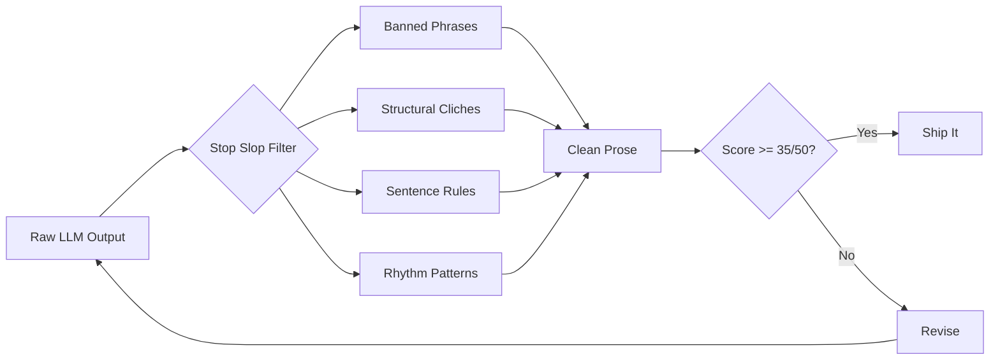

## Overview

Stop Slop is a skill file you bolt onto Claude (or any LLM) to make its writing sound less like a machine. It targets five categories of AI tells: banned phrases, structural cliches, sentence-level habits, rhythm patterns, and tone markers. The repo ships as a drop-in skill folder for Claude Code, but the core rules work anywhere you can inject a system prompt.

The premise is simple: AI writing has a signature. Throat-clearing openers ("In this comprehensive guide..."), emphasis crutches ("It's worth noting that..."), business jargon, dramatic fragmentation, false agency ("This raises important questions"), passive voice. Stop Slop catalogs these patterns and instructs the model to catch them before they reach the output.

## Key Features

- **Banned phrase list** covering openers, emphasis crutches, adverbs, vague declaratives, and meta-commentary
- **Structural pattern detection** for binary contrasts, negative listings, rhetorical setups, and false agency
- **Sentence-level rules** prohibiting Wh- starters, excessive em dashes, and staccato fragments
- **Quality scoring rubric** across 5 dimensions (directness, rhythm, trust, authenticity, density) scored 1-10, with 35/50 as the revision threshold
- **Before/after examples** showing transformations from slop to clean prose

## Code Snippets

### Installation (Claude Code)

```bash
# Add as a skill folder in your Claude Code project
git clone https://github.com/hardikpandya/stop-slop.git .claude/skills/stop-slop
```

### Usage Options

```text
# Claude Code: add the folder as a skill
# Claude Projects: upload SKILL.md + references to project knowledge
# Custom instructions: copy core rules from SKILL.md
# API calls: include SKILL.md in system prompts
```

## Why This Matters

The real value isn't the specific banned phrases. It's the framing: AI writing quality is a solvable problem at the prompt level. Instead of accepting that LLM output sounds like LLM output, you define what "sounds like a machine" means and build detection rules. The 5-dimension scoring rubric turns subjective "this feels AI-ish" into something measurable.

This connects directly to the broader question of AI-assisted writing workflows. The tool assumes you want the AI to do the drafting but want the output to read like a human wrote it. That's a specific stance: don't fight the AI, train it to mimic better taste.



::

## Connections

- [[detecting-ai-slop-with-distance-from-main-sequence]] - Tackles the same "AI slop" problem from the code side rather than the prose side, using metrics to catch structurally poor AI-generated code
- [[dont-outsource-your-thinking-claude-code]] - Complements this tool's philosophy: AI handles the drafting, but humans own the quality standards and critical thinking
